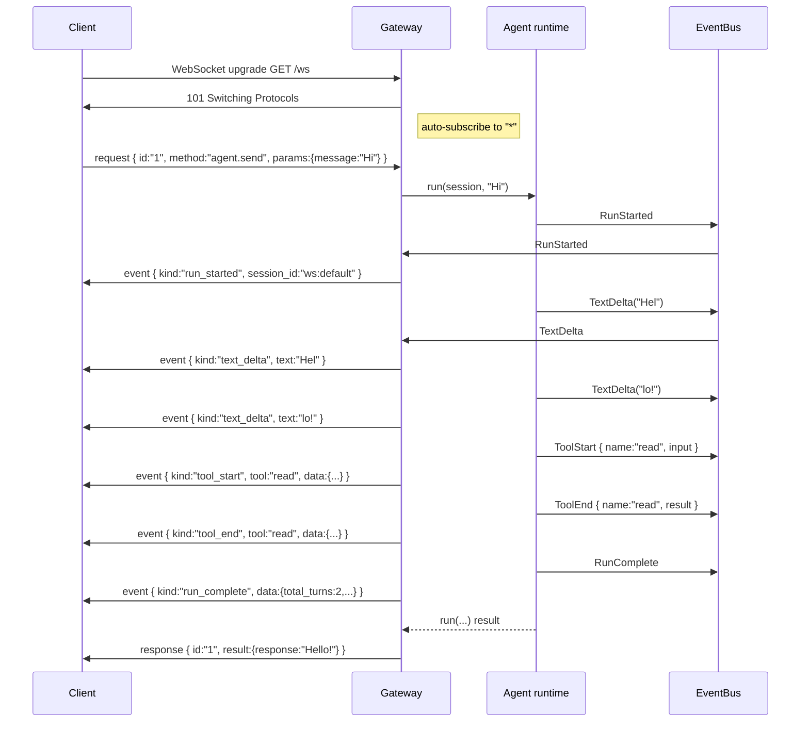
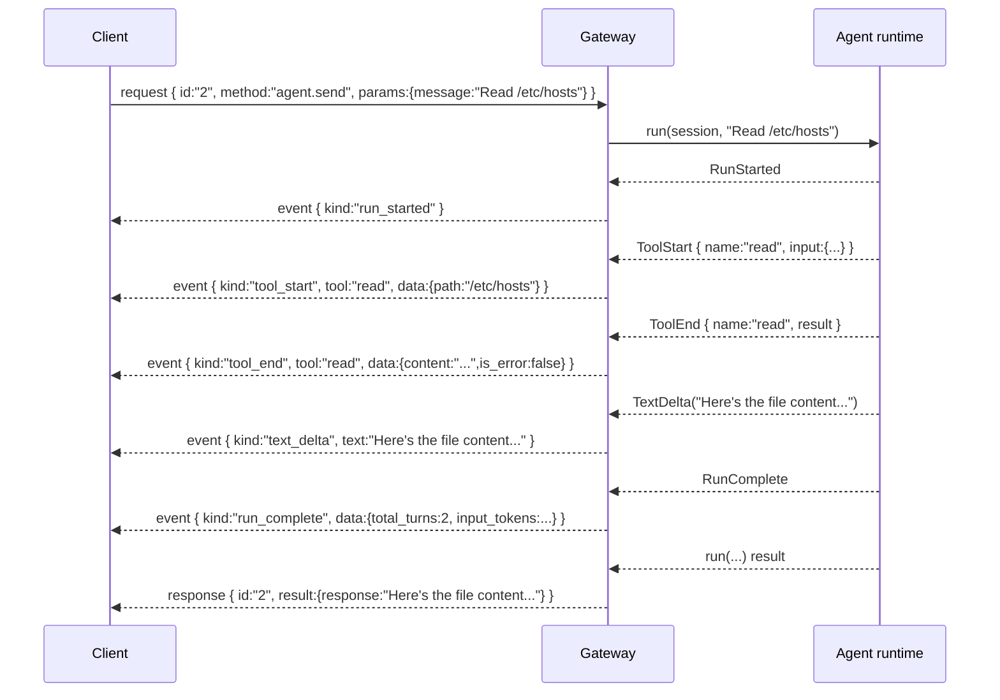

# Gateway WebSocket API

The WebSocket surface on `/ws` is the full-duplex companion to the REST
API. Where REST exposes fire-and-block request handlers that return a
single JSON body, the WebSocket exposes five RPC methods plus a
server-push event stream carrying the live state of the
**[agent runtime](../glossary.md#agent-runtime)**, the
**[Guardian](../glossary.md#guardian)**, the
**[Heartbeat](../glossary.md#heartbeat)**, the cron scheduler, and the
**[Director](../glossary.md#director)** pipeline. This is the interface
the embedded Svelte Web UI uses for everything that involves streaming
output: the live conversation view, the token counter that updates while
the agent is talking, the Goals page that watches DAG node completions,
and the approvals drawer that lights up when a **[soft checkpoint](../glossary.md#soft-checkpoint)**
fires.

A client that only needs to submit a prompt and receive the final
response can do so through `POST /api/sessions/{id}/messages` instead;
every WebSocket RPC method has a REST equivalent. The gap that makes
the WebSocket worth opening is streaming: the REST endpoint blocks
until the run finishes and then returns one JSON object, whereas the
WebSocket delivers `text_delta` frames as soon as the LLM emits them
and `tool_start`/`tool_end` frames as soon as the tool dispatcher
fires them. For anything that renders a live UI, the WebSocket is the
right choice.

The connection handler lives in
`crates/ryvos-gateway/src/connection.rs:38` and the frame type
definitions live in `crates/ryvos-gateway/src/protocol.rs:4`. Read those
two files alongside this document when a wire-level detail needs to be
confirmed; the source is the authoritative reference and this document
describes what a client sees without reproducing the Rust syntax.

## Endpoint and upgrade

The WebSocket is served at `GET /ws` on the same `TcpListener` as the
REST API. Authentication uses the same four-step precedence chain as
REST: a Bearer header, a `?token=...` query parameter, a
`?password=...` query parameter, or the anonymous-admin fallback when
no auth is configured. Browsers cannot send Authorization headers on a
WebSocket upgrade, so the query-string form is the practical choice for
the Web UI; CLI clients can use either. The authoritative auth chain is
documented in [auth-and-rbac.md](auth-and-rbac.md).

The upgrade handshake requires at least `Viewer` role. All five RPC
methods run behind the same role gate; per-method role checks happen
inside the handlers on the application layer, and the WebSocket itself
does not re-extract the role for each frame. This is a deliberate
choice: once a Viewer has opened a WebSocket, they can call any method,
because tearing down an authenticated connection on a per-method basis
would break a live UI for no added security benefit.

The CORS layer applies to the WebSocket upgrade response the same way
it applies to REST, so a browser on a different origin can connect to
`/ws` without a proxy.

## Frame format

Every frame on `/ws` is a UTF-8 JSON text message. Binary messages are
ignored. The frame vocabulary has three kinds of messages, distinguished
by a `type` field at the top level.

### Request (client to server)

```json
{
  "type": "request",
  "id": "client-assigned-id",
  "method": "agent.send",
  "params": { "session_id": "my-session", "message": "Hello" }
}
```

- `id` is chosen by the client and is echoed back in the matching
  response frame. The server never inspects the value; use a UUID, a
  monotonic counter, or any other unique string per connection.
- `method` is one of the five RPC names listed below.
- `params` is a free-form JSON object; its expected shape depends on
  the method.

The corresponding Rust type is `ClientFrame` in
`crates/ryvos-gateway/src/protocol.rs:4`.

### Response (server to client)

```json
{
  "type": "response",
  "id": "client-assigned-id",
  "result": { "session_id": "...", "response": "..." }
}
```

On success, the frame carries a `result` object whose shape depends on
the method. On failure, the frame carries an `error` object instead:

```json
{
  "type": "response",
  "id": "client-assigned-id",
  "error": { "code": -32700, "message": "Parse error: ..." }
}
```

The error object is modeled after JSON-RPC 2.0. Two codes are currently
emitted by the connection handler:

| Code | Meaning |
|---|---|
| `-32700` | Parse error. The text was not valid JSON. The frame `id` is `"0"` in this case because there is no client id to echo. |
| `-32603` | Internal error. The lane queue was closed or the lane task panicked. Usually indicates the server is shutting down. |

RPC methods themselves do not produce structured error codes; they
embed soft errors in the `result` object as an `error` field. For
example, a `session.history` call with an empty `session_id` returns a
successful response frame with `{ "error": "session_id is required" }`
as the result. Clients should check for an `error` field in the
result body in addition to the `error` field on the response frame
itself — a missing top-level `error` does not guarantee the RPC
succeeded logically, only that the connection and the method
dispatch are healthy.

An unknown method name is handled at the same layer as bad
parameters: the handler returns
`{ "error": "Unknown method: <name>" }` in the result, not a
`-32601` JSON-RPC-style error code. This keeps the frame protocol
uniform but means clients must not rely on response-level error
codes for method-validity checks.

The corresponding Rust type is `ServerResponse` in
`crates/ryvos-gateway/src/protocol.rs:17`.

### Event (server to client)

```json
{
  "type": "event",
  "session_id": "my-session",
  "event": {
    "kind": "text_delta",
    "text": "Hello"
  }
}
```

Events are push frames generated from `AgentEvent` variants on the
**[EventBus](../glossary.md#eventbus)**. Every event frame carries a
`session_id` field that identifies the session the event belongs to (or
the synthetic key `system` for events that do not belong to any one
session, such as cron completions). The inner `event` object has a
mandatory `kind` string plus three optional fields — `text`, `tool`,
and `data` — that different event kinds populate.

The corresponding Rust type is `ServerEvent` in
`crates/ryvos-gateway/src/protocol.rs:29`.

## RPC methods

Five methods are dispatched by `process_request` in
`crates/ryvos-gateway/src/connection.rs:404`. Each runs through the
per-connection **[lane](../glossary.md#lane)** queue, so a client cannot
have two RPCs from the same connection in flight concurrently. This is
by design: it prevents a slow `agent.send` from being overtaken by a
fast `session.list` on the same tab, and it gives `agent.cancel`
predictable ordering relative to an in-flight `agent.send`.

### agent.send

Runs the agent for a session. The params carry two fields:

```json
{ "session_id": "my-session", "message": "Summarize the logs" }
```

If `session_id` is empty or missing, the server calls
`session_mgr.get_or_create("ws:default", "websocket")`, which returns
the default WebSocket session. The resolved session ID is always
echoed in the response.

During execution, the server publishes `run_started`, zero or more
`text_delta`, zero or more `tool_start` and `tool_end`, and a final
`run_complete` event before the response frame arrives. The response
itself is a single object with `session_id` and `response`:

```json
{
  "type": "response",
  "id": "42",
  "result": { "session_id": "my-session", "response": "..." }
}
```

On agent error, the result carries an `error` field instead of
`response`. The lane is released once the method returns, so a follow-up
`agent.send` from the same connection waits behind this one.

The connection auto-subscribes to the resolved session ID the first
time `agent.send` runs for it, so subsequent `text_delta`, `tool_start`,
and `tool_end` events addressed to that session are forwarded to the
connection for the rest of its lifetime.

A typical `agent.send` response looks like this:

```json
{
  "type": "response",
  "id": "42",
  "result": {
    "session_id": "ws:default",
    "response": "The log shows three errors on line 412, line 891, and line 1204."
  }
}
```

On agent error:

```json
{
  "type": "response",
  "id": "42",
  "result": {
    "session_id": "ws:default",
    "error": "budget exceeded: $12.40 of $10.00"
  }
}
```

A missing `message` field returns a success frame with
`{ "error": "message is required" }` in the result.

### agent.cancel

Cancels the runtime's cancellation token. No params:

```json
{ "type": "request", "id": "7", "method": "agent.cancel", "params": {} }
```

The response is always `{ "cancelled": true }`. Because of the lane
queue, a `cancel` enqueued while an `agent.send` is in flight waits
behind it until the send's turn ends — the cancellation token is
flipped afterwards, which causes the next scheduled turn (or a future
run) to exit early. Clients wanting mid-turn cancellation must issue
the cancel before the send is popped off the lane, which in practice
means from a separate connection.

### session.list

Returns the set of session keys currently tracked by the session
manager:

```json
{ "sessions": ["ws:default", "telegram:42", "slack:C123"] }
```

No params. This is equivalent to `GET /api/sessions` minus the
per-session metadata enrichment.

### session.history

Returns message history for a session:

```json
{ "session_id": "ws:default", "limit": 100 }
```

`session_id` is required; an empty value returns `{ "error":
"session_id is required" }` in the result. `limit` defaults to 50.
The result carries a `messages` array with `role`, `text`, and
`timestamp` for each message, matching the shape of
`GET /api/sessions/{id}/history`.

### approval.respond

Releases a pending **[soft checkpoint](../glossary.md#soft-checkpoint)**
held by the **[approval broker](../glossary.md#approval-broker)**:

```json
{
  "request_id": "apr_01HW3X4...",
  "approved": true,
  "reason": "looks safe"
}
```

- `request_id` must be the exact ID carried on the earlier
  `approval_requested` event. The broker matches by exact string.
- `approved` is a boolean. `true` builds an `ApprovalDecision::Approved`;
  `false` builds `ApprovalDecision::Denied { reason }`.
- `reason` defaults to `"denied"` when omitted.

The result is `{ "resolved": true }` when the broker found a matching
request, `{ "resolved": false }` otherwise. A `false` result is
common and expected — it means another channel already responded to
the approval, or the request expired. Clients should treat
`resolved: false` as an informational fallthrough rather than an
error, because the intended behavior is "somebody already handled
this" and the agent is already back running.

A full round trip from the Web UI's approval dialog looks like:

```json
{
  "type": "request",
  "id": "approval-77",
  "method": "approval.respond",
  "params": {
    "request_id": "apr_01HW3X4ABC",
    "approved": true,
    "reason": "Verified with owner"
  }
}
```

```json
{
  "type": "response",
  "id": "approval-77",
  "result": { "resolved": true }
}
```

## Lane queue

Each WebSocket connection has its own `LaneQueue`
(`crates/ryvos-gateway/src/lane.rs`), a `tokio::sync::mpsc` channel with
a buffer of 32. One background task per connection drains the queue and
dispatches requests one at a time; the main read loop enqueues items
and `await`s a `oneshot` for the result. The practical consequences:

- Requests from a single connection are serialized. A fast
  `session.list` cannot pass a slow `agent.send` from the same tab.
- Requests from different connections run concurrently. Opening a
  second tab parallelizes throughput.
- Flooding a single connection with more than 32 pending requests
  causes `LaneQueue::send` to block on the client side (backpressure
  surfaces as a stalled write), not as a dropped frame. The server
  does not drop requests on overflow.
- When a client disconnects mid-request, the `oneshot` receiver
  drops and the background task silently discards its result once
  the in-flight work completes. There is no orphaned task running
  against a dead connection.

Cancellation is lane-safe: `agent.cancel` and `agent.send` from the
same connection cannot race with each other, because the lane
guarantees `cancel` runs before or after a given `send`, never during.
For mid-turn cancellation — the common case in UIs — issue the cancel
from a second connection.

## Event stream

In parallel with the lane task, a second background task subscribes to
the EventBus and translates `AgentEvent` variants into `ServerEvent`
frames. Both tasks use the same underlying `WebSocket` sink through a
shared `Arc<Mutex<...>>`, so the event stream and the RPC responses are
interleaved on the same wire.

Every new connection auto-subscribes to the synthetic session ID `*`,
which is the catch-all for events that do not belong to any one
session. When an RPC method like `agent.send` resolves a session ID,
the handler appends that ID to the connection's subscribed list so
subsequent per-session events are forwarded. Events tagged with
`system` (for example, `cron_fired`) are always forwarded regardless
of what the client has subscribed to, because the event translator
builds them with a literal `"system"` in the `session_id` field.

### Event kinds

There are 23 `AgentEvent` variants that the translator maps into
outbound events, plus 6 variants that are silently dropped because the
Web UI does not consume them. The full table is below; the source is
`crates/ryvos-gateway/src/connection.rs:58`.

| Wire `kind` | From `AgentEvent::` | `session_id` on the wire | Payload fields |
|---|---|---|---|
| `text_delta` | `TextDelta(text)` | last subscribed session | `text` |
| `tool_start` | `ToolStart { name, input }` | last subscribed session | `tool`, `data` = raw input JSON |
| `tool_end` | `ToolEnd { name, result }` | last subscribed session | `tool`, `data` = `{content, is_error}` |
| `run_started` | `RunStarted { session_id }` | event's session | — |
| `run_complete` | `RunComplete { ... }` | event's session | `data` = `{total_turns, input_tokens, output_tokens}` |
| `run_error` | `RunError { error }` | last subscribed session | `data` = `{error}` |
| `approval_requested` | `ApprovalRequested { request }` | last subscribed session | `data` = `{id, tool_name, tier, input_summary, session_id}` |
| `tool_blocked` | `ToolBlocked { name, tier, reason }` | last subscribed session | `tool`, `data` = `{tier, reason}` |
| `usage_update` | `UsageUpdate { input_tokens, output_tokens }` | last subscribed session | `data` = `{input_tokens, output_tokens}` |
| `budget_warning` | `BudgetWarning { ... }` | event's session | `data` = `{spent_cents, budget_cents, utilization_pct}` |
| `budget_exceeded` | `BudgetExceeded { ... }` | event's session | `data` = `{spent_cents, budget_cents}` |
| `heartbeat_fired` | `HeartbeatFired { timestamp }` | literal `"system"` | `data` = `{timestamp}` |
| `heartbeat_ok` | `HeartbeatOk { ... }` | event's session | `data` = `{response_chars}` |
| `heartbeat_alert` | `HeartbeatAlert { ... }` | event's session | `data` = `{message, target_channel}` |
| `cron_fired` | `CronFired { job_id, ... }` | literal `"system"` | `data` = `{job_name}` |
| `cron_complete` | `CronJobComplete { name, ... }` | literal `"system"` | `data` = `{job_name}` |
| `guardian_stall` | `GuardianStall { session_id, ... }` | event's session | — |
| `guardian_doom_loop` | `GuardianDoomLoop { session_id, ... }` | event's session | — |
| `guardian_budget_alert` | `GuardianBudgetAlert { session_id, ... }` | event's session | — |
| `graph_generated` | `GraphGenerated { ... }` | event's session | `data` = `{node_count, edge_count, evolution_cycle}` |
| `node_complete` | `NodeComplete { ... }` | event's session | `data` = `{node_id, succeeded, elapsed_ms}` |
| `evolution_triggered` | `EvolutionTriggered { ... }` | event's session | `data` = `{reason, cycle}` |
| `semantic_failure` | `SemanticFailureCaptured { ... }` | event's session | `data` = `{node_id, category, diagnosis}` |

The six variants that are silently dropped — because the browser does
not need them — are `TurnComplete`, `ApprovalResolved`, `GuardianHint`,
`GoalEvaluated`, `DecisionMade`, and `JudgeVerdict`. These events are
still published on the EventBus and consumed by other subsystems (the
TUI, the audit writer, the channel adapters); the gateway just filters
them out of its own WebSocket forwarder.

Events whose `session_id` field is listed as "last subscribed session"
above depend on the connection having at least one session subscribed.
When the subscribed list is empty — which only happens briefly during
connection setup before the auto-subscribe to `*` — those events are
dropped. Once the `*` subscription is in place the list is never empty
again, so in practice the only way an event is dropped is if the
connection is torn down mid-publication.

The "last subscribed session" logic is a known simplification: when a
single WebSocket is active across multiple sessions, `text_delta`
events are tagged with whichever session was most recently added to
the subscribed list, which is not always the session the delta
belongs to. A future revision may pass the session through the
`AgentEvent::TextDelta` payload itself. Clients that need strict
per-session delta routing should open one WebSocket per session until
that change lands.

The translation task also makes one policy decision worth calling
out: when an event's subscribed-sessions list is empty, the event is
dropped silently rather than buffered. This is intentional — there
is no back-pressure scheme for a disconnected subscriber. The
underlying `broadcast::Receiver` from `tokio::sync` drops the oldest
unread message when the channel is full, and the gateway relies on
that behavior to keep event publishing unblocking for every other
subscriber. See [../internals/event-bus.md](../internals/event-bus.md)
for the broadcast semantics in detail.

Event fields that contain a `tier` (for example, `tool_blocked` and
`approval_requested`) use the stringified form of `SecurityTier`
(`T0`, `T1`, `T2`, `T3`, `T4`). These tiers are informational only
since the v0.6.0 switch to **[passthrough security](../glossary.md#passthrough-security)**;
a UI that renders them should treat the string as a label, not as a
gating decision.

## Example session

A typical Web UI conversation flow looks like this. The client opens
the WebSocket, auto-subscribes to `*`, sends `agent.send`, and reads
the stream of events until the response frame arrives.



The response frame always arrives after the terminal `run_complete`
event because the RPC handler awaits `runtime.run(...)` before writing
the response, and the event task publishes `run_complete` inside that
call. Clients can rely on this ordering: any event whose `kind` is
`run_complete`, `run_error`, or a Director-terminal kind like
`node_complete` for the final node can be treated as a signal that
the response frame is imminent.

A second example shows a tool call in the middle of a run. The
client has asked Ryvos to read a file, and the agent's first turn
emits a `tool_start` followed by a `tool_end` before the final
text:



Clients can use `run_started` and `run_complete` as bracketing events
for a live UI progress indicator, and the interleaved `text_delta`
and `tool_*` events as the body of the conversation view. The
response frame is the authoritative end-of-run signal; a client that
has not yet received the response frame should not assume the run
is finished, even after seeing `run_complete`, because the handler
still has a few microseconds of post-run bookkeeping (checkpoint
write, cost update) to do before returning.

## Client implementation notes

A minimum-viable WebSocket client has four parts: the handshake, a
read loop that parses incoming frames and dispatches them by `type`,
a write loop (or helper) that serializes outgoing `request` frames,
and a per-client id counter so every request has a unique `id`. The
event stream and the RPC stream share the same socket, so the read
loop must handle both shapes in a single match. A Svelte or React
client typically routes `event` frames to a reducer that feeds the
UI state and `response` frames to per-request promise resolvers
keyed on `id`.

Reconnect handling is the responsibility of the client. When a
WebSocket closes, any in-flight RPC requests lose their response
frame and should be retried on the new connection. The server does
not buffer events across reconnects — a client that misses a
`text_delta` frame while disconnected cannot recover it. For a
complete post-hoc view of a run, query
`GET /api/sessions/{id}/history` after reconnection; the session
store has the full message log.

## Cross-links

- [../crates/ryvos-gateway.md](../crates/ryvos-gateway.md) — the
  gateway crate reference, including the `connection` module and the
  lane design.
- [../internals/event-bus.md](../internals/event-bus.md) — the
  broadcast semantics behind the EventBus, subscription lifetimes,
  and the slow-subscriber drop policy.
- [gateway-rest.md](gateway-rest.md) — the REST-only surface, which is
  a strict subset of the WebSocket RPC methods.
- [auth-and-rbac.md](auth-and-rbac.md) — the authentication chain used
  by both REST and WebSocket.
