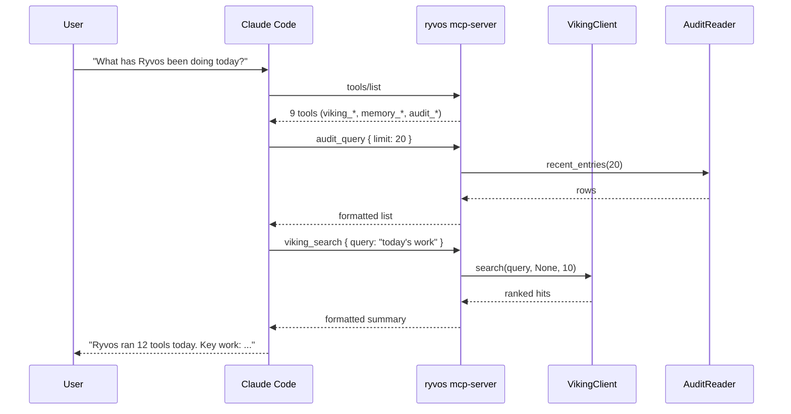

# MCP server API

Ryvos can act as an **[MCP](../glossary.md#mcp)** server in addition to
being an MCP client. When launched with the `ryvos mcp-server`
subcommand, the daemon exposes nine tools over stdio that cover
**[Viking](../glossary.md#viking)** hierarchical memory, file-based
workspace memory, and the **[audit trail](../glossary.md#audit-trail)**.
Any MCP-aware client — Claude Code, Claude Desktop, Cursor, Zed, or a
custom client built on the `rmcp` crate — can connect to this server
and read or write Ryvos state without speaking a Ryvos-specific
protocol.

The design goal is to make Ryvos's persistent memory and safety history
available to external coding assistants. A fresh `claude-code` session
running alongside Ryvos can ask `viking_search` for prior patterns,
read the audit trail for recent tool outcomes, and append a note to
`MEMORY.md` without going through the HTTP gateway. MCP is the
integration layer both ways: Ryvos pulls tools from external MCP
servers through `ryvos-mcp`'s client half, and Ryvos pushes its own
capabilities out through `ryvos-mcp`'s server half. The decision record
is [ADR-008](../adr/008-mcp-integration-layer.md).

This document is the wire-level reference for the nine tools. The
crate-level view — the `RyvosServerHandler` type, the `AuditReader`
read-only SQLite connection, how the `#[tool_router]` and
`#[tool_handler]` macros assemble the `ToolRouter` at build time — is
in [../crates/ryvos-mcp.md](../crates/ryvos-mcp.md).

## Transport and protocol

The server uses stdio exclusively. Streamable HTTP and SSE transports
are not exposed on the server side — they are client-only. The typical
deployment is to add Ryvos to an external client's MCP settings as a
stdio server spawned through `ryvos mcp-server`; see
[../guides/wiring-an-mcp-server.md](../guides/wiring-an-mcp-server.md)
for the config snippets for Claude Code, Claude Desktop, and Cursor.

The protocol is implemented on top of `rmcp` version 0.16 with
`ProtocolVersion::V_2024_11_05`. Server capabilities advertise only
the `tools` capability; the server does not expose resources, prompts,
or sampling. That means an external client sees a tool list and can
invoke tools, but cannot browse a resource tree the way it can with a
file-system MCP server.

The server info block advertised on `get_info` is:

| Field | Value |
|---|---|
| `server_info.name` | `ryvos` |
| `server_info.title` | `Ryvos Agent` |
| `server_info.description` | `Persistent agent memory & audit tools` |
| `server_info.version` | matches `CARGO_PKG_VERSION` (currently `0.8.3`) |
| `server_info.website_url` | `https://ryvos.dev` |
| `instructions` | `Ryvos agent memory & audit tools. Use viking_* to read/write persistent memory, audit_* to inspect tool history.` |
| `capabilities.tools` | enabled |

Clients display the `title` and `instructions` strings in their MCP
server list; the `instructions` field is what an external LLM sees
when deciding whether to call any of the nine tools. The source is
`crates/ryvos-mcp/src/server/handler.rs:43`.

## Running the server

The daemon exposes the server through a dedicated subcommand:

```bash
ryvos mcp-server
```

This launches an stdio MCP server bound to the same Viking store, the
same `audit.db`, and the same workspace as the main daemon. Because
`audit.db` is opened in WAL mode by the writer (see
`crates/ryvos-agent/src/audit.rs`), the MCP server can read it
concurrently with the main daemon's writes without any coordination.
Viking reads and writes go through the shared `VikingClient`, which
transparently routes to either the local `viking.db` or a remote
`ryvos viking-server` depending on configuration.

The server terminates when its stdio pipes close, which matches the
MCP client's lifecycle: when the client process exits, the server
exits too. There is no persistent daemonization on the MCP side.

## Graceful degradation

Each tool falls back to a human-readable "not available" string when
its backing dependency is `None`. This keeps the server usable in
minimal setups that have not wired in every subsystem:

- The four `viking_*` tools return `"Viking memory not available.
  Enable [openviking] in config.toml."` when the `VikingClient` is
  not attached.
- The two `audit_*` tools return `"Audit trail not available. Ensure
  the daemon is running."` when the `AuditReader` is not attached.
- The three file-memory tools always function because their only
  dependency is a workspace path, which is always set.

The fallback strings are plain text, not JSON, so a calling LLM sees
them as the tool output and can reason about them. This is preferable
to returning an MCP error, which most clients surface as "tool failed"
without showing the message.

## Tool reference

The nine tools are grouped into three families and documented
individually below. Each entry lists the tool name, the description
the client sees, the dependencies the handler checks, and the
parameter schema (derived from `schemars::JsonSchema` on the Rust
parameter struct).

The four **Viking memory** tools — `viking_search`, `viking_read`,
`viking_write`, `viking_list` — read and write the
**[Viking](../glossary.md#viking)** hierarchical memory store. Viking
entries are addressed with `viking://` URIs and organized into three
context levels: `L0` (summary), `L1` (details), and `L2` (full
content). All four depend on an attached `VikingClient` and degrade
to the "not available" string when the client is `None`.

### viking_search

```text
Name:        viking_search
Description: Search Viking hierarchical memory. Returns ranked
             results with relevance scores.
Depends on:  VikingClient
```

Parameters (`VikingSearchParams` in
`crates/ryvos-mcp/src/server/tools/mod.rs:11`):

| Field | Type | Required | Description |
|---|---|---|---|
| `query` | string | yes | Natural language search query. |
| `directory` | string | no | Restrict search to a `viking://` directory. |
| `limit` | integer | no | Max results (default 10). |

Internally, the tool calls `VikingClient::search(query, directory,
limit)` and returns the formatted result string. The underlying store
uses SQLite FTS5 on the local `viking.db` or a full-text search in
the remote `viking-server`. Ranking is provided by the store and
surfaced in the response.

### viking_read

```text
Name:        viking_read
Description: Read a Viking memory path at a specific detail level.
             L0=summary, L1=details, L2=full.
Depends on:  VikingClient
```

Parameters (`VikingReadParams`):

| Field | Type | Required | Description |
|---|---|---|---|
| `path` | string | yes | Viking path, e.g. `viking://user/preferences`. |
| `level` | string | no | Detail level: `L0`, `L1`, or `L2` (default `L1`). |

Unknown `level` values fall back to `L1`. The handler calls
`VikingClient::read_memory(path, level)` and returns the formatted
entry text.

### viking_write

```text
Name:        viking_write
Description: Write or update a memory entry in Viking. Use for
             persisting facts, preferences, patterns.
Depends on:  VikingClient
```

Parameters (`VikingWriteParams`):

| Field | Type | Required | Description |
|---|---|---|---|
| `path` | string | yes | Viking path, e.g. `viking://user/entities/server-ips`. |
| `content` | string | yes | Content to write. |
| `tags` | array of string | no | Optional tags for categorization. |

The handler calls the underlying Viking write method. Writes are
idempotent on path — writing the same path twice overwrites the
previous entry. Tags are stored alongside the entry and consulted by
`viking_search`.

### viking_list

```text
Name:        viking_list
Description: List Viking memory directory structure. Returns paths
             with L0 summaries.
Depends on:  VikingClient
```

Parameters (`VikingListParams`):

| Field | Type | Required | Description |
|---|---|---|---|
| `path` | string | no | Viking directory path (default `viking://`). |

The tool lists immediate children of the given directory along with
each child's L0 summary. This is the cheapest way for an external
client to discover what Viking knows without issuing a search.

The three **file-based memory** tools — `memory_get`, `memory_write`,
`daily_log_write` — operate on the workspace filesystem,
specifically on `MEMORY.md` and the `memory/` subdirectory under the
workspace root. They are useful for clients that want to drop a
persistent note into the same file the main daemon reads during
**[onion context](../glossary.md#onion-context)** assembly. All three
depend only on the workspace path, which is always set, so they
function even in a minimal server configuration.

### memory_get

```text
Name:        memory_get
Description: Read a memory file. Without a name, reads MEMORY.md.
             With a name, reads memory/{name}.md.
Depends on:  workspace path
```

Parameters (`MemoryGetParams`):

| Field | Type | Required | Description |
|---|---|---|---|
| `name` | string | no | Memory file name without extension; omit for `MEMORY.md`. |

The handler resolves `{workspace}/MEMORY.md` when `name` is absent and
`{workspace}/memory/{name}.md` when it is present, reads the file,
and returns the content. Missing files return an error string rather
than an MCP error, so a client that asks for a nonexistent memory
file sees the message in the tool output and can react.

### memory_write

```text
Name:        memory_write
Description: Append a timestamped note to persistent memory
             (MEMORY.md).
Depends on:  workspace path
```

Parameters (`MemoryWriteParams`):

| Field | Type | Required | Description |
|---|---|---|---|
| `note` | string | yes | The note to append. |

The handler prepends an ISO-8601 timestamp to the note and appends
the result to `{workspace}/MEMORY.md`, creating the file if it does
not exist. Writes are line-atomic — each call appends a single
timestamped block.

### daily_log_write

```text
Name:        daily_log_write
Description: Append a timestamped entry to today's daily log
             (memory/YYYY-MM-DD.md).
Depends on:  workspace path
```

Parameters (`DailyLogWriteParams`):

| Field | Type | Required | Description |
|---|---|---|---|
| `entry` | string | yes | Log entry text; timestamp added automatically. |

The handler resolves the current date, opens
`{workspace}/memory/YYYY-MM-DD.md` (creating it when needed), and
appends the timestamped entry. This is the canonical way for an
external client to add to a rolling daily journal that the main
daemon reads back into the narrative layer of the onion context.

The two **audit-trail** tools — `audit_query` and `audit_stats` —
read `audit.db` through a separate read-only SQLite connection
opened by `AuditReader` in
`crates/ryvos-mcp/src/server/audit_reader.rs`. Because the writer
opens the database in WAL mode, the MCP server can read consistent
snapshots concurrently with the daemon's writes without blocking or
being blocked. Both depend on an attached `AuditReader` and degrade
to the "not available" string when it is `None`.

### audit_query

```text
Name:        audit_query
Description: Query recent tool executions — shows tool name, input,
             outcome, and timestamp.
Depends on:  AuditReader (read-only audit.db handle)
```

Parameters (`AuditQueryParams`):

| Field | Type | Required | Description |
|---|---|---|---|
| `limit` | integer | no | Number of recent entries to return (default 20). |

The handler calls `AuditReader::recent_entries(limit)`, which runs a
`SELECT ... ORDER BY timestamp DESC LIMIT ?` over the audit table.
Rows are returned as a formatted string that lists each tool call's
session ID, tool name, input summary, outcome, and timestamp.

### audit_stats

```text
Name:        audit_stats
Description: Get aggregate tool call statistics — counts per tool,
             total calls.
Depends on:  AuditReader
```

No parameters. The handler calls `AuditReader::tool_counts()`, which
runs a `SELECT tool_name, COUNT(*) FROM audit_entries GROUP BY
tool_name ORDER BY count DESC` over the audit table, and returns
the formatted breakdown. Useful for answering "which tool has the
daemon called most often?" without writing SQL.

## Example usage from Claude Code

A typical session from an external client looks like this. The
client's MCP configuration names the Ryvos server, spawns the
`ryvos mcp-server` subcommand, and treats its nine tools the same
way it treats any other MCP server's tools.



The client's LLM decides which tools to call based on the `instructions`
string in `get_info`, the per-tool `description`, and the per-field
descriptions derived from the Rust doc comments on the parameter
structs. Ryvos does not push notifications to MCP clients — the
protocol is call-and-response from the client's perspective, even
though Ryvos itself is publishing events on its own EventBus.

## Error handling

Two kinds of failures can happen on the server side: a missing
dependency (Viking or audit not attached) and a lower-layer error
(SQLite read failure, filesystem I/O error, malformed Viking path).
The first class returns the "not available" string described above.
The second class returns a plain-text error message inside the tool
output, prefixed with the operation that failed. For example, a
corrupt `audit.db` might surface as `"audit query failed: database
is locked"`. In both cases the tool call itself succeeds from the
MCP protocol's perspective — the failure is embedded in the output
string rather than propagated as an MCP error. This keeps the
calling LLM in the driver's seat: it sees the error, can reason
about it, and can choose to retry or switch tools without the
client forcibly aborting the turn.

One consequence of the plain-string approach is that structured
output parsing is not possible on the client side. A caller that
wants to read Viking search results into a database must parse the
formatted string the tool returns, or run a follow-up `viking_read`
on the specific path. The server-side formatter is optimized for
LLM consumption rather than machine consumption; the assumption is
that the caller is itself an LLM and can read the output as prose.

## Version and compatibility

The server is tied to `rmcp` 0.16 and the MCP protocol version
`V_2024_11_05`. When `rmcp` or the protocol revision upgrades,
`ryvos-mcp` is updated in lockstep — the crate does not speak
multiple protocol versions at once. Clients connecting with an
older protocol version will see an MCP handshake failure and
should upgrade to a recent client. The decision to pin exactly one
protocol version is recorded in
[ADR-008](../adr/008-mcp-integration-layer.md) along with the
rationale for using rmcp rather than a custom protocol
implementation.

Tool names, descriptions, and parameter schemas are stable across
Ryvos patch releases. Added tools and added parameters are allowed
in minor releases; removed tools or changed semantics require a
major-release bump. The nine tools listed above are the complete
set as of v0.8.3.

## Cross-links

- [../crates/ryvos-mcp.md](../crates/ryvos-mcp.md) — the crate
  reference for both the client and the server, including the
  `McpClientManager`, `RyvosClientHandler`, `McpBridgedTool`, and the
  `#[tool_router]` / `#[tool_handler]` macros.
- [../guides/wiring-an-mcp-server.md](../guides/wiring-an-mcp-server.md) —
  a task-oriented walkthrough for wiring Ryvos into Claude Code,
  Claude Desktop, or Cursor.
- [../adr/008-mcp-integration-layer.md](../adr/008-mcp-integration-layer.md) —
  the decision record for using MCP as Ryvos's integration layer both
  inbound and outbound.
- [../internals/mcp-bridge.md](../internals/mcp-bridge.md) — how the
  client side dispatches bridged tools, which is the mirror image of
  the server side documented here.
