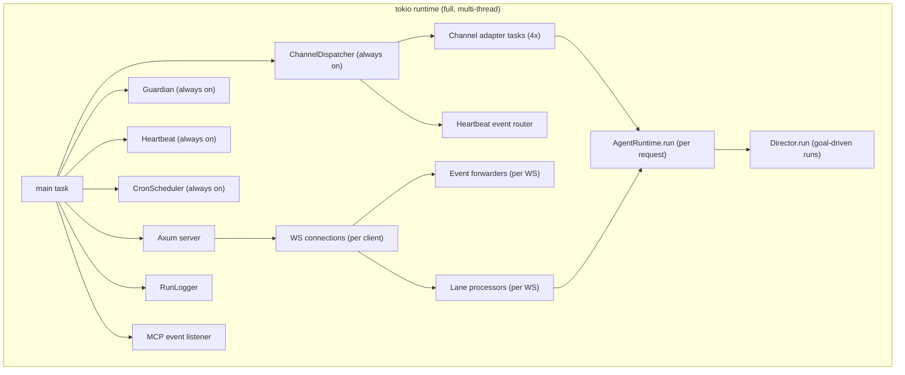

# Concurrency model

Ryvos runs on a single multi-threaded `tokio` runtime. Every subsystem —
the agent loop, the Director, the Guardian, the Heartbeat, each channel
adapter, each connected gateway client, the cron scheduler, the MCP bridge
— is a tokio task, scheduled cooperatively on the same executor. This
document lays out the task topology, the synchronization primitives Ryvos
uses for shared state, the cancellation discipline, and the places where
parallelism shows up.

[execution-model.md](execution-model.md) already covered *what* the agent
loop does per turn. This document is about *how the task graph is shaped*
and *why* the specific primitives were chosen. It assumes you have read the
execution model and the system overview.

## One runtime, many tasks

The binary's `fn main` constructs a single `tokio::runtime::Runtime` with
the `full` feature set enabled. Every `tokio::spawn`, every channel, every
`tokio::time::interval`, and every `tokio::sync` primitive in the process
lives on that runtime. There is no secondary runtime, no thread pool for
CPU work outside `spawn_blocking`, and no nested `block_on` calls.

The one-runtime rule is what makes cancellation, backpressure, and fairness
tractable. Every task shares the same scheduler, so no task can be starved
by an unrelated pool; every awaitable eventually wakes on the same reactor,
so cancellation propagates uniformly; and every future is polled by worker
threads drawn from the same worker set, so there is no coordination tax
between runtimes.

The runtime houses two classes of task: **long-lived background tasks**
that are spawned at startup and run until shutdown, and **per-request
tasks** that are spawned for a specific message or operation and finish
when that operation completes. The agent loop is per-request; the Guardian,
Heartbeat, cron scheduler, channel dispatcher, run logger, and MCP event
listener are long-lived.

## Background tasks

The long-lived tasks are spawned during daemon boot from `fn main`. Each
one runs a `loop` that awaits on some combination of timer, channel, or
event bus.

### Agent runtime task

The foreground task per user request. Spawned by the channel dispatcher,
the gateway lane processor, or the CLI REPL. Runs `AgentRuntime::run` to
completion and returns the final assistant text. Multiple agent runtime
tasks can be active simultaneously on different sessions — there is no
global lock that serializes runs across sessions. The only serialization
happens *within* a single WebSocket connection (via the lane) and
*within* a single conversational session on the channel path (because the
dispatcher's per-envelope task waits on `run_handle.await` before sending
the response).

### Guardian

Spawned once at boot. Subscribes to the `EventBus`, maintains the doom
loop fingerprint window, stall timer, and budget accumulator, and fires
`GuardianHint` or `GuardianDoomLoop` events when thresholds are crossed.
The Guardian never holds a lock that the agent loop is contending for; it
reads events and writes events. When it wants to influence a run, it
sends a `GuardianAction::InjectHint` over an mpsc channel that the agent
loop drains at the top of every turn. See
[../internals/guardian.md](../internals/guardian.md) for the full timing.

### Heartbeat

Spawned once at boot. Owns a `tokio::time::interval` with period
`heartbeat_secs`. On each tick it spawns a fresh agent run using the
`HEARTBEAT.md` prompt. The run proceeds like any other, passes through the
Guardian, and if the agent reports nothing interesting the response is
suppressed. See [../internals/heartbeat.md](../internals/heartbeat.md).

### Cron scheduler

Spawned once at boot. Owns its own `tokio::time::interval` ticked at
coarse granularity (one second in practice). On each tick it consults the
persistent cron table, fires any jobs whose next-run timestamp has passed,
and publishes `CronFired { job_id, prompt }` before spawning the run. When
the run completes it publishes `CronJobComplete { name, response, channel }`
which the channel dispatcher's heartbeat event router picks up. See
[../internals/cron-scheduler.md](../internals/cron-scheduler.md).

### Channel dispatcher

Spawned once at boot. Holds the `HashMap` of adapters, owns the central
`mpsc::Receiver<MessageEnvelope>` (buffer 256), and owns the background
heartbeat event router. The dispatcher's main loop is a plain `while let
Some(envelope) = rx.recv().await` that spawns a per-envelope task for each
inbound message. The spawned tasks handle the envelope concurrently, so a
slow adapter does not block new messages from other adapters.

### Per-adapter tasks

Each channel adapter (Telegram, Discord, Slack, WhatsApp) owns at least one
task when started. Telegram and Discord use long-poll or gateway
subscriptions, so they effectively run a read loop; Slack uses Events API
webhooks routed through the gateway; WhatsApp uses Cloud API webhooks. The
adapters all push into the same mpsc Sender owned by the dispatcher, so
the adapter tasks and the dispatcher task communicate through that single
channel.

### Gateway server

The Axum HTTP server runs as a single task that accepts TCP connections
and hands them off. REST handlers run as Axum-spawned per-request tasks.
WebSocket upgrades result in a `handle_connection` task per client, and
that task in turn spawns two children (event forwarder, lane processor).

### Per-connection forwarder

Spawned inside `handle_connection` at `crates/ryvos-gateway/src/connection.rs:57`.
Subscribes to the EventBus, translates ~23 of the 29 event types into
`ServerEvent` frames, and writes them to the outbound sink. Aborted on
disconnect.

### Per-connection lane processor

Spawned inside `handle_connection` at
`crates/ryvos-gateway/src/connection.rs:331`. Pulls items from the
`LaneQueue` mpsc receiver, runs each through `process_request`, and sends
the result back on the oneshot attached to the item. One at a time: that
is the lane's defining property. Aborted on disconnect.

### MCP event listener

The MCP client bridge spawns a background task per connected server. Each
task reads notifications from its server (over stdio or streamable HTTP)
and translates them into Ryvos events or tool invalidations. See
[../internals/mcp-bridge.md](../internals/mcp-bridge.md).

### RunLogger

Spawned once at boot. Subscribes to the EventBus, serializes each event
as a JSONL line, and appends it to `~/.ryvos/logs/runs.jsonl`. Purely a
consumer; publishes nothing. The RunLogger is a useful reference for the
subscribe-and-persist pattern used by audit and cost tracking.

## The three channel types

Ryvos uses three distinct channel primitives for distinct purposes, and
the choice of primitive is load-bearing for the design.

### broadcast for the EventBus

The `EventBus` is a single `tokio::sync::broadcast::Sender<AgentEvent>`
with capacity **256** (see `crates/ryvos-core/src/event.rs:39`). Broadcast
channels fan out: every subscriber receives every message, with the
caveat that a slow subscriber will eventually lag and lose messages when
its buffer overflows.

The broadcast choice is deliberate. Events in Ryvos are fan-out by nature
— a single `ToolEnd` is interesting to the audit writer, the cost tracker,
the Guardian, every connected Web UI client, the channel dispatcher, and
potentially the Director. Point-to-point channels would require the
publisher to know its subscribers, which is exactly the coupling the
EventBus is meant to break.

Capacity 256 is enough buffer for the normal case. A turn that fires 30
events (a few `TextDelta`s, a few `ToolStart`/`ToolEnd`s, a `TurnComplete`)
can overlap with another turn's 30 events and still leave headroom. A
stalled subscriber that stops draining for a few seconds will eventually
start lagging when the 257th event arrives while the first is still
unread.

See ADR-005 for the full rationale and the durability argument (critical
subscribers also persist to SQLite, so a dropped event never loses data).

### mpsc for backpressure-sensitive queues

`tokio::sync::mpsc` (multi-producer, single-consumer) is used where
back-pressure is desirable or the message is too expensive to drop:

- **Channel envelope queue.** The central `mpsc::Sender<MessageEnvelope>`
  in `ChannelDispatcher::run` (buffer 256). When the dispatcher falls
  behind, adapters' sends block rather than drop, which is the correct
  behavior for user-facing messages.
- **Guardian hints.** The Guardian produces `GuardianAction` values on an
  `mpsc::Sender<GuardianAction>` that the agent loop drains at the top of
  every turn. Buffer size is small (default 16); if the Guardian produces
  hints faster than the agent consumes them, the Guardian's send future
  yields and tries again. In practice the queue is almost always empty.
- **Lane queue.** Each WebSocket connection owns a `LaneQueue` backed by
  an mpsc with buffer 32 — a **[lane](../glossary.md#lane)**. The lane
  is the gateway's serialization guarantee: every request from one
  connection goes through the same queue, so the lane processor sees them
  in arrival order and handles them one at a time.
- **WhatsApp webhook fan-in.** The WhatsApp adapter receives webhooks on
  a gateway route and forwards them over an mpsc into the adapter's
  processing loop. The mpsc isolates the Axum handler from the adapter's
  internal state, which is protected by a separate mutex.
- **Telegram callback handling.** The Telegram adapter uses a small mpsc
  to marshal callback queries (approval button presses) from the poll
  loop to the adapter's state handler.

### oneshot for request/response and signals

`tokio::sync::oneshot` is used for single-use sender/receiver pairs:

- **Approval broker responses.** When a tool call is paused for approval,
  the broker inserts a `(ApprovalRequest, oneshot::Sender)` into its
  pending map (see `crates/ryvos-agent/src/approval.rs:33`). The agent
  loop awaits on the paired `oneshot::Receiver`. When a decision arrives
  via the `/approve` or `/deny` path, the broker looks up the ID and
  sends on the stored sender; the agent loop wakes up and continues.
  Each approval has its own oneshot; there is no shared channel across
  pending approvals.
- **Lane request completion.** Each item in the lane queue carries a
  `respond: oneshot::Sender<Result>` that the lane processor uses to
  return the result back to the WS frame handler waiting synchronously
  on the corresponding receiver.
- **Adapter shutdown signals.** Each adapter's start method receives a
  oneshot that fires on shutdown so the adapter can drain cleanly.

Oneshots are the right primitive when the producer fires exactly once and
the consumer waits for exactly that fire. Using a mpsc for this would
hide the single-use semantics; using a broadcast would be absurd.

## Mutex model

Ryvos uses three flavors of mutual exclusion. The choice is driven by
whether the critical section needs to await and how long it is held.

### std::sync::Mutex for SQLite connections

The SQLite stores (`SqliteStore`, `VikingStore`, `CostStore`,
`SessionMetaStore`, `FailureJournal`, `SafetyMemory`, `AuditTrail`) each
hold their `rusqlite::Connection` inside a `std::sync::Mutex<Connection>`.
SQLite operations are synchronous and fast — a point query returns in
microseconds — so the critical section is short enough that an async
mutex would add more overhead than it saves.

The lock is held for the duration of a query or a short transaction.
Because each store has its own connection and its own mutex, cross-store
queries do not block each other: the audit writer and the cost tracker
can run simultaneously without contention. Within a single store, the
mutex serializes the writes; SQLite's WAL mode lets readers continue
against the last committed snapshot.

The one nuance: inside async code, holding a `std::sync::Mutex` across an
`.await` is a deadlock risk, because the executor can park the task while
the lock is still held. Ryvos follows the discipline of acquiring,
operating, and releasing the mutex without awaiting anything in the
middle — every call site reads as `let conn = self.conn.lock().unwrap();
conn.execute(...)?;` and drops the lock when the block ends.

### tokio::sync::Mutex for IntegrationStore and approvals

`tokio::sync::Mutex` appears where the critical section genuinely needs
to await:

- **IntegrationStore.** Wraps the SQLite connection in an async mutex
  because its public methods are `async fn` and their callers hold the
  lock across awaits (see
  `crates/ryvos-memory/src/integration_store.rs`). The tradeoff is
  accepted because integration operations are rare (OAuth token lookups,
  token refresh) and the async mutex correctness wins over the sync mutex
  performance.
- **ApprovalBroker pending map.** The broker's `HashMap` of pending
  approvals lives inside a `tokio::sync::Mutex`. Insertions and removals
  are short, but the broker's public surface is async and the tests use
  tokio patterns, so async mutex was the simpler fit.
- **Connection WebSocket sink.** Each WebSocket connection wraps its
  outbound half (`ws_tx`) in an `Arc<tokio::sync::Mutex<...>>` so the
  main frame handler and the event forwarder can both write to it
  without interleaving frames. The lock is held only across a single
  `tx.send(Message::Text(...)).await`.

### tokio::sync::RwLock for the tool registry

The `ToolRegistry` — the central list of available tools — is wrapped in
`tokio::sync::RwLock<ToolRegistry>`. Reads vastly outnumber writes: every
agent turn acquires a read lock to enumerate tool definitions and look up
a tool by name, but writes only happen when skills are loaded, MCP servers
connect, or an administrative endpoint adds a tool at runtime. `RwLock`
lets multiple readers acquire the lock concurrently, which matters when
multiple agent runs are active on different sessions.

The registry itself is stored as `Arc<tokio::sync::RwLock<ToolRegistry>>`
inside `AgentRuntime`, so the runtime is cloneable by `Arc::clone` and
every clone shares the same registry.

## The Arc pattern

Every piece of shared state in Ryvos is wrapped in `Arc<...>`. `AppState`
in the gateway is `Arc<AppState>`, `AgentRuntime` lives inside
`Arc<AgentRuntime>`, `EventBus` is `Arc<EventBus>`, each store is an
`Arc<dyn SessionStore>` or `Arc<SqliteStore>`, and so on. The pattern is so
pervasive that the dispatcher and the gateway routes take `state.runtime.clone()`
dozens of times across the codebase.

Ref-counting is the right shape here because:

- Tasks outlive their spawners. The channel dispatcher spawns a task per
  envelope; the task may finish long after the dispatcher has moved on to
  the next envelope, but both need access to the runtime.
- Background tasks hold references to shared state that lives as long as
  the daemon. Without `Arc`, the state would need to live in `'static`
  globals or be threaded through every function signature.
- `Arc` is cheap. The reference count is atomic but rarely contended in
  practice, and cloning a small `Arc` is a single increment.

When the daemon shuts down, `AppState` and everything it holds is dropped
last. All outstanding `Arc` references reach zero in order: first the
per-request tasks finish, then the background tasks exit after observing
the cancellation token, then the `Arc` counts drop and the SQLite
connections close. There is no explicit teardown beyond dropping the state.

## Cancellation tokens

Every run in Ryvos is started with a
`tokio_util::sync::CancellationToken`. The token is created by the runtime
at construction time and stored in `AgentRuntime.cancel`. It is threaded
through:

- The agent loop (`AgentRuntime::run_turn` checks it at the top of every
  turn — see `crates/ryvos-agent/src/agent_loop.rs:494`).
- The LLM stream dispatch (`tokio::select!` with
  `cancel.cancelled()` as one branch, so the stream future is dropped when
  the token fires — see `crates/ryvos-agent/src/agent_loop.rs:524`).
- Tool execution (each tool call checks at its next await point).
- The Guardian, Heartbeat, CronScheduler, and channel dispatcher each
  clone the same token and exit their own loops when it fires.
- The Director passes it to the `GraphExecutor`, which in turn passes it
  to each per-node `runtime.run_turn` call.

Cancellation fires from several sources:

- **User cancel.** TUI `Esc`, REPL `/cancel`, Web UI stop button, or a
  channel-specific cancel command.
- **Session end.** When the session is explicitly closed.
- **Daemon shutdown.** A SIGINT or SIGTERM handler cancels the root
  token, which propagates to every subsystem.
- **Director per-node timeout.** When a DAG node exceeds its time budget
  the Director cancels just that node's subordinate token.

Because cancellation is cooperative, a tool blocked on a blocking syscall
will not observe it until the syscall returns. Ryvos mitigates this by
running blocking work in `tokio::task::spawn_blocking` and polling the
token between chunks, which keeps cancellation latency under a second in
practice.

When the token fires mid-run the agent catches `RyvosError::Cancelled`,
publishes a terminal event, and unwinds. A cancelled turn is still
checkpointed, so the next resume sees a consistent state: either the run
completed all its turns, or the last turn before cancellation is the
checkpoint.

## Parallelism inside a turn

The intra-turn parallelism story is simple but important.

### Parallel tool dispatch

When the LLM returns a single assistant message with multiple `tool_use`
blocks, the agent runtime dispatches them in parallel via `tokio::spawn`
and joins the results with `futures::future::join_all`. The security gate
is safe to enter concurrently because its work is confined to per-call
state (audit entry, safety lesson lookup) plus a single SQLite insert
under the audit mutex.

Tools that must be serial within a batch (for example, two `git_commit`
calls targeting the same repository) are marked as serial in their
metadata. When the batch contains a serial tool, the dispatcher still
parallelizes the non-serial ones but runs the serial ones in sequence.

### Parallel director nodes

The Director's graph executor walks ready nodes (nodes whose predecessors
have all succeeded) and dispatches them in parallel. Nodes with direct
data dependencies run in sequence; independent branches of the DAG run
concurrently. This is how a multi-file refactor can test three files at
once when the plan does not declare dependencies between them.

### Parallel event delivery

The EventBus broadcast delivers each event to every subscriber's local
buffer. Subscribers drain their own buffers on their own tasks, so event
consumption is parallel across subscribers. A slow audit writer cannot
stall the Web UI forwarder, and a slow forwarder cannot stall the
Guardian.

## Slow subscriber handling

The broadcast channel's one gotcha is the lag semantics. When a subscriber
falls behind by more than the channel capacity (256 events), the next
`recv()` returns `RecvError::Lagged(n)` where `n` is the number of events
the subscriber missed.

Ryvos handles lag by logging, dropping the lagged count, and resubscribing
where needed. For the Web UI forwarder in particular, missing events is
only a display issue — the durable record is in the audit database, and
the Web UI will simply redraw from the next event onward. The `FilteredReceiver`
wrapper in `crates/ryvos-core/src/event.rs:174` is shaped to make this
pattern easy: callers that want a filtered subscription can iterate and
catch lag without repeating the filter logic.

## Drop behavior

The daemon shuts down by cancelling its root `CancellationToken`. Every
task that was waiting on that token wakes, observes the cancellation,
cleans up, and returns. The `tokio::spawn` handles are either awaited or
aborted by the parent task. The `Arc<AppState>` then drops, which drops
the `Arc<AgentRuntime>`, which drops the runtime's references to the
stores, which drops each store's `Mutex<Connection>`, which closes the
SQLite connection and checkpoints the WAL.

There is no explicit shutdown ordering beyond the cancellation token.
Tasks exit in whatever order they observe the cancellation; the Arc
graph handles the rest. The correctness argument is that each store owns
its own data and can be dropped independently, the EventBus is a
broadcast that no one is still sending to once tasks have cancelled, and
SQLite's WAL mode guarantees consistency on connection close.

The one wrinkle is the event forwarder in each WebSocket connection.
When the WS disconnects, the `handle_connection` task calls `abort` on
the forwarder and the lane processor. `abort` is more brutal than
cancellation — it drops the task's future in whatever state it is in —
but because the forwarder's state is just a broadcast receiver and a
mutex guard, dropping it is safe.

## Where to go next

- [../internals/event-bus.md](../internals/event-bus.md) — the broadcast
  semantics, filtered subscriptions, and the 29 event variants in detail.
- [../internals/agent-loop.md](../internals/agent-loop.md) — the turn
  state machine, every await point, and the cancellation check sites.
- [../crates/ryvos-core.md](../crates/ryvos-core.md) — the `EventBus`
  implementation and the core traits.
- [data-flow.md](data-flow.md) — how messages flow through the task
  topology described here.
- [../adr/005-event-driven-architecture.md](../adr/005-event-driven-architecture.md)
  — why broadcast was chosen over direct coupling.
