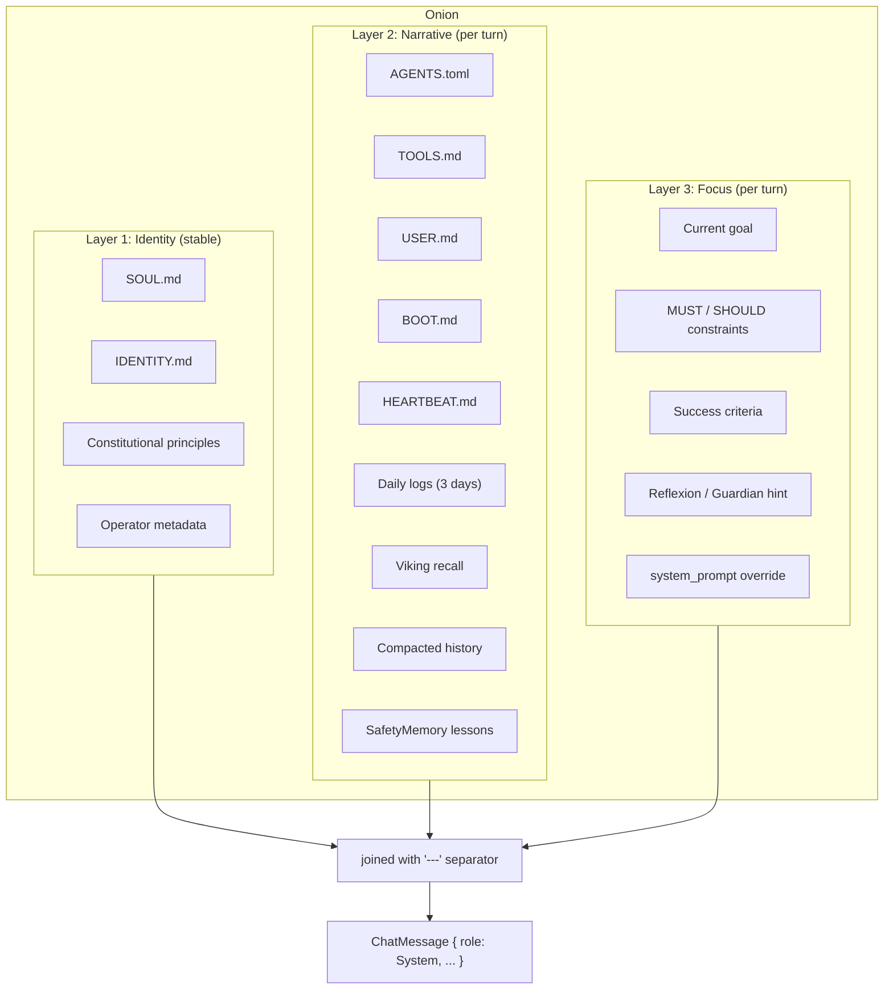
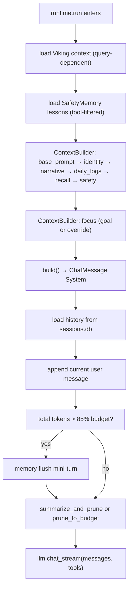

# Context composition

Before every LLM call Ryvos assembles a system prompt from a well-defined
stack of sources. The stack is the **[onion context](../glossary.md#onion-context)**:
three layers wrapped from the inside out, each with its own refresh cadence,
its own inputs, and its own job. The onion is rebuilt at the start of every
run — and the outer layers are rebuilt at the start of every turn within that
run — so the model always sees a composition that reflects the latest state
of the world.

This document explains what each layer contains, where the sources come
from, how the layers are combined, and how the runtime keeps the whole thing
within the token budget. The implementation lives in
`crates/ryvos-agent/src/context.rs` and is invoked from
`crates/ryvos-agent/src/agent_loop.rs:264`.

## Why three layers?

Early drafts of the agent used a single concatenated system prompt assembled
on demand from whatever files happened to exist in the workspace. That worked
for a proof of concept but broke in two predictable ways: first, small
changes to operator instructions would bury the agent's *personality* in
noise; second, task-specific context (the current goal, a just-arrived
reflexion hint) would get lost somewhere in the middle of a 20,000-token
wall of history.

The three-layer onion separates concerns:

- **Stable identity** at the core — the agent's personality, role, and the
  facts about its operator. These rarely change and should never be pruned.
- **Rich narrative** around the core — recent conversations, learned
  patterns, project context, sustained memory from **[Viking](../glossary.md#viking)**.
  This is the long tail of what the agent knows, and it is rebuilt every turn
  so fresh recall replaces stale fragments.
- **Focused task** at the outermost shell — the current user message, the
  goal being pursued (if any), MUST/SHOULD constraints, and any corrective
  hint the Guardian or Reflexion subsystem has injected. This is the smallest
  and most volatile part.

The metaphor is deliberate: the inner onion layer is effectively immutable
for the life of a run, the middle layer breathes with each turn, and the
outer layer is rewritten on demand. An LLM reading the final prompt sees
"who I am" first, "what I know" next, and "what I am doing right now" last —
which is also, not coincidentally, the order in which a human operator would
brief a new colleague.

## Layer 1: Identity

The innermost layer answers "who is the agent and who does it serve?". It is
loaded by `ContextBuilder::with_identity_layer` at
`crates/ryvos-agent/src/context.rs:72` and it reads two files from the
workspace directory.

### Sources

- **`SOUL.md`** — the personality file. Produced by the `ryvos soul`
  onboarding interview and shaped by the user's answers to fifteen questions
  about tone, proactivity, operator context, projects, and character. See
  [../glossary.md#soulmd](../glossary.md#soulmd) for the full breakdown.
  Typical content is a short block of first-person prose describing how the
  agent should speak, what it should volunteer, and what it should hold back.
- **`IDENTITY.md`** — the agent's role and immutable facts. Agent name, a
  one-sentence mission statement, any hard constraints the operator wants
  always present ("you are Ryvos running for user `it8` on a Debian
  workstation; your primary language is English; you never pretend to be
  human").

Both files are optional. If the workspace lacks one, the builder silently
skips it. If it lacks both, the agent still runs but with no personality —
the base system prompt from `DEFAULT_SYSTEM_PROMPT` (defined at
`crates/ryvos-agent/src/context.rs:201`) provides the minimum viable agent
identity and the safety constitution.

### Framing

The identity layer also contains two sources that are *not* files:

- **Constitutional principles.** The seven principles of
  **[Constitutional AI](../glossary.md#constitutional-ai)** — Preservation,
  Intent Match, Proportionality, Transparency, Boundaries, Secrets, Learning,
  plus the external-data handling rule — are appended by the base prompt.
  They are effectively fixed across runs and belong with the identity layer
  because they define *how* the agent reasons regardless of the task.
- **Operator metadata.** The agent's operator username, timezone, and default
  workspace path. These are read once from the config tree in
  `AppConfig` and are considered part of the stable identity because they
  change only when the user reconfigures Ryvos.

### Lifecycle

The identity layer is built on every run, but its inputs are cheap: four
file reads plus a handful of string formats. There is no network I/O and no
SQL. Rebuilding it per run is effectively free. It is never pruned, never
summarized, and never subjected to the token budget — if `SOUL.md` grows to
10,000 tokens the entire context budget expands around it rather than
pushing it out.

## Layer 2: Narrative

The middle layer is the *long tail* of what the agent knows about the user,
the workspace, and the conversation history. It is the largest of the three
layers by far and is the main target for pruning and summarization. The
layer is assembled by three separate builder calls in
`crates/ryvos-agent/src/context.rs`:

- `with_narrative_layer` (line 79) — project narrative files.
- `with_daily_logs` (line 91) — recent daily log files from `memory/`.
- `with_recall_layer` (line 166) — Viking sustained context injected as a
  pre-formatted string.

Treating the layer as three sub-layers makes it easy to swap a source out
without touching the others. Below, the sub-layers are labeled 2a, 2b, and
2c for clarity; they are not labeled that way in the code.

### Sub-layer 2a: project narrative

Five files are read from the workspace directory if they exist:

- **`AGENTS.toml`** — the repository-local agent profile. Declares which
  tools the agent should use, per-agent defaults, and optional system prompt
  fragments. This file is how a project pins a specific tool set or a
  specific model without touching global config.
- **`TOOLS.md`** — human-readable tool usage conventions. Things like "always
  use `read_file` before `write_file` on anything over 100 lines", or "the
  `deploy` skill takes a `dry_run` argument that should be set to `true` the
  first time each day". These are soft rules the agent can cite back when
  it explains a choice.
- **`USER.md`** — operator information. Distinct from the operator metadata
  in Layer 1 because it contains *preferences* ("I prefer concise answers",
  "My Spanish is fluent, feel free to switch"), not facts.
- **`BOOT.md`** — one-time boot instructions. Content that should be
  surfaced at the start of every run but might change frequently. Used for
  example to pin "current sprint goal" or "this week's focus" that the
  operator wants the agent aware of across sessions.
- **`HEARTBEAT.md`** — the periodic self-check prompt. Used primarily by the
  **[Heartbeat](../glossary.md#heartbeat)** subsystem as the prompt body for
  its own runs, but it is also included in the narrative layer of regular
  runs so the agent knows what it is checking for when asked "anything
  interesting?".

Each file is read fresh every turn. The builder prefixes each with an
H1 heading (`# Agent Configuration`, `# Tool Usage Conventions`, etc.) so
the LLM can parse them as a structured document rather than as an undifferentiated
text blob.

### Sub-layer 2b: daily logs

The `with_daily_logs` call walks `workspace/memory/YYYY-MM-DD.md` files for
the last `N` days (default `3`, see `crates/ryvos-agent/src/context.rs:322`).
Each day's file is a free-form log the agent or the user appended to during
that day's sessions. The builder:

- Reads each file in order from oldest to newest.
- Prepends a `## YYYY-MM-DD` subheading to each.
- Joins them into a single section headed `# Recent Daily Logs`.
- Skips empty or missing files.

Daily logs are how Ryvos gets continuity across sessions without paying the
Viking lookup cost on every turn. A user who worked on a bug yesterday will
see yesterday's log in today's context automatically.

### Sub-layer 2c: Viking recall

The final narrative input is the `with_recall_layer` call, which receives a
pre-built string from `ryvos_memory::viking::load_viking_context`. That
function is called from `crates/ryvos-agent/src/agent_loop.rs:279` and does
two things:

- **Top-N L0 summaries.** Loads the `N` most relevant `L0` summary entries
  from the `user/` and `agent/` directories of the Viking store. These are
  the "quick refresher" lines that define what the agent knows about the
  user and about itself. Each is a sentence or two; loading ten of them
  costs only a few hundred tokens.
- **FTS5 semantic search.** Runs a full-text search against the current
  user prompt and the last few assistant messages. Results are appended as
  compact snippets with their `viking://` URIs so the agent can follow up
  with `viking_read` for full content if needed.

The output is a single string formatted with markdown headings and URIs,
which the context builder appends as another narrative section. If Viking
is unavailable (no `viking.db`, the store failed to open, or the lookup
returned nothing) the string is empty and the section is skipped entirely.

### Sub-layer 2c': safety lessons

Immediately after Viking recall, the runtime calls
`SafetyMemory::format_for_context(&tool_names, 5).await` (see
`crates/ryvos-agent/src/agent_loop.rs:306`) to get a compact string of up
to five relevant safety lessons. Lessons are filtered by the tools available
in this run — only rules that apply to tools the agent can actually invoke
are injected. The string is passed to `with_safety_context`, which adds it
to the builder as another narrative section.

Safety lessons are *advisory* context, not a blocklist. They read like "last
time you ran `rm -rf $HOME/build` without checking if the target was a
symlink, it deleted source files; always `ls -la` the path first". The
agent is free to deviate from the lesson if the current situation warrants
it. See [../internals/safety-memory.md](../internals/safety-memory.md) for
the lesson schema and reinforcement rules.

### Sub-layer 2c": compacted history

If a previous turn triggered summarization, the resulting summary is
injected via `with_summary`. The format is
`# Previous Conversation Summary` followed by the text. This replaces a
chunk of older messages that were pruned from the conversation history, so
the LLM has a narrative of what was discussed without the token cost of the
raw messages.

### Lifecycle

Every piece of the narrative layer is rebuilt at the start of every turn.
There is no caching between turns for three reasons:

- The file sources might change under the agent's feet (the operator could
  edit `USER.md` while a run is in progress; the next turn should pick up
  the edit).
- Viking recall is query-dependent; a search against "what about the thing
  we discussed?" yields different results than a search against the
  original user message.
- Safety lessons are filtered by the active tool set, which can shift
  between turns (MCP servers can connect and disconnect, skills can be
  loaded dynamically).

The cost of rebuilding is small in absolute terms — a handful of file reads
plus one FTS5 query — but it is what gives Ryvos its *fresh-every-turn*
behavior. If narrative layer assembly ever shows up in a profile, the fix
will be targeted caching inside each source (for instance, remembering the
result of the Viking search across turns that did not bring new messages),
not a turn-level cache.

## Layer 3: Focus

The outermost layer contains the three things that change most rapidly: the
task, the constraints, and any just-in-time corrections. It is built by
`with_focus_layer` at `crates/ryvos-agent/src/context.rs:140`.

### Sources for goal-driven runs

When the run has an attached **[goal](../glossary.md#goal)**, the focus
layer includes:

- **Goal description.** The free-text description of what the goal is. This
  is what the user or the goal authoring code wrote as the task statement.
- **Constraints.** A bullet list of `MUST` (hard) and `SHOULD` (soft)
  constraints, each tagged with its category (time, cost, safety, scope,
  quality). The formatting is deliberately flat so the LLM parses them
  uniformly rather than ranking hard constraints as more important than
  soft ones — the weighting is done by the
  **[Judge](../glossary.md#judge)**, not by prose framing.
- **Success criteria.** A weighted list of criteria that the Judge will
  evaluate the final output against. Each line shows the criterion's text
  and its weight as a float. The agent sees exactly what it is being graded
  on, which is the whole point of exposing the criteria in the prompt.

### Sources for reactive runs

When the run has no goal (the common case: a chat message, a Telegram
reply, a cron job that did not specify criteria), the focus layer is much
smaller:

- **Instructions override.** If `ryvos.toml` set `agent.system_prompt` to a
  literal string or a `file:path` reference, its content is injected here.
  This is the escape hatch for workflows that want to fully control the
  focus without editing workspace files.

In both cases, the user message itself is *not* part of the focus layer.
It enters the conversation as a regular user-role `ChatMessage`, not as
part of the system prompt. The focus layer is about framing the upcoming
task; the task content is delivered via the normal message channel.

### Dynamic additions

Two additional sources can land in the focus layer during a run:

- **Reflexion hints.** After a configured number of consecutive failures
  of the same tool, the `FailureJournal` produces a hint via
  `reflexion_hint_with_history` and the runtime injects it as a user-role
  message. The hint explains what failed and suggests a different approach.
  This is technically a message rather than a system prompt extension, but
  conceptually it belongs to the focus layer because it is a task-specific
  correction with a lifetime of one turn. See
  [../glossary.md#reflexion](../glossary.md#reflexion).
- **Guardian hints.** The Guardian's `GuardianAction::InjectHint` is drained
  at the top of every turn (see `crates/ryvos-agent/src/agent_loop.rs:506`)
  and pushed as a user-role message with the hint text. Same lifetime, same
  semantics: one turn, one correction, visible to the LLM as part of the
  task framing.

## Assembly and delivery

The builder accumulates each layer's output into a `parts: Vec<String>`
field. When `build()` is called, the parts are joined with the separator
`\n\n---\n\n` (three dashes as a YAML-style document break) and wrapped in a
single `ChatMessage { role: System, … }`.

The final on-the-wire message array handed to the `LlmClient` is:

1. The system message (the joined onion).
2. Every history message loaded from `sessions.db`, filtered and pruned by
   the token budgeter.
3. The current user message appended at the end.

That ordering matches both the Anthropic and OpenAI message API shapes.
Providers that do not accept a dedicated system role (as some OpenAI-compatible
presets do not) receive the system content prepended to the first user
message instead — the translation happens in the provider's `LlmClient`
implementation, not in the context builder.

## Context pruning and the 85% rule

The onion is only half of the prompt. The other half is the conversation
history — every user message, every assistant message, every tool result
accumulated so far in the session. Token budgets are tight even on models
with 200k context windows because the cost of each turn is linear in the
prompt size, and the slower the turn the worse the UX.

Ryvos enforces the budget in two places:

- **`max_context_tokens`** (default 80,000) — the total prompt ceiling. When
  the computed prompt exceeds this, the runtime prunes or summarizes older
  messages.
- **`max_tool_output_tokens`** (default 4,000) — the per-tool-output
  ceiling. When a single tool returns more than this, the runtime compacts
  it with `compact_tool_output` before appending it to the conversation.
  This prevents a single verbose tool (like `bash cat somefile.log`) from
  consuming the whole budget.

The runtime checks the budget at the top of every turn (see
`crates/ryvos-agent/src/agent_loop.rs:374`). If summarization is enabled
(`agent.enable_summarization = true`), it calls `summarize_and_prune`; if
not, it calls the cheaper `prune_to_budget`. Both functions walk the
message list from oldest to newest and remove non-protected messages until
the total fits.

### Protected messages

Some messages must survive pruning. The `MessageMetadata::protected` flag
(on `ChatMessage`) opts a message out of removal. The runtime sets it on:

- Tool result blocks from the current turn (they are needed for the next
  LLM call to interpret what just happened).
- The memory-flush mini-turn prompt (removed deterministically by phase
  rather than by budget).
- Any message explicitly marked by upstream code — for example, the
  compacted tool output that carries important state forward.

The pruner in `prune_to_budget` (see
`crates/ryvos-agent/src/intelligence.rs:51`) walks `(1..tail_start)` and
only removes messages that are not protected and not in the last `min_tail`
messages. If every removable message is already gone and the budget is
still exceeded, the function stops — the runtime accepts the overflow and
passes the oversized prompt to the LLM, which will either truncate or
return an error depending on the provider.

System messages at index 0 are never touched. The tail — by default the
last 6 messages — is always kept verbatim, so the agent always sees the
most recent user prompt and its immediate context.

## Memory flush before compaction

When total tokens exceed 85% of the budget, the runtime runs a **memory
flush** before pruning (see `crates/ryvos-agent/src/agent_loop.rs:386`).
The flush is a mini-turn where the agent gets one chance to persist
important state before older messages disappear.

The mechanism:

1. `memory_flush_prompt()` (see
   `crates/ryvos-agent/src/intelligence.rs:239`) returns a user-role
   message tagged with `phase: "memory_flush"` and `protected: true`.
   Its body instructs the agent to write facts, decisions, and session
   summaries to `~/.ryvos/memory/*.md` and, if Viking is available, to
   `viking://user/*` and `viking://agent/*`.
2. The runtime appends this prompt and runs one LLM turn with the current
   tool set. The agent typically calls `Write`, `bash >>`, `viking_write`,
   or `daily_log_write`.
3. The flush stream is drained, any memory-related tool calls are executed,
   and the runtime checks for the sentinel `FLUSH_COMPLETE` in the assistant
   output via `is_flush_complete`.
4. The flush prompt itself is then removed from the message list by phase
   (`messages.retain(|m| m.phase() != Some("memory_flush"))`) before the
   real compaction runs.

The flush is opt-out: `agent.disable_memory_flush = true` skips it
entirely. Disabling it is a performance choice — the flush adds one LLM
round trip to any turn that triggers compaction — but the default is on
because losing important session state to pruning is worse than paying for
one extra turn every few hours.

After the flush, `summarize_and_prune` or `prune_to_budget` runs and the
turn proceeds normally. The persisted memory becomes searchable on future
turns via Viking recall or via the daily log reader, so the agent recovers
the information through the narrative layer rather than from in-context
history.

## Putting it together

The full context pipeline for a single turn looks like this, starting from
the moment `runtime.run` is called:

At every turn the identity layer is rebuilt (cheap), the narrative layer is
rebuilt with fresh recall and fresh safety lessons, the focus layer is
rebuilt with the current goal or override, and the whole thing is trimmed to
the token budget after an optional memory-flush safety net.

The simplicity of this design is its main strength: there is no caching
layer, no background context builder, no invalidation logic. Every piece of
the onion is a pure function of the workspace state and the current query,
computed once per turn, thrown away after the LLM call returns.

## Where to go next

- [../internals/agent-loop.md](../internals/agent-loop.md) — the exact
  sequence of context assembly, LLM streaming, and tool dispatch inside a
  single turn.
- [../crates/ryvos-agent.md](../crates/ryvos-agent.md) — the context
  module's place in the wider `ryvos-agent` crate.
- [../internals/safety-memory.md](../internals/safety-memory.md) — how
  `SafetyMemory` classifies outcomes and produces the lesson strings that
  `format_for_context` returns.
- [../adr/003-viking-hierarchical-memory.md](../adr/003-viking-hierarchical-memory.md)
  — the rationale for the hierarchical `L0`/`L1`/`L2` memory model that
  sub-layer 2c depends on.
- [execution-model.md](execution-model.md) — where context assembly sits in
  the turn state machine.
