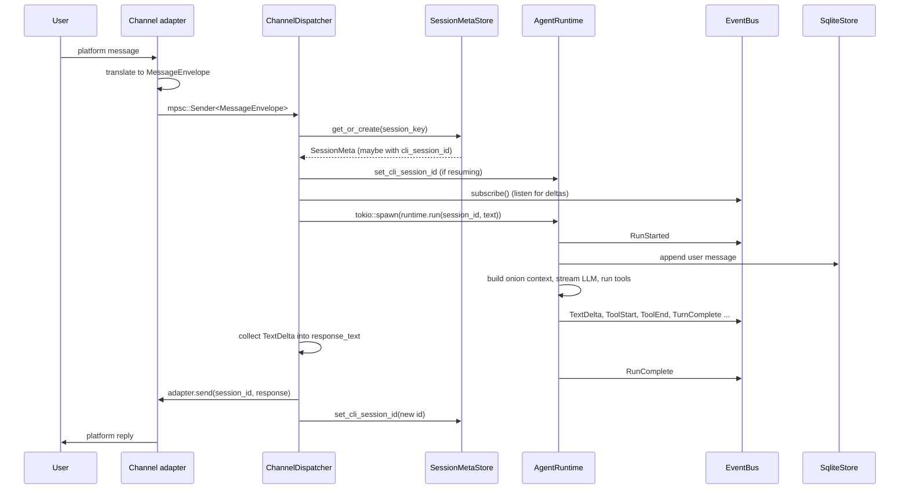
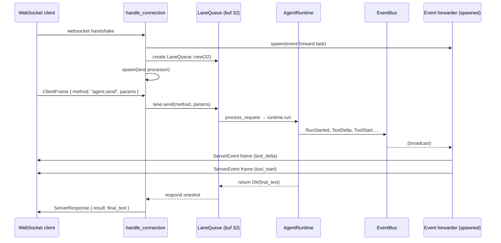
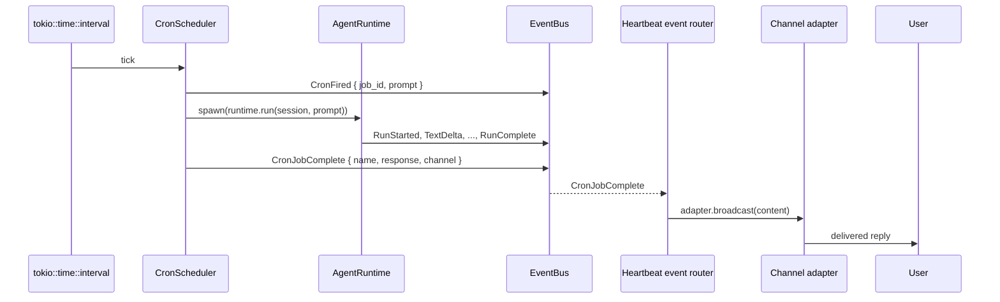
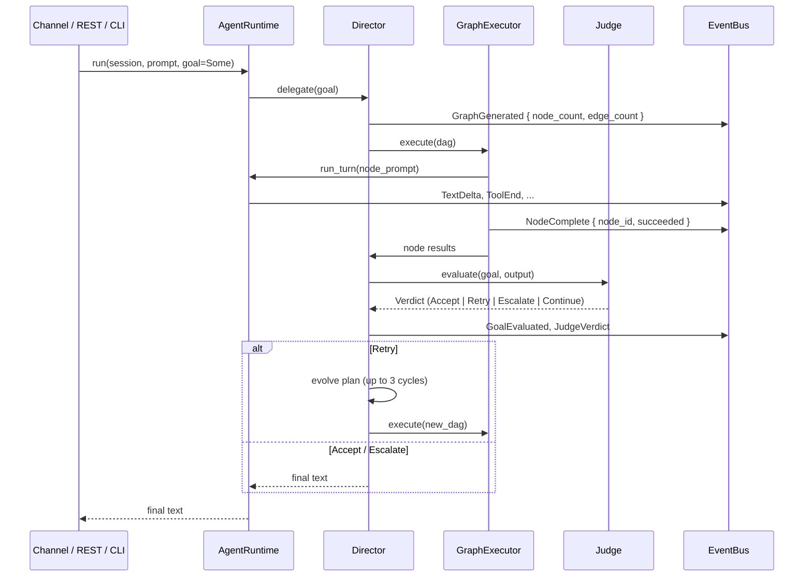

# Data flow

This document traces a user message end-to-end through Ryvos, from the moment
it crosses the process boundary to the moment a reply is handed back to the
user. It covers the five distinct entry paths (channel, gateway REST, gateway
WebSocket, timer-driven, CLI REPL) and calls out every component that touches
the message along the way.

[system-overview.md](system-overview.md) explains which crates own each
component; [execution-model.md](execution-model.md) describes the per-turn
state machine inside the **[agent runtime](../glossary.md#agent-runtime)**.
This document is the middle layer: it explains *who talks to whom* around the
agent loop, not what happens inside it.

## The five entry points

Every inbound event enters Ryvos through one of five well-defined doorways.
After the entry point, all paths converge on the same `AgentRuntime::run`
call. Everything before that convergence is entry-specific; everything after
is the agent loop described in the execution model.

| Entry point | Crate | Protocol | Concurrency unit |
|---|---|---|---|
| **[Channel adapter](../glossary.md#channel-adapter)** | `ryvos-channels` | Platform-specific (Telegram HTTPS long poll, Discord gateway, Slack Events API, WhatsApp webhook) | One task per adapter, one task per inbound message |
| Gateway REST | `ryvos-gateway` | HTTP/1.1, JSON | Axum request handler |
| Gateway WebSocket | `ryvos-gateway` | WebSocket, JSON frames | One task per connection, serialized through a **[lane](../glossary.md#lane)** |
| Cron / Heartbeat | `ryvos-agent` | Timer-driven | One task per scheduler, one task per fired job |
| CLI REPL | `ryvos` (bin) | stdin / stdout | Single-threaded read-eval loop |

The shared contract between every entry point is the `SessionId`. Channel
adapters derive it from their platform-native identifier (Telegram chat ID,
Discord channel ID, Slack conversation ID, WhatsApp phone number). The
gateway accepts it as part of the request path. The cron scheduler attaches
the job's persistent session. The CLI REPL generates a fresh one on first
launch and reuses it for the lifetime of the process.

## Channel path

The channel path is the most elaborate of the five because it has to bridge a
platform-specific protocol to the agent runtime, handle approvals inline, and
route asynchronous events (heartbeat alerts, cron results) back to the right
adapter.

### Adapter to envelope

Each adapter implements the `ChannelAdapter` trait from `ryvos-core` and owns
a tokio task that reads from its platform. When a message arrives, the adapter
translates it into a `MessageEnvelope` (see `crates/ryvos-core/src/types.rs:300`)
with six fields:

- `id` — stable per-message identifier for idempotency (the source platform's
  own message ID when available).
- `session_id` — the Ryvos `SessionId` this message belongs to.
- `session_key` — the per-platform natural key (e.g. `telegram:chat:12345`).
  Used by `SessionMetaStore` for cross-restart lookup.
- `channel` — short string identifying the originating adapter (`telegram`,
  `discord`, `slack`, `whatsapp`).
- `sender` — platform-native sender identifier.
- `text` — the user message content.
- `timestamp` — UTC timestamp of the inbound message.

The adapter sends the envelope over an `mpsc::Sender<MessageEnvelope>` owned
by the **ChannelDispatcher** (see `crates/ryvos-channels/src/dispatch.rs:82`).
The mpsc channel has a buffer of 256 envelopes; if the dispatcher falls
behind, the adapter's send blocks and the platform task applies back-pressure
naturally.

### Dispatcher to runtime

The dispatcher's main loop sits on the mpsc receiver. For every envelope it
pulls, it first checks for the special approval commands (`/approve` and
`/deny`) and routes them to the **[approval broker](../glossary.md#approval-broker)**
rather than the agent. Ordinary messages go through the full path:

1. **Session metadata lookup.** The dispatcher queries `SessionMetaStore` for
   the row keyed on `envelope.session_key` (see
   `crates/ryvos-channels/src/dispatch.rs:322`). If the row exists and carries
   a `cli_session_id`, the dispatcher calls `runtime.set_cli_session_id(Some(id))`
   so CLI providers can resume their upstream session cleanly.
2. **Session meta row creation.** If no row exists, `get_or_create` inserts
   one with a newly-minted `SessionId` and the channel name.
3. **Lifecycle hooks.** `on_session_start` and `on_message` hooks fire (shell
   commands configured in `ryvos.toml`). These run as spawned tasks so they
   do not block the dispatcher.
4. **Event subscription.** The dispatcher calls `event_bus.subscribe()` *before*
   spawning the run, so it captures every `TextDelta` and `ToolEnd` from the
   moment the run begins. A late subscription would drop early deltas.
5. **Run spawn.** The dispatcher `tokio::spawn`s `runtime.run(session_id, text)`.
   On error, it publishes a `RunError` event so the dispatcher's own event
   loop can observe the failure consistently.
6. **Response assembly.** The dispatcher loops on `event_rx.recv()` and
   appends every `TextDelta` to an in-memory `response_text` buffer until it
   sees `RunComplete` for the matching session. This means the adapter
   receives a single consolidated response rather than streaming pieces —
   the tradeoff makes platforms like Telegram (which edits-by-replace) far
   simpler to implement than platforms that support native streaming (which
   can bypass the dispatcher by subscribing to the bus directly, as the Web
   UI does).
7. **Approval handling.** If an `ApprovalRequested` event arrives during the
   run, the dispatcher calls `adapter.send_approval` so the platform can
   render its native approval UI (an inline keyboard on Telegram, a button
   block on Slack, etc.). When the user responds, the adapter turns that into
   an `/approve <id>` or `/deny <id>` envelope that flows back through the
   same dispatcher.
8. **Post-run persistence.** After `run_handle.await` completes, the
   dispatcher reads `runtime.last_message_id()` and writes it back to
   `SessionMetaStore` via `set_cli_session_id`. On the next message, step 1
   will replay that ID into the runtime.
9. **Adapter send.** Finally, `adapter.send(session_id, MessageContent::Text(…))`
   delivers the reply. The `on_response` and `on_session_end` hooks fire last.

Every step above is a pure pass-through — the dispatcher does not transform
content, throttle, or batch. It is a routing layer, not a processing layer.

### When checkpoint and audit happen

Inside `runtime.run`, the **[checkpoint](../glossary.md#checkpoint)** is
written to `sessions.db` at the end of each turn (see
[execution-model.md](execution-model.md) for the turn state machine). The
**[audit trail](../glossary.md#audit-trail)** in `audit.db` is written by the
`SecurityGate` on entry to each tool call and updated with the result on
completion. Both stores are durable: the dispatcher does not need to flush
anything explicitly, and a mid-run crash leaves `sessions.db` and `audit.db`
in a self-consistent state (each turn's checkpoint is atomic within its own
database).

## REST path

REST is the simplest path. A client hits
`POST /api/sessions/{id}/messages` with a JSON body containing the message
text. The Axum handler in `crates/ryvos-gateway/src/routes.rs:118` is an
`async fn`, so Axum spawns a task to run it:

1. The role-based middleware (`crates/ryvos-gateway/src/auth.rs`) validates
   the API key and resolves a Viewer / Operator / Admin role. `send_message`
   requires at least Operator.
2. The handler extracts the path parameter as a `SessionId` and the body's
   `message` field as the user text.
3. It calls `state.runtime.run(&session_id, &body.message).await` directly —
   no dispatcher, no event subscription, no buffer.
4. The runtime's return value is the final assistant text (plus any
   `TaskFailed` error). The handler wraps it in JSON and returns it.

REST is therefore fully blocking: the HTTP response does not come back until
the run is fully complete. There is no streaming in the REST path. Clients
that need token-by-token streaming use the WebSocket path instead.

Because the REST handler does not subscribe to the `EventBus`, events still
flow to every *other* subscriber (audit writer, cost tracker, guardian, any
connected WebSocket client). REST is a write-through channel onto the same
runtime; the gateway's WebSocket path happens to be the one that consumes the
events visibly.

## WebSocket path

The WebSocket path is how the Web UI talks to Ryvos. Every client connection
gets its own task topology:

The three concurrent tasks per connection are described in
[concurrency-model.md](concurrency-model.md). For data flow purposes the
important shape is:

1. The connection handler (`crates/ryvos-gateway/src/connection.rs:38`)
   immediately spawns an **event forwarder** task that subscribes to the
   `EventBus` and turns ~23 of the 29 event types into `ServerEvent` frames
   over the outbound WebSocket sink. The forwarder is how the Web UI shows
   streaming text, tool progress, and runtime alerts in real time.
2. It creates a **[lane](../glossary.md#lane) queue** with buffer 32 and
   spawns a **lane processor** task. The lane is a bounded mpsc — every
   request from the client is enqueued and processed serially, so a client
   cannot overlap two `agent.send` calls on the same session.
3. The main task reads WebSocket frames. Text frames are parsed as
   `ClientFrame` JSON, dispatched through `lane.send(method, params)`, and
   the oneshot response is sent back as a `ServerResponse`. Ping frames are
   answered with pongs; close frames break the loop.
4. On disconnect, both the forwarder task and the lane processor are
   `abort()`ed. Any in-flight run started from this connection continues to
   completion — the runtime does not care that its observer went away — but
   the final response goes nowhere visible.

The important subtlety is that response text and event stream flow through
*different* channels. A `ServerResponse` is the lane processor's own return
value. A `ServerEvent` is the forwarder's live broadcast. The Web UI relies
on events for the incremental rendering and on the response for the final
confirmation.

### Streaming without the forwarder

Clients that want the final text only can ignore `ServerEvent` frames
entirely and wait for `ServerResponse`. Clients that want a live view
subscribe to events and optionally discard the terminal response. The
`handle_connection` handler auto-subscribes each connection to the special
session `"*"`, so system events (heartbeat, cron, budget, guardian alerts)
always reach every connected client.

## Cron and heartbeat path

Both the **cron scheduler** (`crates/ryvos-agent/src/scheduler.rs`) and the
**[Heartbeat](../glossary.md#heartbeat)** (`crates/ryvos-agent/src/heartbeat.rs`)
are timer-driven. They do not wait for user input; they kick off runs on
their own schedules.

The heartbeat event router runs inside the `ChannelDispatcher` (see
`crates/ryvos-channels/src/dispatch.rs:102`). It is a small event loop
spawned at dispatcher startup that subscribes to the bus and filters for
three variants: `HeartbeatAlert`, `HeartbeatOk`, and `CronJobComplete`. When
a matching event arrives, the router either targets a specific adapter by
name (`target_channel: Some("telegram")`) or broadcasts to every adapter
(`target_channel: None`). The cron scheduler attaches the channel hint when
the cron job definition specified one in `ryvos.toml`.

The practical effect is that a cron job defined with
`channel = "telegram"` delivers its result as a Telegram message, while an
alert from the heartbeat subsystem fans out to every connected channel
without the agent loop or the dispatcher ever calling an adapter directly.
Every delivery goes through the EventBus.

A heartbeat run is indistinguishable from a user run once it enters the
agent loop: same context composition, same token budget, same checkpoint,
same audit trail. The only difference is the prompt source (`HEARTBEAT.md`)
and the fact that `HeartbeatOk` responses are suppressed from user-facing
channels unless the agent explicitly flagged a finding.

## CLI REPL path

The CLI REPL is the simplest path of all because there is no network
layer. The `ryvos run` command and the interactive REPL both construct an
`AgentRuntime` directly in `main` and call `run` on it from the foreground
task. There is no dispatcher, no gateway, no adapter — just a read loop
that turns each line of stdin into a `runtime.run` call and streams the
assistant's response back to stdout.

The flow:

1. On startup, `main` loads `ryvos.toml`, constructs the `EventBus`,
   opens the seven stores, builds an `AgentRuntime`, spawns the
   background subsystems (Guardian, Heartbeat, cron scheduler, channel
   dispatcher if channels are configured, gateway if enabled), and then
   either enters the REPL or runs a one-shot command.
2. The REPL generates or reuses a `SessionId`. For `ryvos run --resume`
   it reads the last CLI session ID from `SessionMetaStore` and passes
   it to `runtime.set_cli_session_id` before the first call; otherwise
   it mints a fresh `SessionId`.
3. On each input line, the REPL subscribes a filtered receiver to the
   `EventBus` (scoped to the current session), spawns
   `runtime.run(session_id, text)` as a background task, and starts
   consuming events. `TextDelta` events write to stdout in real time,
   so the terminal shows token-by-token streaming. `ToolStart` and
   `ToolEnd` render as short status lines. `RunComplete` flushes the
   output and returns the prompt to the user.
4. Ctrl-C triggers the runtime's `CancellationToken`, which propagates
   through the agent loop; see [concurrency-model.md](concurrency-model.md)
   for the cancellation machinery.

The CLI path bypasses the channel dispatcher entirely, so
`/approve` and `/deny` commands in the REPL are routed directly to the
`ApprovalBroker` via a small REPL command parser rather than through an
envelope-driven dispatcher task. The end result is identical — the
broker resolves the oneshot and the agent loop continues — but the
intermediary is shorter.

One side effect of the CLI path is that heartbeat alerts and cron results
still reach the terminal: the REPL subscribes to system events on
session `"*"` so the same filtered receiver that handles per-session
events also surfaces `HeartbeatAlert` and `CronJobComplete` banners.
A user running `ryvos` interactively sees the daemon's background
activity inline with their own chat.

## Director path

When a run has an attached **[goal](../glossary.md#goal)**, the agent loop
step is replaced by a **[Director](../glossary.md#director)** run. The
entry-point code path is identical — `runtime.run(session, prompt)` is still
what callers invoke — but internally the runtime hands off to the Director,
which then calls back into the agent runtime for each DAG node.

The **[OODA](../glossary.md#ooda)** phases described in ADR-009 map onto the
sequence above:

- **Observe / Orient** happen when the Director assembles the current state
  and generates the DAG.
- **Decide** picks which nodes are ready (predecessors satisfied, budget
  available).
- **Act** is the `GraphExecutor::execute` call, which walks ready nodes and
  invokes `runtime.run_turn` for each. Nodes without data dependencies run
  in parallel via spawned tasks.
- **Evaluate** is the `Judge` call that produces a
  **[Verdict](../glossary.md#verdict)**.

The data flow is layered: the caller sees exactly one run, but internally
the Director may have orchestrated 3–30 agent sub-runs, each with its own
checkpoint, its own audit entries, and its own event stream. From the event
subscriber's perspective, every sub-run's events carry the same `session_id`,
so a dispatcher listening for `RunComplete` will see one per node. The
Director's `GoalEvaluated` event is the canonical end-of-run marker in the
goal-driven case.

## MessageEnvelope as the shared contract

The `MessageEnvelope` type in `crates/ryvos-core/src/types.rs:300` is the
piece of vocabulary every channel path speaks. It is the narrowest waist
between platform-specific code and the agent runtime: once an adapter has
translated a platform message into an envelope, the rest of Ryvos has a
uniform view of "message arrived, route it". Gateway REST and WebSocket do
not use `MessageEnvelope` because they pass session and text as separate
fields — the envelope is a concession to the fact that channel adapters
need to carry more per-message metadata (sender, platform message ID,
session_key) than the gateway paths do.

The `session_key` field in particular is what makes channel sessions
stable across daemon restarts. The agent's `SessionId` is a fresh UUID
each time the daemon starts, but `session_key` is a deterministic string
derived from the platform's own identifier (`telegram:chat:12345`,
`discord:channel:67890`, etc.). `SessionMetaStore` keys its row on
`session_key`, and on restart it maps the same key to the same (or a new)
`SessionId`, preserving the CLI session ID and the running token totals.

A channel adapter that did not populate `session_key` would work for a
single daemon lifetime but lose its continuity the moment the daemon
restarted. Every built-in adapter sets it; any new adapter should follow
the same pattern. See the channel adapter pattern in ADR-010 for the full
contract.

## Concurrency summary

The paths above all share the same underlying property: events flow through
a broadcast channel while requests flow through mpsc or direct function
calls. That split is the backbone of the concurrency story:

- **Request flow** (message in, response out) is linear and
  back-pressure-friendly. Every entry point eventually calls
  `runtime.run`, blocks on its return, and propagates the result.
- **Event flow** (progress notifications, lifecycle signals, failures) is
  fan-out and lossy. Every subsystem that cares about lifecycle subscribes
  to the **[EventBus](../glossary.md#eventbus)** independently.

Where parallelism enters:

- Tool execution inside a single turn (via `tokio::spawn` + `join_all`,
  dispatched by the agent loop — see
  [execution-model.md](execution-model.md)).
- Director node execution across nodes with no data dependency.
- Event forwarding in the gateway (each connected client has its own
  forwarder task, so slow clients cannot stall fast ones).
- The channel dispatcher's heartbeat event router runs concurrently with
  the main envelope loop, so a slow adapter does not block system event
  delivery.
- Multiple entry points can be active simultaneously: a Telegram user and
  a Web UI client and a cron job can all run on the same `AgentRuntime`
  instance in parallel, each with its own `SessionId`. The runtime is
  stateless at the instance level — per-session state lives in
  `sessions.db` and in the per-run checkpoint.

Cancellation is cooperative throughout. Every path threads a
`tokio_util::sync::CancellationToken` into `runtime.run`. Shutdown fires the
token, the agent loop observes it at its next await, tools drain, checkpoints
flush, and background tasks exit. See
[concurrency-model.md](concurrency-model.md) for the full cancellation
topology.

## Where to go next

- [execution-model.md](execution-model.md) — what happens inside
  `runtime.run` once a path has delivered a message.
- [../internals/agent-loop.md](../internals/agent-loop.md) — the turn-by-turn
  state machine, every event publication, and the file:line references.
- [../internals/session-manager.md](../internals/session-manager.md) — how
  `SessionManager` and `SessionMetaStore` map platform keys to
  `SessionId`s across restarts.
- [../internals/event-bus.md](../internals/event-bus.md) — broadcast
  semantics, subscriber lifecycle, and the filtered subscribe API used by
  the gateway's event forwarder.
- [../crates/ryvos-channels.md](../crates/ryvos-channels.md) — the four
  channel adapters and the `ChannelDispatcher` in detail.
- [../crates/ryvos-gateway.md](../crates/ryvos-gateway.md) — the Axum
  router, lane implementation, and WebSocket protocol.
