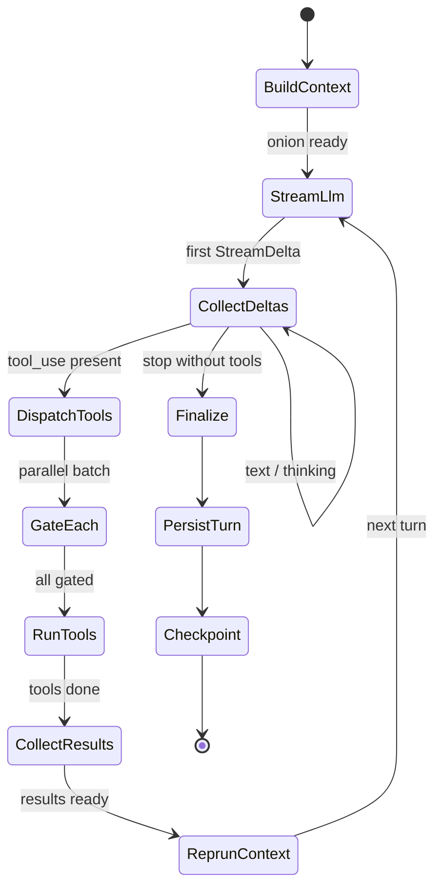
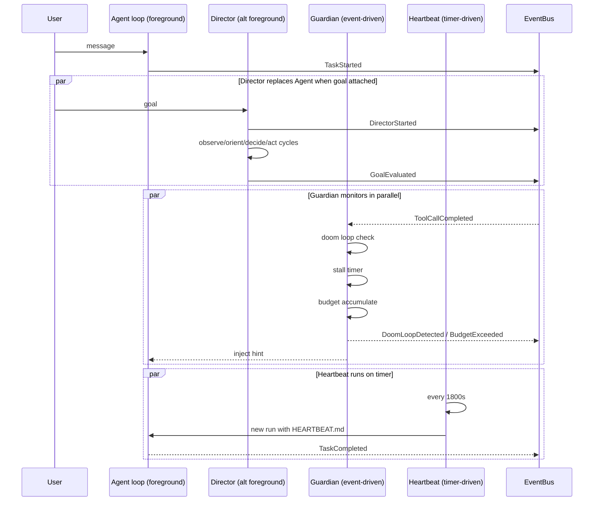

# Execution model

This document is the runtime counterpart to
[system-overview.md](system-overview.md). The overview explains how the crates
fit together statically; this one explains what actually happens at runtime.
It covers the agent loop state machine, the interplay between the
[Director](../glossary.md#director), [Guardian](../glossary.md#guardian), and
[Heartbeat](../glossary.md#heartbeat), the three-layer
[onion context](../glossary.md#onion-context) build, cancellation, and
concurrency.

After reading this, the detailed subsystem docs under
[../internals/](../internals/) should make sense in context.

## The agent loop

The core unit of execution in Ryvos is a **[turn](../glossary.md#turn)**. One
turn is one round trip from the agent runtime to the LLM and back, including
any tool calls the LLM makes. A **[run](../glossary.md#run)** is the
collection of turns that handles a single user message or triggered event. The
`max_turns` config key caps how many turns a run can take (default 25).

A single turn is driven by the state machine below. It lives in
`crates/ryvos-agent/src/agent_loop.rs` as `AgentRuntime::run_turn`. Every
transition publishes events on the
[EventBus](../glossary.md#eventbus); those events are what drive the
[Guardian](../glossary.md#guardian) and the audit subsystem.

The six phases are:

**BuildContext.** The runtime assembles the three-layer onion for this turn.
The identity layer is cached across turns of the same run; the narrative and
focus layers are rebuilt so that fresh Viking recall and updated tool
documentation are always included. Context assembly is described in detail in
[context composition](#three-layer-onion-context-assembly) below.

**StreamLlm.** The composed messages are handed to the `LlmClient` trait. The
client returns a `Stream<Item = StreamDelta>` which yields `Text`,
`Thinking`, `ToolUse`, `InputJsonDelta`, `Usage`, and `MessageStop` deltas as
the LLM produces them. The runtime tees this stream: one consumer assembles
the assistant message, another forwards visual deltas to the EventBus so the
Web UI and TUI can show streaming text.

**CollectDeltas.** Text and thinking deltas are appended to the in-progress
assistant message. `ToolUse` deltas are accumulated into a batch. The stream
ends when the LLM emits `MessageStop`; at that point the runtime decides
whether to dispatch tools or finalize.

**DispatchTools.** If the assistant message contains one or more `tool_use`
blocks, the runtime enters the tool phase. Tools whose inputs are independent
are dispatched in parallel via `tokio::spawn`; tools marked as
serially-dependent (configured per tool) run in sequence. Each tool call first
passes through the [security gate](../glossary.md#security-gate), which writes
an audit entry, consults [SafetyMemory](../glossary.md#safetymemory), and — if
the tool is listed under `pause_before` — publishes an `ApprovalRequested`
event and awaits a decision. The gate never denies based on classification
alone.

**CollectResults.** Tool results are converted into `ContentBlock::ToolResult`
blocks and appended to the conversation as a new user-role message (per the
Anthropic and OpenAI tool-result convention).

**RepruneContext.** After tool results arrive, the runtime runs its token
budgeter over the message list. Messages flagged `protected` in metadata
are kept verbatim. Others are candidates for compaction, pruning, or
summarization based on the `phase` metadata and current token ceiling. The
pruned conversation is what goes into the next `StreamLlm` call.

The turn either loops back to `StreamLlm` for another iteration or, if the
LLM's final message contained no tool calls, proceeds to **Finalize** →
**PersistTurn** → **Checkpoint**. The checkpoint is a full snapshot of the
turn's messages and cumulative usage, written to the `checkpoints` table in
`sessions.db` so a crash mid-run is recoverable on restart.

The loop exits when either the LLM stops without emitting tool calls, the
[Judge](../glossary.md#judge) returns an `Accept` or `Escalate`
[verdict](../glossary.md#verdict) (Director runs only), `max_turns` is hit, or
the run's cancellation token is cancelled.

## Three-layer onion context assembly

The system prompt that goes into every `StreamLlm` phase is the output of the
[onion context](../glossary.md#onion-context) builder in
`crates/ryvos-agent/src/context.rs`. There are three layers:

### Identity layer

Loaded once at the start of each run. Sources:
- `SOUL.md` (personality, tone, proactivity, operator context — produced by
  `ryvos soul`).
- `IDENTITY.md` (agent name, role, immutable facts).
- The seven constitutional principles.
- Core operator metadata (username, timezone, default workspace).

The identity layer is never pruned. It defines *who the agent is* and
*who it serves*, and those facts do not change between turns.

### Narrative layer

Rebuilt at the start of every turn. Sources:
- `AGENTS.toml` (tools available, per-agent defaults, system prompt fragments).
- `TOOLS.md` (human-readable tool documentation).
- Recent daily logs from `viking.db`.
- [Viking](../glossary.md#viking) recall fragments, retrieved by FTS5 search
  against the current user prompt and the last few assistant messages.
- Compacted conversation history for this session.

The narrative layer grows over a run but is capped by the token budgeter. When
space runs out, oldest-first compaction removes messages flagged as
non-protected.

### Focus layer

Rebuilt at the start of every turn. Sources:
- The current user message (or the triggering event).
- The attached goal and its constraints, if any.
- Just-in-time tool documentation for any tool the LLM has not yet invoked in
  this session.
- Any hint injected by [Reflexion](../glossary.md#reflexion) after a repeated
  tool failure.
- Any corrective hint published by the Guardian.

The focus layer is the smallest and most volatile. It answers "what are we
doing *right now*?".

The three layers are concatenated innermost-first and handed to the
`LlmClient` as the system message. The on-the-wire messages array is
identity + narrative + focus as the system message, followed by the
conversation messages as the history.

## Concurrent subsystems

During an agent run, three other subsystems are running in the same process,
each with its own task and its own timing discipline.

The important relationships:

**Agent loop and Director are alternatives, not layers.** When a run has no
attached goal, the `AgentRuntime::run` method drives the state machine
described above. When a run has a goal, the same entry point hands control to
the Director, which then drives its own OODA cycle and calls `AgentRuntime`
internally for each DAG node. Only one of the two is "in charge" at a time.
See ADR-009.

**Guardian is always on, always event-driven.** It starts at daemon boot and
subscribes to the EventBus. It never polls. Its three checks are:

- *Doom loop detection:* After each `ToolCallCompleted` event, the Guardian
  updates a rolling fingerprint window (JSON hash of `(tool_name, inputs)`)
  and publishes `DoomLoopDetected` if the same fingerprint appears more than
  `doom_loop_threshold` times (default 5) in the window.
- *Stall timer:* A `tokio::time::sleep` refreshed on every agent event. If no
  event arrives for `stall_timeout_secs` (default 60), the Guardian publishes
  `StallDetected`.
- *Budget accumulation:* The Guardian subscribes to `TokensUsed` events, runs
  them through the per-provider pricing table, and updates `cost.db`. When the
  monthly spend crosses `warn_pct` or `hard_stop_pct` thresholds, it publishes
  `BudgetWarning` / `BudgetExceeded`.

On any of those conditions, the Guardian can inject a corrective hint into the
agent's focus layer for the next turn. The hint is advisory — the Guardian
never cancels or preempts a running tool call. Even `BudgetExceeded` does not
kill the in-flight turn; it prevents the *next* run from starting.

**Heartbeat is always on, always timer-driven.** A `tokio::time::interval` with
period `heartbeat_secs` (default 1800) fires a new agent run using
`HEARTBEAT.md` as the user prompt. The run proceeds like any other, passes
through the Guardian, and if the agent determines everything is nominal the
result is suppressed (no message is sent to any channel). Non-nominal
findings are routed to configured alert channels.

### Timing summary

| Subsystem | Lifetime | Trigger | Preempts others? |
|---|---|---|---|
| Agent loop | Per run | Incoming message | No — foreground |
| Director | Per run | Incoming run with goal | Replaces agent loop for that run |
| Guardian | Whole daemon | EventBus events | No — advisory only |
| Heartbeat | Whole daemon | Timer (`heartbeat_secs`) | No — spawns its own run |

## Cancellation semantics

Every run is started with a `tokio_util::sync::CancellationToken` that is
threaded through the agent loop, every tool call, every LLM stream, and every
Director node. Cancellation sources:

- User cancel via TUI `Esc`, REPL `/cancel`, Web UI stop button, or any
  channel's cancel command.
- Session end (the parent session is closed).
- Daemon shutdown.
- Director timing out a node that exceeds its per-node time budget.

When the token fires, every cooperating task checks it at its next await point
and returns early. The agent loop catches `RunCancelled` and writes a final
`TaskFailed{cancelled: true}` event before unwinding. A cancelled turn is still
checkpointed so the next resume sees consistent state.

Cancellation is cooperative, not preemptive. A tool that is blocked on a blocking
syscall will not observe the cancellation until its next await. In practice,
tools that wrap blocking work do so with `tokio::task::spawn_blocking` and poll
the token between chunks so cancellation latency stays under a second.

## Concurrency model

Ryvos is built on `tokio` with the `full` feature set. The concurrency model
has a few deliberate choices worth noting.

### One tokio runtime, many tasks

The whole binary runs on a single multi-threaded tokio runtime created in
`src/main.rs`. There is no process-level parallelism other than tools that
choose to `spawn_blocking`. Every subsystem — the agent loop, the Director,
the Guardian, the Heartbeat, each channel adapter, each gateway connection,
each MCP client — is a tokio task.

### Broadcast EventBus, not MPSC

The EventBus is a `tokio::sync::broadcast::Sender<AgentEvent>` with capacity
256. It is a fan-out channel: every subscriber gets every event. The tradeoff
is that a slow subscriber can drop messages when its receive buffer overflows;
Ryvos accepts this because the subscribers that care about durability (the
audit writer, the cost tracker) also write to SQLite directly, so a dropped
broadcast never loses data. See ADR-005 for the full discussion.

### Async mutex for I/O, std mutex for plain state

Ryvos uses `tokio::sync::Mutex` only when the critical section awaits. Plain
in-memory state (registries, maps, small counters) is protected by
`std::sync::Mutex` because the lock is held for microseconds and an async
mutex would be pure overhead. A handful of performance-critical hot paths use
`parking_lot::RwLock` via a thin feature flag.

### Parallel tool execution

When the LLM emits multiple `tool_use` blocks in a single assistant message,
the agent loop dispatches them concurrently via `tokio::spawn` and joins with
`futures::future::join_all`. The security gate runs once per call and is safe
to enter concurrently. Tools that are inherently serial (e.g. `git_commit` in
the same repo) are marked as serial in their metadata and are still dispatched
in sequence within a batch.

### Per-connection lanes in the gateway

The gateway does not share a single queue across WebSocket clients. Each
connection gets its own bounded MPSC channel with buffer 32 — a
[lane](../glossary.md#lane) — so that one slow client cannot stall requests
from another. When a lane overflows, the client receives a back-pressure event
instead of silently lagging.

## Where to go next

- [internals/agent-loop.md](../internals/agent-loop.md) — the state machine,
  every state transition, and the file:line references for each step.
- [internals/director-ooda.md](../internals/director-ooda.md) — the OODA cycle
  in detail, including DAG generation prompts and plan evolution.
- [internals/guardian.md](../internals/guardian.md) — doom loop fingerprinting,
  stall timer implementation, budget math.
- [internals/heartbeat.md](../internals/heartbeat.md) — prompt bootstrapping,
  alert suppression, alert routing.
- [internals/judge.md](../internals/judge.md) — Level 0 deterministic checks
  and the Level 2 LLM prompt.
- [internals/safety-memory.md](../internals/safety-memory.md) — outcome
  classification, lesson schema, reinforcement and pruning rules.
