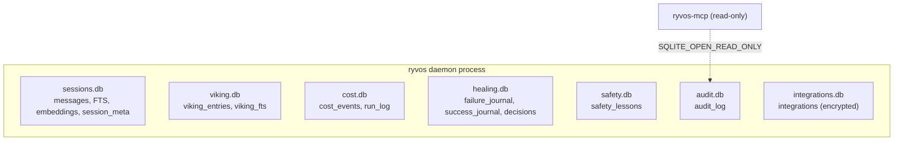

# Persistence

Ryvos persists its state across seven separate SQLite databases. Each one
is owned by a single subsystem, each opens with its own `rusqlite::Connection`,
and each manages its own schema. None of them reference each other with
foreign keys. This split is a deliberate design choice, recorded in
[ADR-006](../adr/006-separate-sqlite-databases.md), that trades the
convenience of joins for operational simplicity and failure isolation.

This document is the reference for what is stored where, how the databases
are kept consistent, and what a backup or restore actually has to copy.
The individual stores are implemented under `crates/ryvos-memory/` and
`crates/ryvos-agent/`, with read-only access for the MCP server provided by
`crates/ryvos-mcp/src/server/audit_reader.rs`.

## Why seven databases?

The obvious alternative is one database with many tables — the typical
shape for an embedded application. Ryvos rejected it for four reasons
spelled out in the ADR:

- **Zero coordination.** Each subsystem adds, alters, or drops its own
  tables without touching any other subsystem's code. Schema work is
  local.
- **Easy reset and backup.** A user who wants to clear their audit log
  can delete `audit.db` without losing their Viking memory. A user who
  wants to back up just their memory can copy `viking.db` without
  carrying along gigabytes of audit history.
- **Failure isolation.** A corrupt index in `viking.db` does not block
  the audit system. Each database fails independently, and because
  there are no cross-database joins, partial recovery is possible.
- **Parallel reads.** Different subsystems hold their own
  `Mutex<Connection>`, so the Viking store's read does not contend with
  the cost tracker's write. With a single database, every operation
  would serialize through one lock.

The cost is that there is no cross-database transaction. If the process
crashes between writing to `audit.db` and `cost.db`, the two can disagree
about whether a run happened. The ADR accepts that because each database
is self-consistent under SQLite's WAL mode — the inconsistency is a
reconciliation problem, not a corruption problem — and cross-database
correlation in Ryvos is handled on the EventBus rather than in SQL.

## Database inventory



The seven files live in the Ryvos workspace directory (typically
`~/.ryvos/`). The table below gives the purpose and the owning type for
each database. Schemas are summarized below the table; each store is
opened at daemon startup, runs `CREATE TABLE IF NOT EXISTS` on every open,
and then serves its owner throughout the process lifetime.

| File | Owner | Purpose |
|---|---|---|
| `sessions.db` | `SqliteStore` in `crates/ryvos-memory/src/store.rs` | Conversation history, FTS5 index, optional embeddings, and (in the same file) session metadata. |
| `viking.db` | `VikingStore` in `crates/ryvos-memory/src/viking_store.rs` | Hierarchical `viking://` memory entries with L0/L1/L2 levels and a manually-synced FTS5 index. |
| `cost.db` | `CostStore` in `crates/ryvos-memory/src/cost_store.rs` | Per-turn token usage, per-run totals, and billing type classification. |
| `healing.db` | `FailureJournal` in `crates/ryvos-agent/src/healing.rs` | Tool failure trail, success trail, and decision journal for Reflexion. |
| `safety.db` | `SafetyMemory` in `crates/ryvos-agent/src/safety_memory.rs` | Self-learning safety lessons with reinforcement counts. |
| `audit.db` | `AuditTrail` in `crates/ryvos-agent/src/audit.rs` | Append-only record of every tool invocation and its outcome. |
| `integrations.db` | `IntegrationStore` in `crates/ryvos-memory/src/integration_store.rs` | OAuth tokens for Gmail, Calendar, Notion, and other integrations (encrypted at rest). |

Each database enables SQLite's WAL mode (`PRAGMA journal_mode = WAL`) and
sets `PRAGMA synchronous = NORMAL` on open. WAL mode lets readers and
writers proceed concurrently against the same file — the writer appends
to the log, readers see the committed snapshot, and a background
checkpoint eventually folds the log back into the main database. The
`synchronous = NORMAL` setting trades a small durability window on crash
for a much faster write path; Ryvos accepts the tradeoff because lost
writes are recoverable from the EventBus, and the write amplification
savings are large.

### sessions.db

Schema highlights (see `crates/ryvos-memory/src/store.rs:36`):

- `messages` — the base table. Columns: `id` (primary key), `session_id`,
  `role`, `content`, `timestamp`. Indexed on `(session_id, id)` so a
  session's history loads in insertion order without a full scan.
- `messages_fts` — an FTS5 virtual table with the porter/unicode61
  tokenizer. Configured with `content_rowid=id` so it indexes the
  `content` column of the base table by rowid.
- `messages_ai` — an `AFTER INSERT` trigger on `messages` that inserts
  the new row's text into `messages_fts`. This is how full-text search
  stays in sync automatically; the store never writes to the FTS table
  directly.
- `embeddings` — optional table storing one blob per message. The blob
  is a sequence of little-endian f32 bytes produced by whichever embedder
  the user configured. Indexed on `message_id` so a lookup by message
  rowid is cheap. Present even when embeddings are disabled; the table
  stays empty.

The session metadata table (`session_meta`, defined in
`crates/ryvos-memory/src/session_meta.rs`) is often opened in the same
physical file as `sessions.db`. It holds one row per
`(channel, session_key)` pair, tracking the Ryvos `SessionId`, the last
`cli_session_id` (for `--resume`), running token totals, and timestamps.
The `SessionMetaStore` uses a separate `Connection` but the two stores
can coexist in one file because their tables do not overlap.

### viking.db

Schema highlights (see `crates/ryvos-memory/src/viking_store.rs:54`):

- `viking_entries` — the base table. Columns include `user_id`, `path`,
  `content` (the L2 full body), `content_l1`, `content_l0`, `category`,
  `tags`, `source_session`, `created_at`, `updated_at`. The `(user_id,
  path)` pair is unique, so writes are upserts. The three level columns
  are auto-generated by `generate_l0` and `generate_l1` on write.
- `idx_viking_user_path` and `idx_viking_path_prefix` — two indices
  supporting the common query shapes: exact lookup by full path, and
  prefix listing (e.g. `viking://user/preferences/*`).
- `viking_fts` — an FTS5 virtual table with the porter/unicode61
  tokenizer, indexing `content`, `path`, and `user_id`.

Unlike `messages_fts`, the Viking FTS index is **manually synced**. The
reason is upserts: when a write replaces an existing row, the trigger-based
sync would insert a duplicate FTS row. Instead, every `write` call does a
delete-then-insert pair on both the base table and the FTS table
explicitly, guaranteeing the index sees each entry exactly once.

The comment at `crates/ryvos-memory/src/viking_store.rs:78` makes the
manual-sync intention explicit: the upsert path handles FTS maintenance
directly. This is the only Viking-specific complexity in the store, and
it is the price of allowing `viking://` paths to be overwritten in place.

### cost.db

Schema highlights (see `crates/ryvos-memory/src/cost_store.rs:39`):

- `cost_events` — one row per LLM response. Columns: `run_id`,
  `session_id`, `timestamp`, `input_tokens`, `output_tokens`,
  `cost_cents`, `billing_type`, `model`, `provider`. Indexed by
  timestamp for monthly/weekly aggregation queries.
- `run_log` — one row per **[run](../glossary.md#run)**. Columns:
  `run_id` (unique), `session_id`, `start_time`, `end_time`,
  totals for input/output tokens, turn count, `billing_type`, `model`,
  `provider`, total `cost_cents`, `status`. The `status` column tracks
  `running`, `completed`, or `failed`.

The cost store is how Ryvos classifies runs as
**[API billing](../glossary.md#api-billing)** or
**[subscription billing](../glossary.md#subscription-billing)**. For
subscription-billed providers (`claude-code`, `copilot`) the cost is
recorded as `$0.00` even though tokens are counted, because the billing
relationship is between the user and the upstream vendor rather than
metered per token.

### healing.db

Schema highlights (see `crates/ryvos-agent/src/healing.rs:57`):

- `failure_journal` — one row per tool failure. Columns include
  `timestamp`, `session_id`, `tool_name`, `error`, `input_summary`,
  `turn`. Indexed on `(tool_name, timestamp)` so the
  **[failure journal](../glossary.md#failure-journal)** can find recent
  failures of a specific tool in constant time.
- `success_journal` — one row per successful tool call. Columns:
  `timestamp`, `session_id`, `tool_name`. Indexed on
  `(tool_name, timestamp)`. Kept as a counter-balance to the failure
  journal so **[Reflexion](../glossary.md#reflexion)** can see how rare
  a failure pattern actually is before deciding to inject a hint.
- `decisions` — the decision journal. Columns: `id`, `timestamp`,
  `session_id`, `turn`, `description`, `chosen_option`,
  `alternatives_json`, `outcome_json`. One row per Director decision,
  with the outcome filled in later when the decision's effect is known.
  Indexed on `(session_id, timestamp)`.

The healing database is read-heavy during runs (the reflexion hint
builder queries it on every tool failure) and write-heavy on turn
boundaries. It is small compared to `sessions.db` and `audit.db` — a
typical install keeps the file under 10 MB.

### safety.db

Schema highlights (see `crates/ryvos-agent/src/safety_memory.rs:85`):

- `safety_lessons` — one row per learned lesson. Columns include `id`,
  `timestamp`, `action`, `outcome`, `reflection`, `principle_violated`,
  `corrective_rule`, `confidence`, `times_applied`. Indexed on `action`
  and on `confidence DESC`.

The store is the backing for **[SafetyMemory](../glossary.md#safetymemory)**,
the self-learning component that turns tool outcomes into reinforceable
lessons. Writes happen from the security gate's post-execution hook;
reads happen during context building when the runtime calls
`format_for_context` to inject relevant lessons into the narrative layer.

Pruning is handled by a background cleanup that deletes rows with
`confidence < threshold AND times_applied = 0` older than a configurable
window. The effect is that lessons the agent has never applied and has
low confidence in eventually fall off, while reinforced lessons stay.

### audit.db

Schema highlights (see `crates/ryvos-agent/src/audit.rs:33`):

- `audit_log` — one row per tool invocation. Columns include `timestamp`,
  `session_id`, `tool_name`, `input_summary`, `output_summary`,
  `safety_reasoning`, `outcome`, and a JSON column for structured
  lessons. Indexed on `session_id`, `tool_name`, and `timestamp DESC`
  for the three common query shapes: "what did session X do", "how often
  has tool Y been used", and "what happened in the last hour".

The audit trail is append-only and the only database that is opened in
**read-only** mode by a separate process. The MCP server's
`AuditReader` at `crates/ryvos-mcp/src/server/audit_reader.rs:20` opens
`audit.db` with `SQLITE_OPEN_READ_ONLY | SQLITE_OPEN_NO_MUTEX`, which is
safe to do against a WAL-mode writer — the reader sees the last
committed snapshot without blocking the writer's appends.

`SQLITE_OPEN_NO_MUTEX` tells SQLite the caller handles its own mutual
exclusion, which the Rust wrapper does via a `tokio::sync::Mutex`. The
effect is one fewer layer of locking inside SQLite itself; the caller's
lock is enough.

### integrations.db

Schema highlights (see `crates/ryvos-memory/src/integration_store.rs:23`):

- `integrations` — one row per connected app. Columns: `app_id`
  (primary key), `provider`, `access_token`, `refresh_token`,
  `token_expiry`, `scopes`, `connected_at`, `metadata`.

Tokens are stored encrypted at rest. The store's public interface is
async (`tokio::sync::Mutex<Connection>`) because token refresh paths may
hold the lock across an HTTP await — unlike the other stores, where the
critical section is always synchronous.

## FTS5 sync strategies

Two of the seven databases have FTS5 tables, and they handle sync in
opposite ways.

### messages_fts: trigger-synced

The `messages` table uses a plain `AFTER INSERT` trigger
(`messages_ai`) to keep `messages_fts` in sync. Every insert into the
base table fires one insert into the FTS table. There are no updates to
rows in `messages`, so the trigger handles the full lifecycle. The
code never writes to `messages_fts` directly.

The tradeoff: the trigger pattern only works when the base table never
updates or upserts. `messages` is append-only, so this is fine. If an
update trigger were added, it would also need to update the FTS row,
and the delete trigger would need to remove the FTS row — SQLite's FTS5
documentation describes this as the "external content" pattern.

### viking_fts: manually synced

The `viking_entries` table **is** upserted. Writes to a
`(user_id, path)` pair that already exists replace the row in place.
The FTS5 trigger pattern would duplicate the row in `viking_fts` on
every upsert, because an upsert is an `INSERT OR REPLACE` under the
hood and fires both an implicit delete trigger (not by default) and an
insert trigger.

Rather than fight with compound triggers, the Viking store handles FTS
sync manually in the `write` and delete methods: delete the existing
FTS row for the path, then insert the new one. This keeps the FTS
table exactly consistent with the base table without relying on
trigger cascading, at the cost of having the sync logic live in Rust
instead of SQL.

## Embeddings

The `embeddings` table in `sessions.db` is optional — its rows are
written only when the user has configured an embedder — and stores one
blob per message. The blob is a little-endian byte sequence of f32
values, matching what the embedder produced. On read, the blob is
parsed back into a `Vec<f32>` and compared against query vectors using
cosine similarity.

The implementation is deliberately brute-force: all embeddings are
loaded into memory and compared one at a time. There is no approximate
nearest-neighbor index, no HNSW, no IVF. For the scale Ryvos targets
(tens of thousands of messages per user, not tens of millions), a
linear scan over floats is fast enough and dramatically simpler than
ANN structures that require their own persistence, index maintenance,
and tuning.

The cosine similarity function lives at
`crates/ryvos-memory/src/embeddings.rs` and operates on borrowed slices,
so the comparison loop is a tight inner loop of floating-point
arithmetic with no allocation.

## Workspace layout

Ryvos reads and writes files from a single workspace directory. Unless
overridden, the directory is `~/.ryvos/` and contains the full set:

```text
~/.ryvos/
  ryvos.toml             # main configuration (not a database)
  SOUL.md                # personality file (Layer 1 identity)
  IDENTITY.md            # agent identity (Layer 1 identity)
  AGENTS.toml            # repo-local agent profile
  TOOLS.md               # tool usage conventions
  USER.md                # operator preferences
  BOOT.md                # one-time boot instructions
  HEARTBEAT.md           # heartbeat prompt
  MEMORY.md              # high-level memory index
  sessions.db            # SqliteStore + SessionMetaStore
  viking.db              # VikingStore
  cost.db                # CostStore
  healing.db             # FailureJournal
  safety.db              # SafetyMemory
  audit.db               # AuditTrail
  integrations.db        # IntegrationStore
  memory/
    2026-04-09.md        # daily logs (sub-layer 2b in context)
    2026-04-10.md
    2026-04-11.md
    facts.md
    projects.md
    preferences.md
  logs/
    runs.jsonl           # RunLogger append-only JSONL
  skills/
    <skill>.toml         # TOML skills with Lua/Rhai scripts
    <skill>.lua
```

The database files are all in the top of the workspace; the markdown
files for the onion context are alongside them; daily logs sit in a
`memory/` subdirectory; the RunLogger writes to `logs/runs.jsonl`; and
skills live in `skills/`. A user who wants to wipe the entire Ryvos
state can delete `~/.ryvos/` and start over, or selectively delete
individual files for targeted resets.

## Backup and restore

Because there are no cross-database foreign keys, backup is
straightforward: stop the daemon, copy the `.db` files, and you have a
consistent snapshot. The one nuance is the WAL file.

WAL mode creates two extra files alongside each database: `<name>.db-wal`
(the write-ahead log) and `<name>.db-shm` (a shared memory region). A
backup that copies only `<name>.db` will miss recent writes that have not
yet been checkpointed from the WAL into the main file.

There are two correct approaches:

- **Checkpoint first.** Run `PRAGMA wal_checkpoint(TRUNCATE)` on the
  live connection before copying. This forces the WAL contents into the
  main database and truncates the log, so `<name>.db` contains
  everything.
- **Copy all three files.** Copy `<name>.db`, `<name>.db-wal`, and
  `<name>.db-shm` together. The restored triplet is a point-in-time
  snapshot. The `.db-shm` file is the least critical and will be
  regenerated on next open if missing.

The canonical backup script (see
[../operations/backup-and-restore.md](../operations/backup-and-restore.md))
stops the daemon, runs the checkpoint, copies the seven `.db` files, and
restarts. An incremental backup strategy that preserves WAL snapshots
for point-in-time recovery is possible but not what Ryvos ships out of
the box.

## Migration strategy

Every store runs `CREATE TABLE IF NOT EXISTS` and `CREATE INDEX IF NOT
EXISTS` on every open. Adding a new column to an existing table requires
a real migration — SQLite's `ALTER TABLE ADD COLUMN` is fast but not
idempotent — so the practical rule in Ryvos is: new tables and new
indices can be added by editing the `execute_batch` call in the store's
`open` method; column changes need a custom migration path.

At the time of writing (v0.8.3), no store has versioned migrations.
Schema evolution has been additive: new tables, new indices, new
columns defaulted from NULL. When a destructive migration becomes
necessary, it will likely be handled by writing a one-shot rebuild
function in the owning store, gated on the presence or absence of the
new schema shape.

Failure isolation means a migration regression in one store does not
block the rest of the system. If `safety.db`'s schema upgrade fails, the
daemon can still start with the other six stores; `safety.db` just goes
into a degraded read-only fallback or is recreated empty, depending on
the severity.

## Failure isolation in practice

The seven-database split pays off whenever a single file corrupts. A
typical incident looks like this:

1. A kernel panic or power loss leaves `audit.db-wal` half-written.
2. On next start, SQLite's recovery code replays what it can and
   discards the corrupted tail of the WAL.
3. If the recovery fails (rare but possible with journal_mode=WAL), the
   audit writer logs an error and falls back to a read-only mode or
   creates a fresh `audit.db`.
4. The other six databases open successfully and the daemon continues.

There is no scenario in which a corrupt `cost.db` prevents the agent
from loading its Viking memory. There is no scenario in which a bad
FTS index in `sessions.db` prevents the integration store from serving
tokens. Each subsystem is one database-open away from starting cold.

The pattern also simplifies forensics. A user who reports "the agent
seems to have forgotten my preferences" can share `viking.db` without
sharing the full conversation history in `sessions.db`. A user who
reports "costs are being reported incorrectly" can share `cost.db`
without sharing `audit.db`. The isolation is social as well as
operational.

## Concurrency across stores

No transaction in Ryvos spans more than one database. Each store holds
its own `Mutex<Connection>` and commits its own writes; cross-store
correlation happens on the EventBus, not in SQL.

The practical consequences:

- **The audit trail can lag the cost tracker by one event.** The agent
  loop publishes `ToolEnd`, and two different subscribers (the audit
  writer and the cost tracker) apply the update independently. If the
  process crashes between the two writes, the databases disagree by one
  row. Reconciliation is by run_id and timestamp, both of which the
  events carry.
- **Snapshots are never consistent across databases.** A backup
  taken under load is a set of seven independent snapshots, not a
  single atomic one. For the use cases Ryvos targets (personal agent
  state, not financial ledgers) this is acceptable.
- **Queries that need cross-database data do the join in Rust.** The
  gateway's `/api/runs` endpoint, for example, reads from `cost.db` for
  run metadata and from `audit.db` for the associated tool calls, and
  assembles the response in memory.

## Where to go next

- [../adr/006-separate-sqlite-databases.md](../adr/006-separate-sqlite-databases.md)
  — the full rationale for the seven-file split.
- [../crates/ryvos-memory.md](../crates/ryvos-memory.md) — the memory
  crate's types, traits, and store implementations.
- [../operations/backup-and-restore.md](../operations/backup-and-restore.md)
  — the canonical backup procedure, including the WAL checkpoint step.
- [../internals/checkpoint-resume.md](../internals/checkpoint-resume.md)
  — how per-turn checkpoints in `sessions.db` enable crash recovery.
- [../internals/cost-tracking.md](../internals/cost-tracking.md) — the
  cost event and run log flow in detail.
- [../internals/safety-memory.md](../internals/safety-memory.md) —
  lesson schema, reinforcement, and pruning in `safety.db`.
