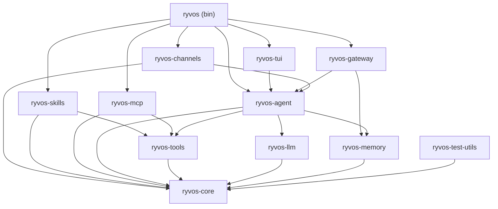
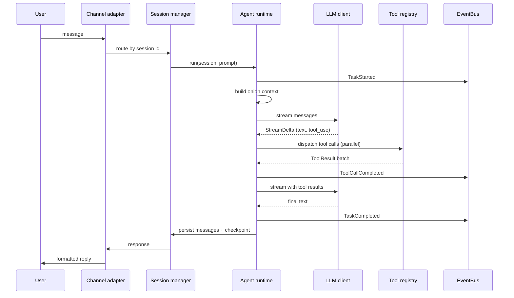

# System overview

Ryvos is a Cargo workspace of ten crates that compile into a single 45 MB
binary. This document explains how those crates fit together, what each
architectural layer is responsible for, and the invariants every component
upholds. It is the starting point for anyone trying to build a mental model of
the whole system before diving into a specific crate or subsystem.

Runtime behavior — how a single user message flows through the system, and how
the [Director](../glossary.md#director), [Guardian](../glossary.md#guardian),
and [Heartbeat](../glossary.md#heartbeat) run concurrently — is the subject of
[execution-model.md](execution-model.md). This document focuses on the static
structure.

## Crate dependency graph

The ten crates sit in four layers. Lower layers know nothing about higher ones.
Every arrow below points from a crate to something it depends on.

The single binary at the top depends on every integration-layer crate and,
through them, on every lower-layer crate. `ryvos-core` is the root: every other
crate depends on it, and it depends on nothing inside the workspace.

## Architectural layers

Ryvos is organized into four layers. The layer boundary is not enforced by the
compiler — a higher-layer crate is free to import any lower-layer crate — but
it is a hard invariant in practice: no crate ever depends on one in its own
layer or any layer above it.

### Foundation layer

`ryvos-core` and `ryvos-test-utils` sit at the bottom.

`ryvos-core` defines the types, traits, and configuration schema that everything
else is built on. The four extension-point traits live here: `LlmClient`,
`Tool`, `ChannelAdapter`, and `SessionStore`. The core conversation types —
`ChatMessage`, `ContentBlock`, `StreamDelta`, `ToolResult`, `ToolContext`,
`AgentEvent` — are all defined here, as is the `AppConfig` tree parsed from
`ryvos.toml`. The [EventBus](../glossary.md#eventbus) that ties the rest of the
system together is in `crates/ryvos-core/src/event.rs`. The goal system and
its `Verdict` enum live in `crates/ryvos-core/src/goal.rs`.

`ryvos-test-utils` provides mock implementations of those traits so other
crates can unit-test their logic without spinning up real LLMs, real databases,
or real channels.

The invariant for this layer is: no I/O, no SQLite, no HTTP, no tokio tasks.
Foundation code is pure data and type definitions.

### Platform layer

`ryvos-llm` and `ryvos-memory` are the two platform-layer crates. They provide
capabilities — calling an LLM, persisting conversation state — that every
higher layer uses but that are orthogonal to each other.

`ryvos-llm` implements the `LlmClient` trait for 18+ providers. Eight are
dedicated implementations (Anthropic, OpenAI, Azure, Bedrock, Gemini, Cohere,
`claude-code`, `copilot`); ten are [OpenAI-compatible](../glossary.md#api-billing)
presets (Ollama, Groq, OpenRouter, Together, Fireworks, Cerebras, xAI, Mistral,
Perplexity, DeepSeek) that share a single client with per-provider defaults.
The two [CLI providers](../glossary.md#cli-provider) are special: they spawn a
subprocess instead of hitting an HTTP endpoint, and their runs are classified as
[subscription-billed](../glossary.md#subscription-billing) so that token-based
cost tracking reports `$0.00`. See ADR-004 for the rationale.

`ryvos-memory` provides SQLite-backed implementations of session storage,
history storage, and the local [Viking](../glossary.md#viking) store. Ryvos
uses seven separate SQLite databases — `sessions.db`, `audit.db`, `cost.db`,
`healing.db`, `viking.db`, `safety.db`, `integrations.db` — one per subsystem.
The separation is deliberate: each subsystem has its own schema lifecycle and
its own backup cadence, and no single-DB lock contends across them. See ADR-006.

### Orchestration layer

`ryvos-agent`, `ryvos-tools`, and `ryvos-mcp` form the orchestration layer. This
is where the agent runtime actually executes work.

`ryvos-agent` is the largest crate in the workspace. It contains the ReAct
**agent loop** (`AgentRuntime`), the Director (`Director`), the Guardian
(`Guardian`), the Heartbeat (`Heartbeat`), the [Judge](../glossary.md#judge)
(`Judge`), the [SafetyMemory](../glossary.md#safetymemory) (`SafetyMemory`), the
[failure journal](../glossary.md#failure-journal) (`FailureJournal`), the
[approval broker](../glossary.md#approval-broker) (`ApprovalBroker`), the
[security gate](../glossary.md#security-gate) (`SecurityGate`), the
[checkpoint store](../glossary.md#checkpoint) (`CheckpointStore`), the
structured-output validator (`OutputValidator`), the JSONL run logger
(`RunLogger`), the cron scheduler (`CronScheduler`), the DAG executor
(`GraphExecutor`), the multi-agent orchestrator (`MultiAgentOrchestrator`), and
the restricted sub-agent spawner ([`PrimeOrchestrator`](../glossary.md#prime)).
Every one of those pieces publishes on the EventBus, and every one consults
`SafetyMemory` when appropriate.

`ryvos-tools` owns the [tool registry](../glossary.md#tool-registry) and the
70+ built-in tools across twelve categories (bash, filesystem, git, code, data,
database, network, system, browser, memory, scheduling, sessions). Each tool
implements the `Tool` trait from core. The registry also accepts tools from
`ryvos-skills` and from `ryvos-mcp` so that a skill or an external MCP tool
looks identical to a built-in from the agent's perspective.

`ryvos-mcp` is both an [MCP](../glossary.md#mcp) client — it connects to
external MCP servers over stdio or streamable HTTP and proxies their tools into
the registry — and an MCP server that exposes nine Ryvos tools to other MCP
clients (Claude Code, the Claude desktop app, Cursor, and so on). See ADR-008
for why MCP is the integration layer rather than a bespoke plugin system.

### Integration layer

`ryvos-gateway`, `ryvos-channels`, `ryvos-skills`, and `ryvos-tui` are the
integration-layer crates. They translate between the agent runtime and the
world outside the process.

`ryvos-gateway` is an Axum HTTP and WebSocket server. It exposes 40+ REST
endpoints, an embedded Svelte 5 Web UI (built at compile time and baked into
the binary via `rust_embed`), and a per-connection [lane](../glossary.md#lane)
queue that serializes requests from a single client while parallelizing across
clients. The gateway also owns the role-based API-key middleware that maps
keys to Viewer, Operator, or Admin roles.

`ryvos-channels` contains four
[channel adapter](../glossary.md#channel-adapter) implementations: Telegram,
Discord, Slack, and WhatsApp (Cloud API). Each implements `ChannelAdapter` from
core, handles its platform's approval UI idioms, and enforces its own DM policy
(`allowlist`, `open`, or `disabled`). See ADR-010 for the adapter pattern.

`ryvos-skills` loads drop-in skills from `~/.ryvos/skills/`. Each skill is a
TOML manifest plus a Lua or Rhai script. Skills appear as tools in the registry
once validated.

`ryvos-tui` is a ratatui-based terminal UI with an adaptive banner and
streaming output. It is a read-only consumer of the agent's EventBus, so its
display updates without polling.

## Data flow

The happy path for a user message — from inbound channel to outbound response —
crosses every layer exactly once.

The diagram elides three background participants that are always running in
parallel with the agent loop: the Guardian (subscribed to `E` for doom loops,
stalls, and budget events), the Heartbeat (timer-driven, publishes its own
runs), and the Director (which replaces the agent loop entirely when a goal is
attached). See [execution-model.md](execution-model.md) for how those
concurrent tasks interleave.

Every step in the diagram above publishes at least one event on the EventBus,
which is how the audit trail, the cost tracker, the gateway WebSocket
broadcast, the TUI, and the Guardian all stay in sync without any of them
knowing about each other. See ADR-005 for the rationale.

## Key invariants

These are the properties the system maintains across every release. Each one
corresponds to an explicit design choice recorded in an ADR.

### Every tool call is audited

No tool invocation ever executes without first passing through the
`SecurityGate` in `crates/ryvos-agent/src/gate.rs`. The gate writes an entry to
`audit.db` before the call is dispatched and updates it with the result
afterward. There is no "fast path" that bypasses auditing. The audit trail is
append-only and survives process restarts. See ADR-002.

### The gate never blocks

Passthrough security means the gate logs, consults `SafetyMemory`, optionally
triggers a [soft checkpoint](../glossary.md#soft-checkpoint), and then lets the
call proceed. Classification alone is never a reason to deny a call. The
deprecated [T0–T4](../glossary.md#t0t4) tiers remain as informational metadata
but are no longer a gating mechanism. Users who want a manual gate can list
specific tools under `pause_before` in the config; this is opt-in per tool.
See ADR-002.

### Safety is learned, not enforced

`SafetyMemory` turns outcomes into lessons: `Harmless`, `NearMiss`, `Incident`,
`UserCorrected`. Useful lessons are reinforced; stale ones are pruned. Relevant
lessons are injected into the system prompt before similar future actions. The
agent gets safer over time because its memory grows, not because the blocklist
grows. See ADR-002.

### Components communicate through events, not direct calls

No subsystem calls another subsystem's public API to notify it of a lifecycle
event. Instead, the active subsystem publishes an event on the EventBus and
interested parties subscribe. This is how the Guardian, the cost tracker, the
audit writer, the TUI, and the gateway all watch the agent loop without being
coupled to it. See ADR-005.

### Each subsystem owns its database

The seven SQLite files are never joined across. `audit.db` does not know about
`cost.db`, and neither knows about `safety.db`. Each subsystem manages its own
schema migrations and its own backups. Cross-subsystem correlation happens on
the EventBus (which carries event IDs), not in SQL. See ADR-006.

### MCP is the integration layer

External tools, whether proxied from Claude Desktop, Cursor, or a custom
server, are brought in through MCP rather than through a Ryvos-specific plugin
format. Conversely, Ryvos exposes its own tools through an MCP server so that
any MCP-aware client can use them. This avoids inventing yet another plugin
protocol. See ADR-008.

### Channels are symmetric

Every channel adapter implements the same trait and has the same lifecycle
hooks. Adding a new channel is never a cross-cutting change; it is a single
new file in `crates/ryvos-channels/src/`. The four built-in adapters are not
privileged relative to a new one. See ADR-010.

### The agent is goal-driven when asked and reactive by default

A bare `ryvos run "…"` uses the standard ReAct agent loop. A run with an
attached goal (from the Goals page, a cron job with a `goal` field, or a
channel command that specifies criteria) is handed to the Director. The
Director and the agent loop are alternatives, not layers: exactly one of them
is in charge of a run at any moment. See ADR-009.

## Where to go next

For the runtime story — how these static pieces actually execute a request —
read [execution-model.md](execution-model.md).

For a specific crate, start at [../crates/README.md](../crates/README.md) and
follow the link to the crate you care about. The crate reference is the
entry-point for source-level detail.

For a specific subsystem (agent loop, Director, Guardian, Judge, SafetyMemory),
go to the corresponding file under [../internals/](../internals/). Those
documents assume you have already read this overview and go straight into the
code.

For the decisions behind the design, read the [ADRs](../adr/README.md). Every
invariant above links to the ADR that justifies it.
