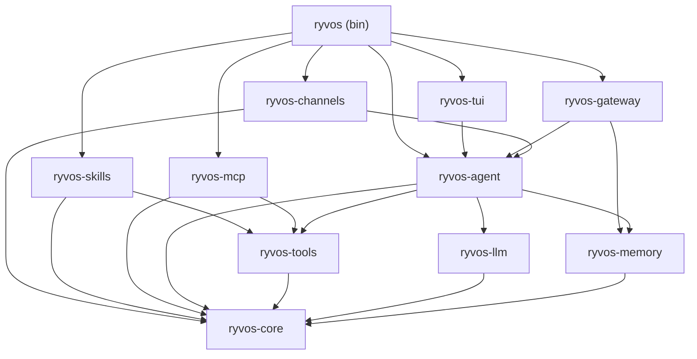

# Crate reference

Ryvos is a Cargo workspace of ten crates (plus one test-support crate).
Together they compile into a single `ryvos` binary. This page is the
navigator for the detailed crate documents; it shows the dependency graph,
summarizes each crate in one line, and recommends a reading order for
contributors who want to work through the codebase systematically.

For the high-level architectural view — how the crates fit into foundation,
platform, orchestration, and integration layers — read
[../architecture/system-overview.md](../architecture/system-overview.md)
first. For runtime behavior, read
[../architecture/execution-model.md](../architecture/execution-model.md).

## Dependency graph

`ryvos-core` is at the bottom and depends on nothing inside the workspace.
Every other crate depends on it, directly or transitively. The single binary
at the top (`src/main.rs`) depends on every integration-layer crate and,
through them, on everything else.

`ryvos-test-utils` is not shown above because it is a dev-dependency of
several crates and not part of the runtime graph. It provides mock
implementations of the four extension traits (`LlmClient`, `Tool`,
`ChannelAdapter`, `SessionStore`) so other crates can unit-test without real
LLMs or databases.

## Crate summary

| Crate | Purpose | Key traits and types | Depends on |
|---|---|---|---|
| `ryvos-core` | Foundation: traits, types, config, [EventBus](../glossary.md#eventbus), goal system | `LlmClient`, `Tool`, `ChannelAdapter`, `SessionStore`, `AppConfig`, `ChatMessage`, `ContentBlock`, `StreamDelta`, `AgentEvent`, `Goal`, `Verdict` | — |
| `ryvos-llm` | LLM client abstraction + 18+ provider implementations | `LlmClient` impls, `ProviderConfig`, `BillingType` | `ryvos-core` |
| `ryvos-memory` | SQLite session, history, and local Viking store | `SessionStore` impls, `HistoryStore`, `VikingStore` | `ryvos-core` |
| `ryvos-tools` | [Tool registry](../glossary.md#tool-registry) + 70+ built-in tools | `ToolRegistry`, `ToolCategory`, built-in `Tool` impls | `ryvos-core` |
| `ryvos-mcp` | MCP client and MCP server | `McpClient`, `McpServer`, transport adapters | `ryvos-core`, `ryvos-tools` |
| `ryvos-agent` | Agent loop, [Director](../glossary.md#director), [Guardian](../glossary.md#guardian), [Judge](../glossary.md#judge), [SafetyMemory](../glossary.md#safetymemory), Heartbeat, checkpoint store, run logger, cron, DAG executor | `AgentRuntime`, `Director`, `Guardian`, `Heartbeat`, `Judge`, `SecurityGate`, `ApprovalBroker`, `SafetyMemory`, `FailureJournal`, `CheckpointStore`, `RunLogger`, `CronScheduler`, `GraphExecutor`, `MultiAgentOrchestrator`, `PrimeOrchestrator`, `OutputValidator` | `ryvos-core`, `ryvos-llm`, `ryvos-tools`, `ryvos-memory` |
| `ryvos-gateway` | Axum HTTP/WS server, embedded Svelte Web UI, role-based auth | `GatewayRouter`, `Lane`, `Role`, `ApiKey` | `ryvos-core`, `ryvos-agent`, `ryvos-memory` |
| `ryvos-channels` | Telegram, Discord, Slack, WhatsApp adapters | `ChannelAdapter` impls, `DmPolicy` | `ryvos-core`, `ryvos-agent` |
| `ryvos-skills` | TOML + Lua/Rhai skill loader | `SkillLoader`, `SkillManifest`, `Tool` impls from skills | `ryvos-core`, `ryvos-tools` |
| `ryvos-tui` | Ratatui terminal UI with adaptive banner | `TuiApp`, streaming view, `EventBus` subscriber | `ryvos-core`, `ryvos-agent` |
| `ryvos-test-utils` | Shared test fixtures, mock LLMs, mock tools | `MockLlmClient`, `MockTool`, `MockChannelAdapter`, `MockSessionStore` | `ryvos-core` (dev) |

LOC figures and exact struct lists will appear in each crate's individual
reference page. This page is a map; the crate pages are the territory.

## Reading order

Contributors get the most value by reading bottom-up. Each step builds on the
previous one, and the dependency graph guarantees that every crate only uses
concepts you have already seen.

### Step 1: Foundation

Start with [ryvos-core.md](ryvos-core.md). Every other crate imports types and
traits from here, so understanding the `ChatMessage` model, the
`StreamDelta` enum, the four extension traits, and the `EventBus` is a
precondition for reading anything else. The config tree (`AppConfig` and its
nested structs) is also defined here and is referenced by every subsystem.

### Step 2: Platform

Read [ryvos-llm.md](ryvos-llm.md) and [ryvos-memory.md](ryvos-memory.md) next,
in either order. These two crates are orthogonal — neither depends on the
other — and they introduce the two I/O-bearing concerns that every higher
layer takes for granted: calling an LLM and persisting state. The
[CLI provider](../glossary.md#cli-provider) pattern from ADR-004 is explained
in `ryvos-llm`, and the seven-database layout from ADR-006 is explained in
`ryvos-memory`.

### Step 3: Orchestration

Move up to [ryvos-tools.md](ryvos-tools.md), then
[ryvos-mcp.md](ryvos-mcp.md), then [ryvos-agent.md](ryvos-agent.md). The tool
registry is small and self-contained — read it first so that when
`ryvos-agent` talks about tool dispatch you already know what a tool looks
like. `ryvos-mcp` builds on the tool registry (it registers proxied tools into
it). `ryvos-agent` is by far the largest crate in the workspace and is where
the bulk of the runtime logic lives; save it for last in this step.

When reading `ryvos-agent`, use
[../architecture/execution-model.md](../architecture/execution-model.md) as
the narrative guide and the crate doc as the structural reference. The agent
loop, Director, Guardian, Heartbeat, Judge, and SafetyMemory each have their
own detailed files under [../internals/](../internals/).

### Step 4: Integration

Finally, read the four integration-layer crates in any order:
[ryvos-gateway.md](ryvos-gateway.md),
[ryvos-channels.md](ryvos-channels.md),
[ryvos-skills.md](ryvos-skills.md), and [ryvos-tui.md](ryvos-tui.md). Each is
self-contained; none depends on another. If you are contributing a new
channel adapter, read `ryvos-channels` first. If you are contributing to the
Web UI, read `ryvos-gateway`.

### Optional: Test support

[ryvos-test-utils.md](ryvos-test-utils.md) is worth a quick read once you
start writing tests. It provides the mock implementations you will reach for
in almost every integration test under the workspace.

## Per-crate summaries

Each crate has its own detailed reference document. The links below take you
to those pages; the prose here is a one-paragraph preview so you know what
to expect.

### ryvos-core

The foundation crate. Defines the four extension-point traits (`LlmClient`,
`Tool`, `ChannelAdapter`, `SessionStore`), the conversation types
(`ChatMessage`, `ContentBlock`, `StreamDelta`, `ToolResult`, `ToolContext`,
`AgentEvent`), the `AppConfig` tree with `${ENV_VAR}` expansion, the
`EventBus` broadcast channel, the goal system with its `Verdict` enum, and the
deprecated [T0–T4](../glossary.md#t0t4) security tiers retained as
informational metadata. See [ryvos-core.md](ryvos-core.md).

### ryvos-llm

The LLM client abstraction. Provides `LlmClient` implementations for
Anthropic, OpenAI, Azure OpenAI, AWS Bedrock (with SigV4), Google Gemini,
Cohere v2, Claude Code CLI, GitHub Copilot CLI, and ten OpenAI-compatible
presets (Ollama, Groq, OpenRouter, Together, Fireworks, Cerebras, xAI,
Mistral, Perplexity, DeepSeek). Each provider reports a
[billing type](../glossary.md#billing-type) that determines whether its usage
is metered or flat-fee. See [ryvos-llm.md](ryvos-llm.md).

### ryvos-memory

The persistence crate. Owns `SessionStore`, `HistoryStore`, and `VikingStore`
implementations backed by SQLite. Following ADR-006, Ryvos uses seven
separate database files rather than one combined one: `sessions.db`,
`audit.db`, `cost.db`, `healing.db`, `viking.db`, `safety.db`, and
`integrations.db`. Each has its own schema lifecycle, migration path, and
backup cadence. See [ryvos-memory.md](ryvos-memory.md).

### ryvos-tools

The tool registry and 70+ built-in tools across twelve categories: bash,
filesystem, git, code, data, database, network, system, browser, memory,
scheduling, sessions. Each tool implements the `Tool` trait from
`ryvos-core`. The registry is also where skills (from `ryvos-skills`) and
external MCP tools (from `ryvos-mcp`) are registered, so the agent sees a
uniform view across all three sources. See [ryvos-tools.md](ryvos-tools.md).

### ryvos-mcp

Both an [MCP](../glossary.md#mcp) client and an MCP server. As a client it
connects to external MCP servers over stdio or streamable HTTP transports and
proxies their tools into the tool registry. As a server it exposes nine
Ryvos tools to other MCP clients (Claude Code, Claude Desktop, Cursor, and
others). MCP is the integration layer rather than a bespoke plugin protocol.
See [ryvos-mcp.md](ryvos-mcp.md) and ADR-008.

### ryvos-agent

The largest crate in the workspace and the one that contains the bulk of the
runtime logic. Houses the ReAct agent loop (`AgentRuntime`), the
[Director](../glossary.md#director), the [Guardian](../glossary.md#guardian),
the [Heartbeat](../glossary.md#heartbeat), the [Judge](../glossary.md#judge),
[SafetyMemory](../glossary.md#safetymemory), the
[failure journal](../glossary.md#failure-journal), the
[security gate](../glossary.md#security-gate), the
[approval broker](../glossary.md#approval-broker), the
[checkpoint store](../glossary.md#checkpoint), the JSONL run logger, the
cron scheduler, the DAG executor, the multi-agent orchestrator, the
structured-output validator, and the restricted sub-agent spawner
([`PrimeOrchestrator`](../glossary.md#prime)). See
[ryvos-agent.md](ryvos-agent.md) and the internals documents under
[../internals/](../internals/) for per-subsystem detail.

### ryvos-gateway

The Axum HTTP and WebSocket server. Exposes 40+ REST endpoints, the embedded
Svelte 5 Web UI (built at compile time and baked into the binary via
`rust_embed`, per ADR-007), and the per-connection [lane](../glossary.md#lane)
queue. Owns the role-based API-key middleware that maps keys to Viewer,
Operator, or Admin roles. See [ryvos-gateway.md](ryvos-gateway.md).

### ryvos-channels

The four [channel adapter](../glossary.md#channel-adapter) implementations:
Telegram, Discord, Slack, and WhatsApp (Cloud API). Each adapter implements
the `ChannelAdapter` trait from `ryvos-core`, handles its platform's approval
UI, and enforces its DM policy (`allowlist`, `open`, or `disabled`). See
[ryvos-channels.md](ryvos-channels.md) and ADR-010.

### ryvos-skills

Loads drop-in skills from `~/.ryvos/skills/`. Each skill is a TOML manifest
declaring inputs, outputs, and sandbox requirements, plus a Lua or Rhai
script. Validated skills are registered as tools in the registry and are
indistinguishable from built-ins from the agent's perspective. See
[ryvos-skills.md](ryvos-skills.md).

### ryvos-tui

The ratatui-based terminal UI with adaptive banner and streaming output. A
pure EventBus subscriber: it renders the state it learns from events and
never polls. Used by `ryvos` (the default interactive mode) and `ryvos tui`.
See [ryvos-tui.md](ryvos-tui.md).

### ryvos-test-utils

Shared test fixtures. Provides `MockLlmClient` (returns scripted
`StreamDelta` sequences), `MockTool` (records calls), `MockChannelAdapter`
(captures sent messages), and `MockSessionStore` (in-memory). Every
integration test in the workspace uses at least one of these. See
[ryvos-test-utils.md](ryvos-test-utils.md).

## Where to go next

Pick a crate and open its reference. If you are not sure where to start,
`ryvos-core` is the right first step; if you already know the foundation and
want the runtime story, `ryvos-agent` is where the interesting code lives.

The subsystem-level detail for `ryvos-agent` is split out into the
[../internals/](../internals/) documents. Those are the files to read when
you want every line of the agent loop, every state of the Director, or the
exact shape of a Guardian fingerprint.
