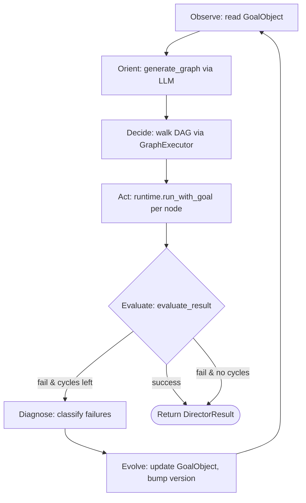

# Director OODA loop

The **[Director](../glossary.md#director)** is the alternate execution model
for **[runs](../glossary.md#run)** that carry a **[goal](../glossary.md#goal)**.
When a run has no goal, `AgentRuntime::run` drives the standard ReAct loop
documented in [agent-loop.md](agent-loop.md). When a run does have a goal and
the `[agent.director]` config section is enabled, the same entry point hands
off to `AgentRuntime::run_with_director`, which constructs a `Director` and
delegates the entire run to it. From that point on, the Director is in
charge: it plans, executes, evaluates, diagnoses, evolves, and retries up to
`max_evolution_cycles` times (default 3) before returning a best-effort
result.

This document walks the Director's implementation across `director.rs` and
the `graph/` submodule, and should be read alongside
[ADR-009](../adr/009-director-ooda-loop.md) for the design rationale and
[agent-loop.md](agent-loop.md) for the underlying runtime the Director
targets.

## The OODA framing

**[OODA](../glossary.md#ooda)** — Observe, Orient, Decide, Act — is the
military decision loop adapted from John Boyd's fighter-pilot literature.
The Director uses it because goals are not one-shot prompts; they are
multi-step tasks whose shape depends on what happened in earlier steps. The
four phases map onto the Director's top-level cycle in `Director::run`:

- **Observe** — read the current `GoalObject`: the goal itself, its
  constraints, its failure history, and its evolution count.
- **Orient** — ask the LLM to plan a DAG of subtasks via `generate_graph`.
- **Decide** — walk the DAG via `GraphExecutor`, evaluating each edge
  condition to pick the next node.
- **Act** — each node calls `runtime.run_with_goal` to run an agent
  sub-task against its system prompt and input keys.

After the cycle ends, the Director evaluates the result. If the goal is
met, it returns success. If not, it diagnoses the failures, evolves the
goal object, and loops back to Orient. The key intuition is that
"replan with more information" is a more robust recovery strategy than
"retry blindly", and that the `GoalObject.failure_history` is how the new
plan learns from the old one.

## The top-level loop

`Director::run` is the entry point. See
`crates/ryvos-agent/src/director.rs:65`:

```rust
pub async fn run(
    &self,
    goal_obj: &mut GoalObject,
    runtime: &AgentRuntime,
    session_id: &SessionId,
) -> Result<DirectorResult> {
    let mut all_failures: Vec<SemanticFailure> = Vec::new();
    let mut total_nodes = 0usize;

    for cycle in 0..=self.max_evolution_cycles {
        // 1. Generate graph
        let (nodes, edges) = self.generate_graph(goal_obj, session_id, cycle).await?;
        // 2. Execute graph
        let exec_result = self.execute_graph(nodes, edges, &entry, runtime, session_id).await?;
        // 3. Evaluate result
        let verdict = self.evaluate_result(&output, &exec_result, goal_obj).await;
        if exec_result.succeeded && verdict { return Ok(/* success */); }
        if cycle >= self.max_evolution_cycles { return Ok(/* best effort */); }
        // 4. Diagnose
        let failures = self.diagnose_failure(&exec_result, goal_obj, session_id).await;
        // 5. Evolve
        let should_retry = self.evolve(goal_obj, &failures, session_id, cycle);
        if !should_retry { return Ok(/* best effort */); }
    }
    Err(RyvosError::Config("Director: exhausted evolution cycles".to_string()))
}
```

The loop runs up to `max_evolution_cycles + 1` times — the `+1` is deliberate
because cycle 0 is the first attempt, not a retry, and the default of 3
evolution cycles means up to 4 total attempts at the goal. Each cycle takes
five steps in strict order: generate, execute, evaluate, diagnose (on
failure), evolve (on failure). Success at any step aborts the cycle early
and returns a `DirectorResult`.

The `DirectorResult` struct at
`crates/ryvos-agent/src/director.rs:29` is the single return shape:

```rust
pub struct DirectorResult {
    pub output: String,
    pub succeeded: bool,
    pub evolution_cycles: u32,
    pub total_nodes_executed: usize,
    pub semantic_failures: Vec<SemanticFailure>,
}
```

Note that `succeeded = false` is not an error — the Director returns
`Ok(DirectorResult { succeeded: false, ... })` on max-cycle exhaustion. The
caller (`AgentRuntime::run_with_director`) always returns the `output` field
regardless of `succeeded`. The only real error path in `Director::run` is
the unreachable "exhausted evolution cycles" fallthrough at the bottom of
the `for` loop, which should not fire under normal control flow.

## Observe: GoalObject and failure history

The Director does not have a distinct "Observe" function; observation is
what every other function reads from the `GoalObject`. The relevant
`ryvos_core::goal::GoalObject` holds the goal, a `failure_history: Vec<SemanticFailure>`
that accumulates across cycles, and an `evolution_count: u32`. The goal
itself has a `description`, a set of `success_criteria`, a list of
`constraints`, a `success_threshold`, and a `version` counter.

Observation is implicit: `generate_graph` reads
`goal_obj.goal.description`, `goal_obj.goal.success_criteria`,
`goal_obj.goal.constraints`, and `goal_obj.failure_history` directly and
stitches them into a prompt. On the first cycle, `failure_history` is
empty, so the prompt contains only the goal itself. On subsequent cycles,
every prior failure is formatted into the prompt's "Previous failures
(avoid repeating)" section.

## Orient: generate_graph

`generate_graph` is one LLM call that turns the goal into a JSON DAG. See
`crates/ryvos-agent/src/director.rs:160`:

```rust
let prompt = format!(
    r#"You are a Director planning an execution graph for a goal.

Goal: {}
Success criteria: {}
Constraints:
{}{}

Respond with a JSON object containing "nodes" and "edges" arrays.
Each node: {{"id": "string", "name": "string", "system_prompt": "string",
             "input_keys": [], "output_keys": [], "max_turns": number}}
Each edge: {{"from": "string", "to": "string", "condition": "always"}}

The first node in the array is the entry point. The last node should produce
a "final_output" output key.
Keep the graph minimal (2-5 nodes). Respond with ONLY the JSON object."#,
    goal_obj.goal.description,
    /* success criteria joined with "; " */,
    constraints_text,
    failure_context
);
```

The prompt is short and imperative on purpose. Three design choices matter:

- **"Minimal" is part of the instruction.** The Director steers the LLM
  toward 2-5 nodes because graphs larger than that compound cost and risk
  without adding much leverage. Complex goals are handled by evolution
  (more cycles, refined plans), not by giant graphs.
- **The first node is the entry point by convention.** There is no explicit
  `entry` field in the response; `Director::run` picks
  `nodes[0].id` as the entry. The LLM is told this, and in practice follows
  it consistently.
- **The last node produces `final_output`.** This is the contract that
  lets `Director::run` pick up a string result from the `HandoffContext`
  regardless of graph shape. A node that writes to `final_output` is
  signalling that its output is the run's result.

The LLM response is passed through `parse_graph_json`, which handles two
response shapes: markdown-fenced JSON and raw JSON. See
`crates/ryvos-agent/src/director.rs:422`:

```rust
pub fn parse_graph_json(response: &str) -> Result<(Vec<Node>, Vec<Edge>)> {
    let json_str = extract_json_object(response)
        .ok_or_else(|| RyvosError::Config("No JSON object found in LLM response".to_string()))?;
    let value: serde_json::Value =
        serde_json::from_str(json_str).map_err(|e| RyvosError::Config(e.to_string()))?;
    let nodes: Vec<Node> = value.get("nodes")
        .and_then(|v| serde_json::from_value(v.clone()).ok())
        .unwrap_or_default();
    let edges: Vec<Edge> = value.get("edges")
        .and_then(|v| serde_json::from_value(v.clone()).ok())
        .unwrap_or_default();
    if nodes.is_empty() {
        return Err(RyvosError::Config("Graph must have at least one node".to_string()));
    }
    Ok((nodes, edges))
}
```

`extract_json_object` walks the response in three passes: look for ` ```json`
fences first, then generic ``` ``` fences containing an object, then the
first balanced `{...}` substring. The third path handles models that emit
prose before or after the JSON despite the "only the JSON" instruction.
Missing `edges` is legal (a single-node graph); missing or empty `nodes` is
a hard error — a DAG without nodes is not a DAG.

Once parsed, `generate_graph` publishes `AgentEvent::GraphGenerated` with
the node and edge counts and the current `evolution_cycle`. Subscribers
(gateway UI, TUI, run log) can show the user the plan before execution
starts.

## Decide and Act: GraphExecutor

Executing the graph is delegated to `GraphExecutor` in
`crates/ryvos-agent/src/graph/executor.rs`. The Director calls it with a
fresh `HandoffContext` and no LLM override (the LLM inside the executor is
only used for `EdgeCondition::LlmDecide` edges, which the default Director
graph does not generate). See
`crates/ryvos-agent/src/director.rs:230`:

```rust
async fn execute_graph(
    &self,
    nodes: Vec<Node>,
    edges: Vec<Edge>,
    entry: &str,
    runtime: &AgentRuntime,
    _session_id: &SessionId,
) -> Result<crate::graph::executor::ExecutionResult> {
    let executor = GraphExecutor::new(nodes, edges, entry);
    let context = HandoffContext::new();
    executor.execute(runtime, context, None).await
}
```

The executor's main loop is a deterministic walk from the entry node. See
`crates/ryvos-agent/src/graph/executor.rs:84`:

```rust
loop {
    if visited.iter().filter(|id| **id == current_node_id).count() > 5 {
        warn!(node_id = %current_node_id, "Node visited more than 5 times, terminating graph");
        break;
    }
    visited.push(current_node_id.clone());
    let node = self.nodes.get(&current_node_id).ok_or_else(|| { /* ... */ })?;
    // ... build prompt, execute, ingest output, set status ...
    // ... find outgoing edges and pick first matching ...
}
```

Three safeties are built into the walk:

1. **Per-node visit cap at 5.** The loop breaks if any node is visited more
   than five times. This is the executor's cycle-breaker; it does not care
   why the cycle exists (bad graph, stuck condition, LLM producing the same
   decision every time), it just caps re-entry. Five is enough for
   legitimate loops (a node that retries on failure before advancing) and
   tight enough to prevent wasteful runaways.
2. **Unknown node id is a hard error.** An edge that points at a node not
   in the graph returns `RyvosError::Config` with the missing id. This
   surfaces malformed DAGs produced by a confused LLM immediately rather
   than letting them run halfway before breaking.
3. **No outgoing edges or no matching condition ends the graph.** The
   executor treats "nothing to do" as the terminal state, not as an error.
   A node with zero outgoing edges is a sink. A node whose outgoing edges
   all have conditions that evaluate to false is effectively a sink for
   this execution.

### Node execution

For each node, the executor builds a prompt, runs the agent, and ingests
the output back into the `HandoffContext`. See
`crates/ryvos-agent/src/graph/executor.rs:107`:

```rust
let base_prompt = node.system_prompt.as_deref().unwrap_or("Complete the task.");
let prompt = node.build_prompt(base_prompt, context.data());
let node_start = Instant::now();
let session = SessionId::new();
let result = if let Some(ref goal) = node.goal {
    runtime.run_with_goal(&session, &prompt, Some(goal)).await
} else {
    runtime.run(&session, &prompt).await
};
let elapsed_ms = node_start.elapsed().as_millis() as u64;
let (output, succeeded) = match result {
    Ok(text) => (text, true),
    Err(e) => { error!(/* ... */); (e.to_string(), false) }
};
context.ingest_output(&node.output_keys, &output);
context.set_str(format!("{}_status", node.id), if succeeded { "success" } else { "failure" });
```

Every node gets a **fresh `SessionId`** — nodes do not share conversation
history with other nodes. The shared state is exclusively the
`HandoffContext`, which passes values between nodes as named keys. This
makes each node a self-contained agent run with its own turn budget, its
own failure tracking, its own checkpoint (if checkpointing is enabled),
and its own Judge evaluation (if the node has a sub-goal).

Node-level goals nest inside Director-level goals. A `Node` with
`goal: Some(_)` will trigger the `AgentRuntime::run_with_goal` path; if the
runtime's director config is *also* enabled for that node's goal, there is
a theoretical second Director layer. In practice the inner Director is
avoided because generated sub-goals typically omit the `Goal` object — the
Director graph uses flat `system_prompt`s instead.

After the node returns, two writes happen on the handoff context:

- `context.ingest_output(&node.output_keys, &output)` extracts the
  declared output keys from the returned text. If the output parses as a
  JSON object and contains keys matching `output_keys`, those keys are
  extracted individually. Otherwise, the full output text is stored under
  *each* declared output key.
- `context.set_str("{node_id}_status", "success" | "failure")` writes a
  status flag under a conventional key name. This is what
  `EdgeCondition::Conditional { expr: "node1_status == \"success\"" }`
  reads.

`NodeResult` entries accumulate in an order-preserving `Vec` on the
execution result; when the graph ends, `all_succeeded` is
`node_results.iter().all(|r| r.succeeded)`.

### Node struct

Nodes are declared by the JSON the LLM generates, parsed via serde into
the `Node` struct at `crates/ryvos-agent/src/graph/node.rs:12`:

```rust
pub struct Node {
    pub id: String,
    pub name: String,
    #[serde(default)]
    pub system_prompt: Option<String>,
    #[serde(default)]
    pub input_keys: Vec<String>,
    #[serde(default)]
    pub output_keys: Vec<String>,
    #[serde(default)]
    pub tools: Vec<String>,
    #[serde(default = "default_max_turns")]
    pub max_turns: usize,
    #[serde(default)]
    pub goal: Option<Goal>,
    #[serde(default)]
    pub model: Option<ModelConfig>,
}
```

Seven fields are user-facing, two are optional overrides:

- `id` and `name` — identity. Names are for display; ids are used by edges.
- `system_prompt` — the node's task. `None` falls back to `"Complete the task."`.
- `input_keys` — which context values to splice into the prompt.
- `output_keys` — which context keys to write after the node runs.
- `tools` — tool allowlist. An empty list means "all tools in the runtime's
  registry".
- `max_turns` — per-node ReAct turn cap; default 10 (distinct from the
  runtime-wide `max_turns` of 25).
- `goal` — optional per-node goal that triggers the nested Judge path.
- `model` — optional per-node model override (e.g. a smaller model for a
  cheap step, a stronger model for a critical one).

The prompt builder at `crates/ryvos-agent/src/graph/node.rs:97` splices
context data for declared input keys into a `## Context Data` section
before the base prompt:

```rust
if !self.input_keys.is_empty() {
    prompt.push_str("## Context Data\n\n");
    for key in &self.input_keys {
        if let Some(value) = context_data.get(key) {
            let display = match value {
                serde_json::Value::String(s) => s.clone(),
                other => other.to_string(),
            };
            prompt.push_str(&format!("**{}**: {}\n", key, display));
        }
    }
    prompt.push_str("\n---\n\n");
}
prompt.push_str(base_prompt);
```

A node with no input keys just gets the base prompt verbatim. A node with
input keys that are not yet populated in the context silently omits them
— the splicer uses `if let Some(value) = ...` so missing inputs do not
crash; they just do not appear.

### Edges and edge conditions

Edges connect nodes and carry a condition. The `Edge` struct and the
`EdgeCondition` enum live in `crates/ryvos-agent/src/graph/edge.rs:4`:

```rust
pub struct Edge {
    pub from: String,
    pub to: String,
    #[serde(default)]
    pub condition: EdgeCondition,
}

#[serde(tag = "type", rename_all = "snake_case")]
pub enum EdgeCondition {
    #[default]
    Always,
    OnSuccess,
    OnFailure,
    Conditional { expr: String },
    LlmDecide { prompt: String },
}
```

The five variants are evaluated in order for each outgoing edge, and the
first matching edge wins. See `crates/ryvos-agent/src/graph/executor.rs:169`:

```rust
for edge in &outgoing {
    let matches = match &edge.condition {
        EdgeCondition::Always => true,
        EdgeCondition::OnSuccess => succeeded,
        EdgeCondition::OnFailure => !succeeded,
        EdgeCondition::Conditional { expr } => evaluate_condition(expr, context.data()),
        EdgeCondition::LlmDecide { prompt: decide_prompt } => {
            if let Some((llm_client, config)) = llm {
                evaluate_llm_edge(llm_client, config, decide_prompt, context.data()).await
            } else {
                warn!("LlmDecide edge but no LLM configured, skipping");
                false
            }
        }
    };
    if matches {
        next_node = Some(edge.to.clone());
        break;
    }
}
```

`Conditional` uses a tiny expression DSL implemented in
`crates/ryvos-agent/src/graph/edge.rs:84`. Three operators are supported:
`key == "value"`, `key != "value"`, and `key contains "substr"`. Evaluation
is by simple string split; anything else falls through to `false`. The
intentionally narrow grammar avoids pulling in a full expression engine
(and the attack surface that comes with it) for the handful of checks the
Director's default graphs actually need.

`LlmDecide` asks an LLM to answer yes/no given a prompt and the current
context data. See `crates/ryvos-agent/src/graph/executor.rs:222`. The
implementation is 30 lines: concat prompt + context + "Respond with ONLY
'yes' or 'no'", stream the response, check for a lowercase "yes". When
the Director calls `GraphExecutor::execute` with `None` for the LLM, any
`LlmDecide` edge logs a warning and defaults to `false` — the graph will
skip that edge and look for another matching one, or terminate.

### HandoffContext

The shared state between nodes is `HandoffContext`, defined in
`crates/ryvos-agent/src/graph/handoff.rs:10`:

```rust
pub struct HandoffContext {
    data: HashMap<String, serde_json::Value>,
    #[serde(default)]
    version: u64,
}
```

Keys are strings; values are `serde_json::Value` so anything serializable
can pass between nodes. The `version` counter increments on every mutation
and exists primarily for future caching and diffing work; it is not
currently read by the executor or Director. The two methods that matter
for graph execution are `set_str` (used by the executor to write
`{node_id}_status`) and `ingest_output`, which is where the output keys
actually flow.

`ingest_output` at `crates/ryvos-agent/src/graph/handoff.rs:61` tries to
parse the node output as JSON first. If parsing succeeds and yields an
object, the declared output keys are extracted individually from the
object. If parsing fails or the root is not an object, the full output
text is stored as a string under *every* declared output key:

```rust
pub fn ingest_output(&mut self, output_keys: &[String], output_text: &str) {
    if output_keys.is_empty() { return; }
    if let Ok(json) = serde_json::from_str::<serde_json::Value>(output_text) {
        if let Some(obj) = json.as_object() {
            for key in output_keys {
                if let Some(val) = obj.get(key) {
                    self.data.insert(key.clone(), val.clone());
                }
            }
            self.version += 1;
            return;
        }
    }
    for key in output_keys {
        self.data.insert(
            key.clone(),
            serde_json::Value::String(output_text.to_string()),
        );
    }
    self.version += 1;
}
```

This is the pragmatic compromise. A node that produces structured output
can declare multiple keys and get one value each. A node that produces
free text will get that text duplicated under every declared key, which is
wasteful but keeps downstream nodes working. The Director's generated
graphs usually declare a single output key per node to sidestep the
duplication case.

## Evaluate

Once the graph has finished walking, `evaluate_result` decides whether the
goal was actually met. See `crates/ryvos-agent/src/director.rs:244`:

```rust
async fn evaluate_result(&self, output: &str, exec_result: &ExecutionResult, goal_obj: &GoalObject) -> bool {
    if !exec_result.succeeded { return false; }
    let results = goal_obj.goal.evaluate_deterministic(output);
    let eval = goal_obj.goal.compute_evaluation(results, vec![]);
    if eval.passed { return true; }
    // fallback to LLM Judge for LlmJudge criteria
    let judge = Judge::new(self.llm.clone(), self.config.clone());
    match judge.evaluate(output, &[], &goal_obj.goal).await {
        Ok(verdict) => matches!(verdict, ryvos_core::types::Verdict::Accept { .. }),
        Err(_) => false,
    }
}
```

Three gates in sequence:

1. **Graph succeeded?** If any node failed, the whole execution is
   rejected regardless of output. This is stricter than it could be — a
   graph where an optional node failed could still succeed semantically —
   but the simpler rule avoids false positives.
2. **Deterministic criteria pass?** `evaluate_deterministic` runs the
   `OutputContains` and `OutputEquals` criteria against the final output
   string. If all deterministic criteria pass, the **[Judge](../glossary.md#judge)** is
   not called at all — no extra LLM cost for simple goals.
3. **LLM Judge accept?** Only if deterministic evaluation did not pass do
   we fall to the Judge. The Judge runs any `LlmJudge` criteria and
   returns a **[verdict](../glossary.md#verdict)**. Only `Verdict::Accept`
   counts as success here; `Retry`, `Escalate`, and `Continue` all map to
   `false`.

A `true` return short-circuits the Director loop and produces a successful
`DirectorResult`. A `false` return falls through to diagnosis and
evolution.

## Diagnose: classifying failures

`diagnose_failure` asks the LLM to categorize each failure into one of
five semantic buckets. See `crates/ryvos-agent/src/director.rs:271`. The
function has two branches — one for "some node failed, diagnose each
failed node" and one for "all nodes succeeded but the goal was not met,
diagnose the overall output".

The five failure categories are defined in
`ryvos_core::goal::FailureCategory`:

- `LogicContradiction` — the output contradicts a stated constraint or
  another part of the output.
- `VelocityDrift` — the graph took too long or used too many turns
  relative to the goal's time constraint.
- `ConstraintViolation` — an explicit constraint was ignored or
  violated.
- `FailureAccumulation` — many small errors compounded into a final
  failure without any single smoking gun.
- `QualityDeficiency` — the output meets the literal criteria but is
  not good enough. This is the catchall.

The diagnosis prompt is built per failed node:

```rust
let prompt = format!(
    "A graph node failed during goal execution.\n\
     Goal: {}\n\
     Node: {} ({})\n\
     Output/Error: {}\n\n\
     Classify the failure as one of: logic_contradiction, velocity_drift, \
     constraint_violation, failure_accumulation, quality_deficiency.\n\
     Respond with JSON: {{\"category\": \"...\", \"diagnosis\": \"...\"}}",
    goal_obj.goal.description, nr.node_id, nr.node_id,
    &nr.output[..nr.output.len().min(500)]
);
```

Only the first 500 characters of the failing node's output are shown to
the classifier — enough context for a diagnosis, not so much that the
prompt explodes. The response is parsed by `parse_diagnosis`, which looks
for the same JSON shape and falls back to `FailureCategory::QualityDeficiency`
with the first 200 chars of the response as the diagnosis text if parsing
fails.

Each classified failure becomes a `SemanticFailure`:

```rust
let failure = SemanticFailure {
    timestamp: chrono::Utc::now(),
    node_id: nr.node_id.clone(),
    category,
    diagnosis: diagnosis.clone(),
    attempted_action: format!("execute node {}", nr.node_id),
};
self.event_bus.publish(AgentEvent::SemanticFailureCaptured {
    session_id: session_id.clone(),
    node_id: nr.node_id.clone(),
    category: format!("{:?}", failure.category),
    diagnosis,
});
failures.push(failure);
```

The `SemanticFailureCaptured` event goes on the **[EventBus](../glossary.md#eventbus)**
so the gateway and run log can show the user what went wrong. The returned
`Vec<SemanticFailure>` is then passed to `evolve`.

## Evolve: growing the plan across cycles

`evolve` mutates the `GoalObject` in place to carry the diagnosed failures
into the next cycle, then returns whether the Director should retry. See
`crates/ryvos-agent/src/director.rs:366`:

```rust
fn evolve(&self, goal_obj: &mut GoalObject, failures: &[SemanticFailure], session_id: &SessionId, cycle: u32) -> bool {
    if failures.is_empty() { return false; }
    goal_obj.failure_history.extend(failures.iter().cloned());
    goal_obj.evolution_count += 1;
    goal_obj.goal.version += 1;
    let reason = failures.iter()
        .map(|f| format!("{:?}", f.category))
        .collect::<Vec<_>>().join(", ");
    self.event_bus.publish(AgentEvent::EvolutionTriggered {
        session_id: session_id.clone(),
        reason: reason.clone(),
        cycle: cycle + 1,
    });
    true
}
```

Three state changes happen atomically here:

1. **Failures are appended to `failure_history`.** The history grows
   monotonically across cycles and is read by the next `generate_graph`
   call to produce a revised plan.
2. **`evolution_count` is incremented.** This is the counter the user sees
   in event logs and in the final `DirectorResult`.
3. **`goal.version` is incremented.** This is what external observers
   (the gateway, the audit trail) use to tell "the first plan" apart from
   "the plan after one evolution".

`evolve` returns `false` if there are no failures — which is a defensive
case that should not fire, because the Director only calls `evolve` after
`evaluate_result` returned `false`. Still, the guard keeps the contract
honest: no failures means nothing to evolve from, so do not waste a cycle
replanning the same thing.

The failures themselves feed back into the next `generate_graph` call via
the `failure_context` preamble:

```rust
let failure_context = if goal_obj.failure_history.is_empty() {
    String::new()
} else {
    let failures: Vec<String> = goal_obj.failure_history.iter()
        .map(|f| format!("- Node '{}': {:?} — {}", f.node_id, f.category, f.diagnosis))
        .collect();
    format!("\n\nPrevious failures (avoid repeating):\n{}", failures.join("\n"))
};
```

So on cycle 1, the LLM sees "here is the goal". On cycle 2, it sees "here
is the goal, and the previous plan failed because node 'extract_title'
had a LogicContradiction: the title contradicted the constraints". The new
plan is the LLM's attempt to route around the cited failure.

## The Director OODA diagram



Four events mark the cycle boundaries on the
**[EventBus](../glossary.md#eventbus)**:

| Event | When | Payload |
|---|---|---|
| `GraphGenerated` | after Orient | node count, edge count, evolution cycle |
| `NodeComplete` | after each Act | node id, succeeded, elapsed ms |
| `SemanticFailureCaptured` | during Diagnose | node id, category, diagnosis |
| `EvolutionTriggered` | after Evolve | reason, new cycle number |

Together these give any subscriber enough information to reconstruct the
Director's reasoning without having to open a debugger.

## Entry from the agent loop

The Director is not a new entry point for users; it is an internal
delegation. See `crates/ryvos-agent/src/agent_loop.rs:1189`:

```rust
fn run_with_director<'a>(
    &'a self,
    session_id: &'a SessionId,
    user_message: &'a str,
    goal: &'a Goal,
) -> futures::future::BoxFuture<'a, Result<String>> {
    Box::pin(async move {
        let director_cfg = self.config.agent.director.as_ref()
            .expect("director config checked before call");
        let director_model = director_cfg.model.clone()
            .unwrap_or_else(|| self.config.model.clone());
        let director = Director::new(
            self.llm.clone(), director_model, self.event_bus.clone(),
            director_cfg.max_evolution_cycles, director_cfg.failure_threshold,
        );
        let mut goal_obj = GoalObject {
            goal: goal.clone(),
            failure_history: vec![],
            evolution_count: 0,
        };
        if goal_obj.goal.description.is_empty() {
            goal_obj.goal.description = user_message.to_string();
        }
        let result = director.run(&mut goal_obj, self, session_id).await?;
        self.event_bus.publish(AgentEvent::RunComplete { /* ... */ });
        if result.succeeded { Ok(result.output) } else { Ok(result.output) }
    })
}
```

Three details are worth calling out here:

- **The delegation is gated by config.** `AgentRuntime::run_with_goal`
  checks `self.config.agent.director.as_ref()` and its `enabled` field
  before calling `run_with_director`. A run with a goal but no director
  config falls through to the standard ReAct loop with goal-aware
  iteration — the Judge runs at the end of each turn and injects retry
  hints, but there is no graph and no diagnose/evolve loop.
- **The Director can use a different model than the agent loop.**
  `director_cfg.model` is an optional override. A common pattern is to
  use a weaker, cheaper model for leaf nodes and a stronger planner for
  graph generation and diagnosis. When the override is absent, the
  Director uses the same model as the runtime.
- **Success and failure both return `Ok`.** The terminal `match` on
  `result.succeeded` produces the same `Ok(result.output)` on both
  branches. The Director never returns an error for goal failure; it
  returns a best-effort output with `succeeded: false`. Errors are
  reserved for infrastructure failures — LLM unavailable, malformed
  graph, exhausted cycles path.

## Constraints on the caller

The Director assumes a few things about the surrounding runtime:

- The runtime has an LLM that can produce JSON on request. Tool-augmented
  models work fine; models that cannot follow "respond with only JSON"
  will fall through `extract_json_object`'s bracket-balancing fallback and
  probably fail `parse_graph_json`. The Director reports the parsing
  error as a config error, which ends the cycle early.
- The runtime has a working event bus. Without the bus, every
  `publish` call is a no-op, which is fine for the Director's correctness
  but hides its reasoning from any observer.
- The runtime's session store is populated. Every `runtime.run` call
  from inside `GraphExecutor` writes to the session store under a fresh
  `SessionId`. This is by design — each node is an independent agent run
  and deserves its own history — but it means a goal with five nodes and
  three evolution cycles writes fifteen new sessions to `sessions.db`.
  The MCP session-browser tools expose these sessions, and the cleanup
  story for them is on the roadmap but not yet implemented.

## Testing posture

The test module at `crates/ryvos-agent/src/director.rs:517` covers the
pure functions of the file:

- `test_parse_graph_json_basic` — basic round-trip of a two-node graph.
- `test_parse_graph_json_with_markdown` — markdown-fenced JSON extraction.
- `test_parse_graph_json_empty_nodes_fails` — zero nodes is an error.
- `test_extract_json_object` — the three bracket-balancing fallbacks.
- `test_parse_diagnosis` — category + diagnosis extraction.
- `test_parse_diagnosis_fallback` — unparseable responses default to
  `QualityDeficiency`.
- `test_evolve_bumps_version` — manual walk of the evolve state mutations.

The executor tests live next door at
`crates/ryvos-agent/src/graph/executor.rs:259` and cover basic graph
construction and the status-key handoff convention. Edge-condition tests
are in `crates/ryvos-agent/src/graph/edge.rs:128`. Handoff serialization
and ingestion tests are in `crates/ryvos-agent/src/graph/handoff.rs:100`.

There are no integration tests that exercise a full OODA cycle against a
real LLM; the Director is covered end-to-end through the workspace-wide
director runner tests when `cargo test --workspace` is run against a
mock LLM fixture.

## Where to go next

- [agent-loop.md](agent-loop.md) — the underlying ReAct runtime that
  executes each Director node, including the judge path that evaluates a
  nested goal.
- [graph-executor.md](graph-executor.md) — the deep dive specific to the
  DAG walker (planned).
- [judge.md](judge.md) — the two-level goal evaluator the Director falls
  back to when deterministic criteria are not conclusive.
- [ADR-009](../adr/009-director-ooda-loop.md) — the design decision and
  its tradeoffs.
- [../architecture/execution-model.md](../architecture/execution-model.md) —
  how the Director fits alongside the agent loop, Guardian, and Heartbeat
  at runtime.
