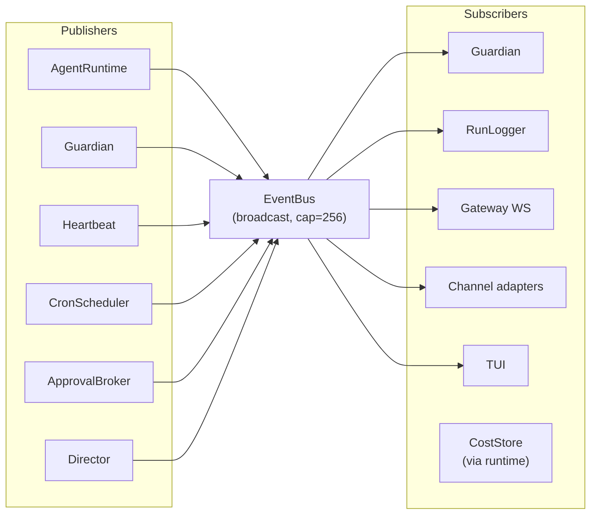

# Event bus

The **[EventBus](../glossary.md#eventbus)** is the central nervous system of a
running Ryvos daemon. Every long-lived subsystem — the **[agent runtime](../glossary.md#agent-runtime)**,
the **[Guardian](../glossary.md#guardian)**, the **[Heartbeat](../glossary.md#heartbeat)**,
the cron scheduler, the gateway's WebSocket handler, every **[channel adapter](../glossary.md#channel-adapter)**,
the run logger, the approval broker, the TUI — either publishes lifecycle
events to the bus, subscribes to them, or both. The bus is what keeps these
tasks decoupled: nothing inside the runtime ever calls a method on the
Guardian, and the Guardian never calls a method on the runtime. They only
ever see each other through events.

This document walks `crates/ryvos-core/src/event.rs` end to end and then
describes the publisher/subscriber topology at the daemon level. For the
architectural motivation behind event-driven pub/sub, see
[../adr/005-event-driven-architecture.md](../adr/005-event-driven-architecture.md).
For the concurrency implications, see
[../architecture/concurrency-model.md](../architecture/concurrency-model.md).
For how the agent loop specifically publishes and consumes events, see
[agent-loop.md](agent-loop.md).

## Purpose and shape

The EventBus is a thin wrapper around a `tokio::sync::broadcast::Sender`,
defined at `crates/ryvos-core/src/event.rs:4`:

```rust
pub struct EventBus {
    tx: tokio::sync::broadcast::Sender<AgentEvent>,
}

impl EventBus {
    pub fn new(capacity: usize) -> Self {
        let (tx, _) = tokio::sync::broadcast::channel(capacity);
        Self { tx }
    }

    pub fn publish(&self, event: AgentEvent) {
        let _ = self.tx.send(event);
    }

    pub fn subscribe(&self) -> tokio::sync::broadcast::Receiver<AgentEvent> {
        self.tx.subscribe()
    }
}
```

Broadcast semantics mean every subscriber sees every event — there is no
routing, no queue, no persistence. Each subscriber holds its own ring
buffer of up to `capacity` events; the sender writes to every buffer in
one call; receivers drain their buffers on their own tasks. That is the
whole mechanism.

`EventBus::default()` calls `new(256)`. The capacity is a compromise
between memory (each slot holds an `AgentEvent`, which is a boxed enum
with payloads up to a few hundred bytes) and burst tolerance. Streaming a
single LLM response produces one `TextDelta` per token chunk, and a
fast model can push 50–100 of those per second. Combined with concurrent
`ToolStart`, `ToolEnd`, `UsageUpdate`, and `TurnComplete` events from
parallel turns in other sessions, 256 slots give a slow subscriber about
two seconds of headroom before falling behind.

`publish` swallows the send error. `tokio::sync::broadcast::Sender::send`
returns `Err(SendError)` when there are zero active receivers, which is a
legitimate state during daemon startup and shutdown. Ryvos treats "no one
is listening" as fine — the event is still useful for the subscribers who
*are* listening, and events are not required to be delivered to be
correct; they are required to be delivered *if the subscriber is active*.

## The AgentEvent enum

`AgentEvent`, defined at `crates/ryvos-core/src/types.rs:426`, is the single
enum that rides the bus. It has 29 variants grouped by purpose.

Lifecycle events bracket every **[run](../glossary.md#run)** and every
**[turn](../glossary.md#turn)**:

- `RunStarted { session_id }` — published by `AgentRuntime::run` before
  the first LLM call.
- `TurnComplete { turn }` — published at the end of each turn iteration
  in the ReAct loop.
- `RunComplete { session_id, total_turns, input_tokens, output_tokens }`
  — published on a clean exit (either `EndTurn` stop or goal acceptance).
- `RunError { error }` — published when the loop returns an error
  (cancellation, timeout, LLM failure, budget exceeded).

Stream events carry the LLM output as it arrives:

- `TextDelta(String)` — a fragment of visible assistant text.
- `ToolStart { name, input }` — a tool call is about to execute.
- `ToolEnd { name, result }` — a tool call finished, with its
  `ToolResult`.

Budget and usage events carry cost metrics:

- `UsageUpdate { input_tokens, output_tokens }` — cumulative token usage
  for the current stream.
- `BudgetWarning { session_id, spent_cents, budget_cents, utilization_pct }`
  — the monthly dollar budget has crossed a soft threshold.
- `BudgetExceeded { session_id, spent_cents, budget_cents }` — the
  monthly dollar budget has been exhausted; the Guardian will cancel
  the run in response.

Guardian events report pathological patterns:

- `GuardianStall { session_id, turn, elapsed_secs }` — no activity for
  the configured stall timeout.
- `GuardianDoomLoop { session_id, tool_name, consecutive_calls }` — the
  same tool was invoked with the same arguments more than `N` times in
  a row.
- `GuardianBudgetAlert { session_id, used_tokens, budget_tokens, is_hard_stop }`
  — token budget is crossing a threshold or has been exhausted.
- `GuardianHint { session_id, message }` — the Guardian injected a
  corrective hint into the agent's next turn.

Goal and judge events report outcome assessment:

- `GoalEvaluated { session_id, evaluation }` — the goal evaluator ran
  a criterion check.
- `JudgeVerdict { session_id, verdict }` — the Judge issued a `Verdict`
  on the run (Accept / Retry / Escalate / Continue).
- `DecisionMade { decision }` — a `Decision` was logged during a tool
  dispatch, with the set of options considered and the chosen outcome.

Approval events coordinate human-in-the-loop checkpoints:

- `ApprovalRequested { request }` — a **[soft checkpoint](../glossary.md#soft-checkpoint)**
  was hit and the `SecurityGate` is waiting for a decision.
- `ApprovalResolved { request_id, approved }` — the broker received a
  decision from a channel or the Web UI.

Heartbeat events report timer-driven self-checks:

- `HeartbeatFired { timestamp }` — the interval timer fired.
- `HeartbeatOk { session_id, response_chars }` — the check returned an
  "all clear" acknowledgment; normally suppressed from user channels.
- `HeartbeatAlert { session_id, message, target_channel }` — the check
  returned a concrete finding; routed to either the target channel or
  all channels.

Cron events report scheduled-run outcomes:

- `CronFired { job_id, prompt }` — a persistent cron job is starting.
- `CronJobComplete { name, response, channel }` — the job finished and
  produced a response for the given channel.

Director events report **[OODA](../glossary.md#ooda)** progress:

- `GraphGenerated { session_id, node_count, edge_count, evolution_cycle }`
  — the Director compiled a new plan DAG.
- `NodeComplete { session_id, node_id, succeeded, elapsed_ms }` — one
  graph node finished.
- `EvolutionTriggered { session_id, reason, cycle }` — the plan is
  being regenerated after a failure.
- `SemanticFailureCaptured { session_id, node_id, category, diagnosis }`
  — the Director diagnosed a semantic failure (as opposed to a tool
  failure).

Finally, `ToolBlocked { name, tier, reason }` is a legacy event retained
for compatibility with the pre-v0.6 tier-blocking model. It is never
emitted under **[passthrough security](../glossary.md#passthrough-security)**
but still has to exist for old subscribers to compile.

The enum has no `#[non_exhaustive]` marker, so every match over
`AgentEvent` must handle all 29 variants. This is intentional: adding a
new variant is a breaking change, and the compile error it produces in
every subscriber is a useful way to catch the sites that need updating.

## Filtered subscriptions

Most subscribers want everything. The Guardian needs `ToolStart` and
`UsageUpdate` to detect doom loops and budget exhaustion; the gateway's
WebSocket forwarder needs `TextDelta` to stream output to the browser;
the run logger needs the full event sequence. These subscribers call
`EventBus::subscribe()` and drain the resulting `broadcast::Receiver`
directly.

Some subscribers want only a slice. A Web UI page showing the history of
a single session should not receive events from every other running
session. A subscriber that only cares about Director graph events does
not want to be woken up by every `TextDelta`. For these cases, the
EventBus exposes `subscribe_filtered` at
`crates/ryvos-core/src/event.rs:29`:

```rust
pub fn subscribe_filtered(&self, filter: EventFilter) -> FilteredReceiver {
    FilteredReceiver {
        rx: self.tx.subscribe(),
        filter,
    }
}
```

`EventFilter` has three optional fields: `session_id`, `event_types`
(a `Vec<String>` of discriminant names), and `node_id` (reserved for
future graph execution). An unset field matches everything; a set field
matches only events that satisfy it. The `matches` method implements
the conjunction. See `crates/ryvos-core/src/event.rs:87`:

```rust
pub fn matches(&self, event: &AgentEvent) -> bool {
    if let Some(ref sid) = self.session_id {
        if let Some(event_sid) = extract_session_id(event) {
            if event_sid != sid {
                return false;
            }
        }
        // Events without a session_id field pass the session filter.
    }
    if let Some(ref types) = self.event_types {
        let event_type = event_type_name(event);
        if !types.iter().any(|t| t == event_type) {
            return false;
        }
    }
    true
}
```

Two subtleties deserve attention. First, `session_id` filtering is a
soft match: events without a session in their payload pass through. This
is because events like `TextDelta` and `UsageUpdate` carry no session id
— they are implicitly "the current run" — and dropping them would break
the streaming contract for filtered subscribers. Second, `node_id`
filtering is currently a no-op; the code returns `true` for any event
because `AgentEvent` variants do not yet carry a node id. When graph
execution starts tagging events with node ids, the filter will become
active without changing the public surface.

`extract_session_id` at `crates/ryvos-core/src/event.rs:115` is the
accompanying helper: a long `match` that pulls `session_id.0` out of the
seventeen variants that carry one, and returns `None` for the twelve
that do not. The twelve without a session id are the ones that are
implicitly scoped to "the current stream" (`TextDelta`, `ToolStart`,
`ToolEnd`, `TurnComplete`, `UsageUpdate`, `DecisionMade`,
`HeartbeatFired`, `CronFired`, `CronJobComplete`, `RunError`,
`ToolBlocked`, `ApprovalResolved`).

`event_type_name` at `crates/ryvos-core/src/event.rs:139` is the
discriminant-to-string mapper used for `event_types` filtering. The
return type is `&'static str`, so the filter comparison is a plain
string-equality check against a compile-time constant.

## The FilteredReceiver loop

`FilteredReceiver` wraps a broadcast receiver and a filter. Its `recv`
method is a simple loop at `crates/ryvos-core/src/event.rs:181`:

```rust
pub async fn recv(&mut self) -> Result<AgentEvent, tokio::sync::broadcast::error::RecvError> {
    loop {
        let event = self.rx.recv().await?;
        if self.filter.matches(&event) {
            return Ok(event);
        }
    }
}
```

Non-matching events are silently dropped — the loop pulls the next event
without the caller ever seeing it. This keeps filter callers simple: they
treat `FilteredReceiver::recv` exactly like `broadcast::Receiver::recv`
and the filter is invisible.

The `RecvError` bubbles up directly. There are two variants:
`RecvError::Lagged(n)` means the receiver fell behind by more than the
channel capacity and skipped `n` events; `RecvError::Closed` means the
sender was dropped. Neither is handled inside `FilteredReceiver`; the
caller decides what to do. Callers that need to survive lag typically
log the skipped count and continue looping. The `RunLogger` does exactly
that at `crates/ryvos-agent/src/run_log.rs:113`:

```rust
Err(tokio::sync::broadcast::error::RecvError::Lagged(n)) => {
    debug!(skipped = n, "RunLogger lagged, skipped events");
}
```

The broadcast receiver is self-healing after a lag. The next `recv` call
returns the oldest event still in the buffer, so a lagged subscriber
simply loses the missed window but keeps functioning. Ryvos treats
missed events as a display issue: durable state lives in the audit
database, the cost store, and the session store, so the UI redrawing
from the next event is always correct relative to those authoritative
sources.

## Publisher/subscriber topology

The full graph of who publishes and who subscribes is worth laying out
because it is the clearest statement of how Ryvos stays decoupled.



The Guardian appears on both sides of the bus. It subscribes to consume
`ToolStart`, `UsageUpdate`, and `TurnComplete` from the runtime, and it
publishes `GuardianStall`, `GuardianDoomLoop`, `GuardianBudgetAlert`,
and `GuardianHint` when its watchers fire. The Guardian never calls
into the runtime directly; its only outbound path is an `mpsc` channel
of `GuardianAction` values that the agent loop drains between turns.
See [guardian.md](guardian.md) for the full story.

The gateway's WebSocket handler subscribes in a background task at
`crates/ryvos-gateway/src/connection.rs:54`. It uses
`EventBus::subscribe()` directly rather than `subscribe_filtered` and
does its own in-loop translation from `AgentEvent` variants to
`ServerEvent` JSON frames. The match there handles about 23 of the 29
variants; Director and semantic-failure events route through a
different subscriber because they are specific to goal runs.

Channel adapters subscribe through `ChannelDispatcher` in
`crates/ryvos-channels/src/dispatch.rs:103`. The dispatcher spawns a
heartbeat router task that pulls `HeartbeatAlert`, `HeartbeatOk`, and
`CronJobComplete` events off the bus and forwards them to the
appropriate adapter's `broadcast` method, optionally scoped to a single
target channel.

The TUI subscribes in `crates/ryvos-tui/src/event.rs:49`. It treats a
`RecvError::Lagged` as a `Tick` event rather than an error, which lets
the draw loop resume cleanly when the user's terminal falls behind a
burst. The `App` state is the durable view, so a redraw from the next
event is correct.

The run logger subscribes once at daemon startup and writes every
interesting event to a JSONL file under `workspace/logs/`. It is the
simplest subscriber: it does not filter, it does not react, it just
flushes each entry for crash resilience. See
[../guides/debugging-runs.md](../guides/debugging-runs.md) for the on-disk
format.

## Slow-subscriber handling

Broadcast's one gotcha is that the publisher never waits. If a
subscriber is slow enough that its local buffer fills up, the next event
evicts the oldest and the receiver sees `RecvError::Lagged(n)` on its
next `recv`. Ryvos handles this differently in different places.

The RunLogger logs the skipped count and continues. It cannot retroactively
write the missed events — they are gone from the buffer — but the
durable state they described is still available in the other stores.
This is fine because the run log's purpose is post-hoc debugging, not
authoritative state.

The TUI converts `Lagged` to `Tick` and lets the next draw cycle pick up
the current `App` state. The `App` is mutated by a separate event loop
that folds events as they arrive; when that loop falls behind a burst of
`TextDelta`, the terminal simply sees a catch-up jump on the next draw.

The Guardian's default behavior, because it uses `subscribe()` directly,
is to resubscribe on lag. Losing a few `TextDelta` events is harmless;
losing a `TurnComplete` or a `UsageUpdate` could miss a budget threshold
on a single turn. The consequence is a delayed alert by at most one
turn, which is acceptable because the next `UsageUpdate` re-syncs the
running total with ground truth.

The gateway's WebSocket forwarder loses deltas to the browser. This is
a display problem only — the durable state is in `sessions.db` and can
be redrawn on reconnect. The Web UI treats a missed delta the same as
network jitter: if the next event arrives successfully, the stream is
assumed to have caught up.

The architectural contract is that *no subsystem relies on the EventBus
for authoritative state*. Everything that must not be lost is also
written to a SQLite store before the event is published. Events are the
fast path for real-time consumers; SQLite is the slow path for
correctness.

## Why broadcast

The choice of `tokio::sync::broadcast` over `mpsc` or a pub/sub crate is
argued in full in [../adr/005-event-driven-architecture.md](../adr/005-event-driven-architecture.md).
The short version:

- Ryvos has a small, known set of subscribers (on the order of 10), and
  the cost of broadcasting to all of them is dominated by the cost of
  cloning the `AgentEvent` enum, which is cheap for most variants.
- Every subscriber needs most variants. Per-topic routing would not
  meaningfully reduce traffic.
- `tokio::sync::broadcast` is a zero-dependency, already-in-the-tree
  primitive with well-understood semantics.
- The slow-subscriber problem is a feature, not a bug: the publisher
  never blocks, so a stalled UI can never deadlock the agent loop.

The alternative — a pub/sub crate like `bus` or `postage` — would add
features Ryvos does not need (topic registration, per-subscriber
queues with backpressure) at the cost of more surface area, another
dependency, and more unfamiliar failure modes. Broadcast is the right
call for the shape of the problem.

## Capacity rationale

256 is not a magic number, but the tradeoffs are specific. Each slot in
the broadcast channel holds one `AgentEvent`, which is a boxed enum
whose largest variant (`JudgeVerdict`) holds a `Verdict` with a reason
string and a hint string. Ballpark, each event is 200–500 bytes
including padding; 256 slots is roughly 64–128 KB of in-flight event
state per subscriber.

On the throughput side, the worst case is a streaming model producing
~100 `TextDelta` per second for a single active stream. A slow
subscriber that pulls at 10 Hz would fall 90 events behind per second.
256 slots give about 2.8 seconds of headroom before the oldest delta is
dropped. That is enough for a network hiccup on the Web UI side to
resolve without losing the stream.

Bumping the capacity to 1024 would add roughly 350 KB of peak memory per
subscriber in return for 11 seconds of headroom. That has not been
necessary in practice — every observed lag incident has been a
permanently stuck subscriber, not a briefly slow one, and more headroom
would not have rescued it.

If a new subscriber needs a different capacity, the right answer is
usually to make that subscriber its own broadcast channel rather than
to expand the shared bus. The bus is shared because every subsystem
reads most of its traffic; a subsystem that reads one variant out of
twenty-nine is better served by a direct channel.

## Testing the bus

The `event.rs` test module at `crates/ryvos-core/src/event.rs:201` covers
the filter logic with six tests: unfiltered subscribe, filter by session,
filter by event type, combined filter, type-name mapping, and the
"sessionless events pass the session filter" rule. The Director event
types each have a dedicated test at
`crates/ryvos-core/src/event.rs:307`. Adding a new `AgentEvent` variant
should include a test at the same level: one test that round-trips the
variant through `subscribe_filtered(EventFilter::for_types(…))`, and one
that verifies `extract_session_id` behaves correctly for the new shape.

There are no integration tests of the full topology — that would require
spinning up a whole daemon — but each subscriber has its own unit tests
that mock the bus with a small-capacity instance and verify the right
events are consumed. The Guardian tests in
`crates/ryvos-agent/src/guardian.rs` are the fullest example.

## Where to go next

- [agent-loop.md](agent-loop.md) — every site in the per-turn loop that
  publishes an event to the bus.
- [guardian.md](guardian.md) — the most sophisticated subscriber, and
  the clearest example of how filtered consumption works in practice.
- [../crates/ryvos-core.md](../crates/ryvos-core.md) — the `EventBus`
  and `AgentEvent` types as part of the core crate surface.
- [../architecture/concurrency-model.md](../architecture/concurrency-model.md)
  — the tokio task topology that the EventBus ties together.
- [../adr/005-event-driven-architecture.md](../adr/005-event-driven-architecture.md)
  — the motivation for broadcast delivery and the rejected alternatives.
