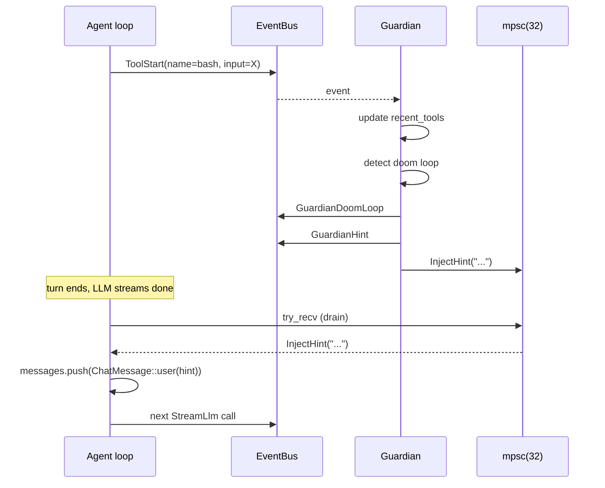

# Guardian

The **[Guardian](../glossary.md#guardian)** is Ryvos's background watchdog. It
is not part of the **[agent runtime](../glossary.md#agent-runtime)** — the
agent loop runs as one task, and the Guardian runs as a separate long-lived
task that subscribes to the **[EventBus](../glossary.md#eventbus)** and watches
for three pathologies: **[doom loops](../glossary.md#doom-loop)**, stalls, and
budget exhaustion. When any of them fires, the Guardian sends a corrective
action back to the agent loop through an `mpsc` channel. The loop picks up
the action between turns and either injects a hint as a user message or
cancels the run.

This document walks the 592-line file at
`crates/ryvos-agent/src/guardian.rs` end to end.

## Purpose and invariants

The Guardian exists because **[passthrough security](../glossary.md#passthrough-security)**
leaves three failure modes uncovered by the classifier. **[SafetyMemory](../glossary.md#safetymemory)**
catches patterns that can be recognized after the fact — a destructive
command, a leaked secret, a denied permission — but it cannot tell when the
agent is looping, idle, or bleeding money. Those are temporal pathologies:
they depend on *sequences* of events, not individual calls. The Guardian is
the subsystem that watches the sequence.

Three invariants hold for every Guardian instance:

1. **It never runs in-band with the agent loop.** Guardian is a separately
   spawned `tokio` task. The agent loop never calls Guardian functions
   directly; the only communication is one broadcast subscription (events
   in) and one `mpsc` sender (actions out).
2. **It is advisory by default.** The only escalation path that actually
   preempts the agent is `GuardianAction::CancelRun`, and that is reserved
   for hard budget violations. Doom loops and stalls produce hints, not
   cancellations.
3. **Its hints are applied between turns, not mid-turn.** A hint injected
   while the LLM is streaming does not interrupt the current stream; it is
   added to the message list that the *next* `llm.chat_stream` call sees.
   This keeps the Guardian from racing with token output.

## Construction and wiring

`Guardian::new` returns both the watchdog and its action receiver. See
`crates/ryvos-agent/src/guardian.rs:69`:

```rust
pub fn new(
    config: GuardianConfig,
    event_bus: Arc<EventBus>,
    cancel: CancellationToken,
) -> (Self, mpsc::Receiver<GuardianAction>) {
    let (hint_tx, hint_rx) = mpsc::channel(32);
    let guardian = Self {
        config,
        event_bus,
        cancel,
        hint_tx,
        cost_store: None,
        budget_config: None,
    };
    (guardian, hint_rx)
}
```

The returned `mpsc::Receiver<GuardianAction>` is passed to the agent runtime
via `AgentRuntime::set_guardian_hints`, which stores it under an
`Arc<Mutex<...>>` so the agent loop can drain it non-blockingly between
turns. The channel has capacity 32 — enough to buffer several bursts of
warnings without back-pressuring the Guardian task.

Two optional fields let the Guardian enforce a dollar budget in addition to
token metrics. `Guardian::set_budget` wires a `CostStore` and a `BudgetConfig`
into the watchdog; without them, dollar enforcement is a no-op. Token
enforcement is always on if `token_budget > 0` in the guardian config.

The `CancellationToken` is shared with the daemon's shutdown signal. When
the daemon is stopped, the Guardian task observes the cancellation on its
next `tokio::select!` and exits cleanly.

## The main loop

The heart of the file is the single `tokio::select!` inside `Guardian::run`
at `crates/ryvos-agent/src/guardian.rs:93`. It handles three cases per
iteration: an event from the bus, the stall timer firing, or the
cancellation token firing.

```rust
loop {
    let stall_remaining = stall_timeout.saturating_sub(last_progress.elapsed());

    tokio::select! {
        event = rx.recv() => { /* ... update state, maybe emit action ... */ }
        _ = tokio::time::sleep(stall_remaining) => { /* ... check stall ... */ }
        _ = self.cancel.cancelled() => { break; }
    }
}
```

The loop has no internal `sleep(fixed_interval)`. Instead, the stall check
uses a dynamic sleep whose duration is recomputed every iteration. That
duration is the remaining slack until the stall threshold trips,
`saturating_sub`'d so it cannot go negative. If an event arrives before the
sleep expires, the sleep is cancelled by the `tokio::select!` branch
selection; on the next iteration, `last_progress` has been refreshed and
`stall_remaining` is larger again.

Per-iteration state lives on the stack (not in `self`): `recent_tools`
(the doom loop window), `last_progress`, `run_active`, `total_tokens`,
`warned`, `hard_stopped`, `dollar_warned`, `dollar_stopped`. This keeps the
Guardian's state independent of its public API and makes the tests easy —
a new Guardian in every test starts clean.

## Doom loop detection

A **[doom loop](../glossary.md#doom-loop)** is the pathological pattern where
the agent calls the same tool with the same arguments over and over, making
no progress. The symptoms are obvious in the event stream: a burst of
`ToolStart` events with identical tool name and identical (or trivially
varied) input JSON. Detection works by fingerprinting each tool call and
comparing the tail of a rolling window.

The rolling window is a `VecDeque<ToolCallRecord>` with capacity
`doom_loop_threshold * 2`. Each record holds the tool name and a canonical
fingerprint of the input. See `crates/ryvos-agent/src/guardian.rs:49`:

```rust
struct ToolCallRecord {
    name: String,
    input_fingerprint: String,
}
```

The fingerprint is produced by `normalize_fingerprint`, which recursively
sorts object keys, strips all whitespace, and takes the first 300 characters
of the resulting string. See `crates/ryvos-agent/src/guardian.rs:382`:

```rust
fn normalize_fingerprint(input: &serde_json::Value) -> String {
    fn sort_value(v: &serde_json::Value) -> serde_json::Value { /* ... */ }
    let normalized = sort_value(input);
    let s = serde_json::to_string(&normalized).unwrap_or_default();
    s.chars().filter(|c| !c.is_whitespace()).take(300).collect()
}
```

Key sorting matters because the LLM may vary argument order between retries:
`{"command": "ls", "cwd": "/tmp"}` and `{"cwd": "/tmp", "command": "ls"}`
are the same command to a human and should be the same fingerprint to the
Guardian. Whitespace stripping matters for the same reason — trailing
newlines or added spaces should not mask a loop. The 300-character cap keeps
very large inputs (e.g. a big JSON blob for a structured tool) bounded;
the first 300 chars are usually enough to distinguish two distinct calls,
and the collision risk for the same tool with legitimately distinct inputs
that happen to share a 300-char prefix is negligible.

When a new `ToolStart` event arrives, the Guardian pushes a record and then
checks the tail:

```rust
if recent_tools.len() >= threshold {
    let tail: Vec<_> = recent_tools.iter().rev().take(threshold).collect();
    let first = &tail[0];
    let is_doom_loop = tail.iter().all(|r| {
        r.name == first.name && r.input_fingerprint == first.input_fingerprint
    });
    if is_doom_loop {
        // ... publish GuardianDoomLoop event, send InjectHint action, clear deque ...
    }
}
```

The check runs when the deque has at least `threshold` entries (default 3),
takes the last `threshold`, and asks whether they all match. "All" is the
right predicate here, not "some" — two matching calls in a row are a
coincidence, three are a pattern. When a doom loop fires, the Guardian does
three things in strict order:

1. Publishes `AgentEvent::GuardianDoomLoop { session_id, tool_name, consecutive_calls }`
   so the audit trail, TUI, gateway, and any other subscriber learn what
   happened.
2. Constructs a hint message — "You have called '{tool}' {N} times with
   identical input. This looks like an infinite loop. Stop repeating this
   call and try a different approach." — and publishes it as
   `AgentEvent::GuardianHint` for UI consumption.
3. Sends `GuardianAction::InjectHint(hint)` on the `mpsc` channel. The agent
   loop drains the channel before its next LLM call and prepends the hint
   as a user message.

After sending, the deque is cleared so the same loop does not fire repeatedly
on the fourth, fifth, sixth identical call. The next cluster of identical
tool calls has to build up the full threshold again before a second hint
goes out.

## Stall detection

Doom loops are the case where the agent is *active but repeating itself*.
Stalls are the case where the agent has *stopped*. The Guardian defines a
stall as "no progress event received for more than `stall_timeout_secs`
during an active run", and progress means `ToolStart`, `ToolEnd`, or
`TurnComplete`.

State lives in two variables on the stack of `Guardian::run`:

```rust
let mut last_progress = Instant::now();
let mut run_active = false;
```

`run_active` is the gating flag — stall detection only fires between
`RunStarted` and `RunComplete`/`RunError`, so the idle daemon does not
generate spurious stall hints. `last_progress` is refreshed on every
`ToolStart`, `ToolEnd`, and `TurnComplete` match arm. See
`crates/ryvos-agent/src/guardian.rs:199`:

```rust
AgentEvent::ToolEnd { .. } | AgentEvent::TurnComplete { .. } => {
    last_progress = Instant::now();
}
```

The check itself lives in the timer branch of the `tokio::select!` at
`crates/ryvos-agent/src/guardian.rs:345`:

```rust
_ = tokio::time::sleep(stall_remaining) => {
    if run_active && last_progress.elapsed() >= stall_timeout {
        let elapsed = last_progress.elapsed().as_secs();
        // ... publish GuardianStall, send InjectHint("No progress detected for {}s ..."),
        // ... last_progress = Instant::now(); // reset to avoid spam
    }
}
```

Three details are load-bearing here. First, the guard `if run_active &&
last_progress.elapsed() >= stall_timeout` runs after the sleep because the
timer's dynamic duration can change; a sleep that was supposed to expire
exactly at the threshold may actually land slightly before it if the clock
advances in small steps. Second, after reporting, `last_progress` is reset
so that the next stall check needs another full `stall_timeout` of silence
— this prevents a single true stall from producing a hint every iteration.
Third, the stall hint is *just* a hint. It does not cancel the run. If the
agent is genuinely stuck waiting on a blocking syscall inside a tool, the
hint goes into the next turn's message list but cannot interrupt the
syscall itself. Cancellation is what the operator uses for that.

## Token budget

Token budget enforcement has two thresholds: a soft warning at
`token_warn_pct` of the budget (default 80%) and a hard stop at 100%. Both
live in the `UsageUpdate` event handler at
`crates/ryvos-agent/src/guardian.rs:202`:

```rust
AgentEvent::UsageUpdate { input_tokens, output_tokens } => {
    total_tokens += input_tokens + output_tokens;

    if token_budget > 0 && !hard_stopped {
        let warn_threshold = token_budget * warn_pct / 100;

        if !warned && total_tokens >= warn_threshold {
            warned = true;
            // ... publish GuardianBudgetAlert { is_hard_stop: false }, InjectHint ...
        }

        if total_tokens >= token_budget {
            hard_stopped = true;
            // ... publish GuardianBudgetAlert { is_hard_stop: true },
            // ... send CancelRun, call self.cancel.cancel() ...
        }
    }
    // ... dollar budget enforcement next ...
}
```

`total_tokens` is cumulative across turns within a run. The event stream
emits `UsageUpdate` once per LLM response, so the Guardian sees the
post-turn total every time. The `warned` latch ensures the soft warning
fires exactly once per run even if many `UsageUpdate` events cross the
threshold; the `hard_stopped` latch guards the same way for the hard stop.

When the hard stop fires, the Guardian does two things at once:

1. Sends `GuardianAction::CancelRun(reason)` on the `mpsc` channel. The
   agent loop will observe this the next time it drains hints and return
   `RyvosError::Cancelled`.
2. Calls `self.cancel.cancel()` on the shared
   `tokio_util::sync::CancellationToken`. This is what actually preempts
   any in-flight `llm.chat_stream` call or tool execution — the agent
   loop's `tokio::select!` awaits the cancellation token alongside the
   stream and returns early the instant it fires.

Sending on the mpsc is a belt; cancelling the token is suspenders. Either
one would be sufficient, but both together guarantee the agent loop cannot
miss the stop even if its hint channel is full or momentarily unattended.

Token budget state is reset on `RunComplete` or `RunError` so the next run
starts with a fresh counter. The Guardian does *not* reset the dollar budget
counters on run end because the dollar budget is monthly, not per-run.

## Dollar budget

Dollar budget enforcement is the same shape as token enforcement but reads
from a different source. Instead of summing tokens in memory, the Guardian
queries the `CostStore`'s `monthly_spend_cents()` after every `UsageUpdate`
and compares it to thresholds derived from `BudgetConfig`. See
`crates/ryvos-agent/src/guardian.rs:256`:

```rust
if budget_cents > 0 && !dollar_stopped {
    if let Some(ref cost_store) = self.cost_store {
        // ... compute cost for this UsageUpdate ...
        let event = ryvos_core::types::CostEvent { /* ... */ };
        let _ = cost_store.record_cost_event(&event);

        if let Ok(spent) = cost_store.monthly_spend_cents() {
            let warn_threshold = budget_cents * dollar_warn_pct / 100;
            let hard_threshold = budget_cents * dollar_hard_pct / 100;

            if !dollar_warned && spent >= warn_threshold {
                // ... publish BudgetWarning, send InjectHint ...
            }

            if spent >= hard_threshold {
                // ... publish BudgetExceeded, send CancelRun, self.cancel.cancel() ...
            }
        }
    }
}
```

Two differences from token enforcement matter:

- **The Guardian writes to `cost.db`.** For each `UsageUpdate` it constructs
  a `CostEvent` and records it via `record_cost_event`. This is belt-and-
  braces accounting: the agent loop also records costs at `complete_run`
  time, but the Guardian's record gives a per-update stream that budget
  checks can rely on before the run completes. A single run crossing the
  budget threshold mid-flight is caught by the Guardian, not by the
  end-of-run check.
- **Dollar warn/hard latches are never reset on `RunComplete`.** The code
  explicitly documents this at
  `crates/ryvos-agent/src/guardian.rs:332`:

  ```rust
  AgentEvent::RunComplete { .. } | AgentEvent::RunError { .. } => {
      run_active = false;
      recent_tools.clear();
      last_progress = Instant::now();
      total_tokens = 0;
      warned = false;
      hard_stopped = false;
      // Don't reset dollar_warned/dollar_stopped — monthly budget persists
  }
  ```

  Once the monthly budget crosses its warn line, every subsequent run in the
  same month sees the warning. Once the month's hard cap fires, subsequent
  runs start already-cancelled. The daemon must be restarted or the next
  month must arrive for the latches to clear. This is the intended behavior:
  hitting the monthly cap is not a per-run problem to be solved, it is a
  configuration decision to be reviewed.

The pricing lookup for the Guardian's cost estimate uses `BillingType::Api`
and the `pricing_overrides` from `BudgetConfig.pricing`; the model and
provider fields are set to `"unknown"` because the Guardian does not have
access to the `ModelConfig` that the agent loop uses for its authoritative
cost calculation. This is fine — the Guardian's job is approximate,
real-time warnings, not end-of-run reconciliation.

## Cross-concern state reset

State reset on `RunComplete`/`RunError` is where the Guardian's lifetime
decisions show. The reset block at
`crates/ryvos-agent/src/guardian.rs:332` covers:

| State | Reset on run end? | Why |
|---|---|---|
| `run_active` | yes | The flag gates stall detection; must be off between runs |
| `recent_tools` | yes | Doom loop window is per-run |
| `last_progress` | yes | Stall clock is per-run |
| `total_tokens` | yes | Token budget is per-run |
| `warned` | yes | Token warn latch is per-run |
| `hard_stopped` | yes | Token hard-stop latch is per-run |
| `dollar_warned` | no | Monthly budget persists across runs |
| `dollar_stopped` | no | Monthly budget persists across runs |

The run-local counters reset because a run that ended clean should not
spill its state onto the next run (a tool call pattern in run A should not
count toward a doom loop in run B). The monthly dollar latches do not reset
because the whole point is that they span runs.

## GuardianAction

There are only two Guardian actions. See
`crates/ryvos-agent/src/guardian.rs:41`:

```rust
pub enum GuardianAction {
    InjectHint(String),
    CancelRun(String),
}
```

`InjectHint(msg)` is how all three detectors warn the agent. The string is a
user-role message body; the agent loop wraps it with `ChatMessage::user` and
pushes it onto the message list before the next LLM call. Hints accumulate —
three simultaneous warnings (doom loop, stall, and budget) all land in the
same turn's message list.

`CancelRun(reason)` is reserved for hard budget violations. The reason
string is logged but has no other effect; the actual preemption comes from
the Guardian calling `self.cancel.cancel()` separately.

## Hint injection flow

The flow from Guardian detection to agent loop consumption is:



The drain is non-blocking (`try_recv` in a `while let Ok(...)`) — the agent
loop processes every queued hint before the next LLM call and never blocks
on an empty channel. See `crates/ryvos-agent/src/agent_loop.rs:505`:

```rust
if let Some(ref hints_rx) = self.guardian_hints {
    let mut rx = hints_rx.lock().await;
    while let Ok(action) = rx.try_recv() {
        match action {
            GuardianAction::InjectHint(hint) => {
                messages.push(ChatMessage::user(&hint));
            }
            GuardianAction::CancelRun(_) => {
                return Err(RyvosError::Cancelled);
            }
        }
    }
}
```

If the channel contains a `CancelRun`, the loop returns immediately with
`RyvosError::Cancelled` — even if the cancellation token has not fired yet.
This belt-and-suspenders handling means a cancel action can never be
silently dropped.

## Events emitted

The Guardian publishes the following event types onto the bus:

- `AgentEvent::GuardianDoomLoop { session_id, tool_name, consecutive_calls }`
- `AgentEvent::GuardianStall { session_id, turn, elapsed_secs }`
- `AgentEvent::GuardianHint { session_id, message }` (for every hint sent)
- `AgentEvent::GuardianBudgetAlert { session_id, used_tokens, budget_tokens, is_hard_stop }`
- `AgentEvent::BudgetWarning { session_id, spent_cents, budget_cents, utilization_pct }`
- `AgentEvent::BudgetExceeded { session_id, spent_cents, budget_cents }`

The audit trail, the gateway's WebSocket broadcast, the TUI status bar, and
the run log all subscribe to these. A doom loop detection is both a
diagnostic signal (for the user) and a corrective signal (for the agent);
publishing to the bus gives every subscriber its view of the same event.

## Testing posture

The test module at `crates/ryvos-agent/src/guardian.rs:403` covers:

- `fingerprint_normalizes_key_order` — JSON key order does not change the
  fingerprint.
- `fingerprint_strips_whitespace` — added or removed whitespace does not
  change the fingerprint.
- `doom_loop_detection` — three identical `ToolStart` events produce an
  `InjectHint` action with the tool name and count.
- `no_doom_loop_on_different_tools` — three different tools do not produce
  a hint.
- `stall_detection` — a short `stall_timeout_secs` plus a `RunStarted` with
  no follow-up events produces a stall hint.
- `no_stall_when_idle` — a short `stall_timeout_secs` with no `RunStarted`
  does not produce a hint.
- `guardian_config_defaults` — the defaults match the documentation
  (threshold 3, timeout 120, warn_pct 80).

All but the last are integration tests against a real `EventBus`,
`CancellationToken`, and `mpsc::Receiver`. The Guardian is spawned as a task
and the test assertion is on the receiver end of the mpsc; the tests serve
as the executable spec for the public contract.

## Where to go next

- [agent-loop.md](agent-loop.md) — the hint-drain step in context, and the
  full per-turn state machine that consumes Guardian actions.
- [safety-memory.md](safety-memory.md) — the complementary learning system
  that catches pattern-classifiable pathologies. Safety memory catches *what*;
  Guardian catches *when* and *how often*.
- [../architecture/concurrency-model.md](../architecture/concurrency-model.md) —
  the broader tokio task topology and the EventBus broadcast semantics the
  Guardian depends on.
- [../architecture/execution-model.md](../architecture/execution-model.md) —
  the sequence diagram that shows where the Guardian fits across a full
  **[run](../glossary.md#run)**.
- `ryvos-core`'s `GuardianConfig` and `BudgetConfig` types for the tunables
  the user can set in `ryvos.toml`.
