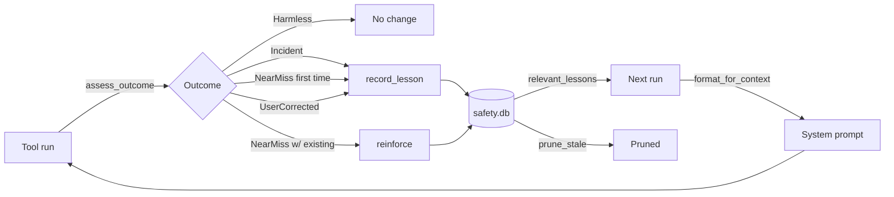

# Safety memory

Ryvos does not block tool execution. It learns instead. **[SafetyMemory](../glossary.md#safetymemory)**
is the SQLite-backed store where that learning lives: a table of lessons derived
from past tool calls, classified by outcome, ranked by confidence, and injected
into the system prompt before similar future actions. Every **[run](../glossary.md#run)**
passes through this store twice — once on the way in (the context build
fetches relevant lessons) and once on the way out (the
**[security gate](../glossary.md#security-gate)** classifies the outcome and,
if anything interesting happened, writes a new lesson).

This document is the full walkthrough of `crates/ryvos-agent/src/safety_memory.rs`,
its integration with `gate.rs` and `agent_loop.rs`, and the philosophy recorded
in [ADR-002](../adr/002-passthrough-security.md).

## Why learning and not blocking

Before v0.6.0, Ryvos used a tier-based classification model: tools were tagged
**[T0–T4](../glossary.md#t0t4)** and dangerous tools were gated behind approval
workflows. The tags are still in the code as informational metadata, but nothing
uses them to deny execution. The reasoning for the pivot is in
[ADR-002](../adr/002-passthrough-security.md). The short version: static
classification cannot tell `rm -rf /tmp/build` from `rm -rf /`, users
rubber-stamp repeated approval prompts, and the only actually useful signal is
what happened *after* a call ran — not the category it was in before.

**[Passthrough security](../glossary.md#passthrough-security)** is what replaced
the tiers. The safety model has four mechanisms that work together:

- **[Constitutional AI](../glossary.md#constitutional-ai)** — eight principles
  in the system prompt that the LLM reasons against before acting.
- **SafetyMemory** — this document. Lessons are the empirical side of the
  constitution.
- **[Reflexion](../glossary.md#reflexion)** — hints injected after repeated
  failures of the same tool.
- **[Audit trail](../glossary.md#audit-trail)** — every call, its arguments,
  its result, and its classification is persisted to `audit.db`.

SafetyMemory sits between the constitution (which is rules) and the audit trail
(which is history). It turns history into rules the constitution can refer to.

## Lesson schema

The `SafetyLesson` struct is the unit of persistence. See
`crates/ryvos-agent/src/safety_memory.rs:60`:

```rust
pub struct SafetyLesson {
    pub id: String,
    pub timestamp: DateTime<Utc>,
    pub action: String,
    pub outcome: SafetyOutcome,
    pub reflection: String,
    pub principle_violated: Option<String>,
    pub corrective_rule: String,
    pub confidence: f64,
    pub times_applied: u32,
}
```

Field by field:

- `id` is a UUID, generated when the lesson is recorded. Deduplication is
  handled by `INSERT OR REPLACE`, so callers may reuse an id when they want
  to update an existing lesson.
- `timestamp` is set by the writer, not the store, so historical imports keep
  their real dates.
- `action` is a free-form label used for retrieval. The convention used by the
  **[security gate](../glossary.md#security-gate)** is `"{tool_name}({input_summary})"`
  — this is what the `action LIKE '%{tool_name}%'` query in
  `relevant_lessons` matches against.
- `outcome` is the classification produced by `assess_outcome` (see below).
- `reflection` is the human-readable "what happened" narrative.
- `principle_violated` is optional and, when set, names one of the eight
  constitutional principles (`Preservation`, `Intent Match`, `Proportionality`,
  `Transparency`, `Boundaries`, `Secrets`, `Learning`, `External Data`).
- `corrective_rule` is the one-sentence instruction injected back into the
  context — what the agent should do differently next time.
- `confidence` is a `0.0..=1.0` score that controls ordering and pruning.
- `times_applied` is incremented by `reinforce` every time the lesson helps
  the agent avoid a repeat pattern; it is the secondary sort key when
  confidence ties.

## Outcome classification

The four outcome variants live in the `SafetyOutcome` enum at
`crates/ryvos-agent/src/safety_memory.rs:44`:

```rust
pub enum SafetyOutcome {
    Harmless,
    NearMiss { what_could_have_happened: String },
    Incident {
        what_happened: String,
        severity: Severity,
    },
    UserCorrected { feedback: String },
}
```

`Harmless` is the overwhelmingly common case. Almost every tool call — reading
a file, running `ls`, posting a Slack message — produces a `Harmless` outcome
and no new lesson is written.

`NearMiss` is emitted when the pre-execution pattern scanner catches something
destructive in the tool input *before* the call runs. It is the classifier's
way of saying "this could have gone badly". NearMiss outcomes do not stop the
call — passthrough — but they create lessons that future runs will see.

`Incident` is emitted when something actually went wrong: a secret leaked into
output, a delete failed with a dangerous error, or the post-execution scan
found a known incident pattern. Each incident carries a `Severity` of
`Low`, `Medium`, `High`, or `Critical`, which maps directly to the `confidence`
of the resulting lesson.

`UserCorrected` is the feedback channel. It is recorded when a user explicitly
tells the agent "don't do that" — either by replying with a correction in the
chat or by denying a **[soft checkpoint](../glossary.md#soft-checkpoint)**
with a reason. The feedback string becomes the lesson's corrective rule.

## Storage

The store wraps a single `rusqlite::Connection` inside a `tokio::sync::Mutex`.
The schema is created on open at `crates/ryvos-agent/src/safety_memory.rs:80`:

```rust
conn.execute_batch(
    "PRAGMA journal_mode = WAL;
     PRAGMA synchronous = NORMAL;
     CREATE TABLE IF NOT EXISTS safety_lessons (
         id TEXT PRIMARY KEY,
         timestamp TEXT NOT NULL,
         action TEXT NOT NULL,
         outcome TEXT NOT NULL,
         reflection TEXT NOT NULL,
         principle_violated TEXT,
         corrective_rule TEXT NOT NULL,
         confidence REAL NOT NULL DEFAULT 0.8,
         times_applied INTEGER NOT NULL DEFAULT 0
     );
     CREATE INDEX IF NOT EXISTS idx_lessons_action ON safety_lessons(action);
     CREATE INDEX IF NOT EXISTS idx_lessons_confidence ON safety_lessons(confidence DESC);",
)
```

Three details are worth calling out:

- **WAL mode.** The store uses write-ahead logging so that reads and writes can
  happen concurrently without blocking each other. The audit trail, the
  gateway, and the MCP server all read `safety.db` while the gate is writing
  to it; WAL mode is what makes that cheap.
- **`synchronous = NORMAL`.** The tradeoff here is an occasional lost write if
  the process is killed mid-fsync. For safety lessons this is acceptable — the
  agent has already survived the action; losing a lesson is strictly less bad
  than losing the user's data.
- **Two indices.** `idx_lessons_action` covers the LIKE lookup in
  `relevant_lessons`; `idx_lessons_confidence` covers the ORDER BY in
  `high_confidence_lessons` and in the reinforcement ranker. The `action`
  index is a B-tree and does not accelerate arbitrary substring searches, but
  it does help the common suffix-anchored pattern that the gate produces.

The default database path is `~/.ryvos/safety.db`, controlled by the config
key `[agent] safety_memory_path`. The database sits next to `audit.db`,
`healing.db`, `cost.db`, `viking.db`, `sessions.db`, and the session store —
the rationale for the seven-database layout is in
[ADR-006](../adr/006-separate-sqlite-databases.md).

An in-memory variant is exposed via `SafetyMemory::in_memory` for tests. It
skips the WAL pragmas and does not create indices (the tests do not care about
query plans on tiny datasets).

## record_lesson

The writer is the single entry point used by the gate and the CLI audit paths.
See `crates/ryvos-agent/src/safety_memory.rs:128`:

```rust
pub async fn record_lesson(&self, lesson: &SafetyLesson) -> Result<(), String> {
    let conn = self.conn.lock().await;
    let outcome_json = serde_json::to_string(&lesson.outcome).map_err(|e| e.to_string())?;
    conn.execute(
        "INSERT OR REPLACE INTO safety_lessons (id, timestamp, action, outcome, ...)
         VALUES (?1, ?2, ?3, ?4, ?5, ?6, ?7, ?8, ?9)",
        rusqlite::params![...],
    ).map_err(|e| e.to_string())?;
    Ok(())
}
```

Two choices here matter downstream. First, the outcome is serialized as JSON
rather than split into typed columns. This keeps the schema stable as new
outcome variants are added — a future `OperationalAnomaly` variant can land
without a migration. Second, `INSERT OR REPLACE` means callers can update a
lesson in place by reusing its id. This is how `reinforce` is able to stay as
a one-line UPDATE rather than having to deal with missing rows.

## relevant_lessons

The read path for the gate. See `crates/ryvos-agent/src/safety_memory.rs:151`:

```rust
let mut stmt = conn.prepare(
    "SELECT id, timestamp, action, outcome, ...
     FROM safety_lessons
     WHERE action LIKE '%' || ?1 || '%'
     ORDER BY confidence DESC, times_applied DESC
     LIMIT ?2"
).map_err(|e| e.to_string())?;
```

Called once per tool execution by `SecurityGate::execute` with `limit = 3`.
The `LIKE '%tool_name%'` pattern matches any lesson whose `action` field
mentions the tool name anywhere — so a lesson recorded against
`"bash(rm -rf /tmp/build)"` will match a future `bash` lookup, and a lesson
recorded against `"bash output"` (the CLI-provider output path) will also
match. Ordering by `confidence DESC, times_applied DESC` means proven lessons
surface first.

The three-lesson limit exists for a reason: the lessons are injected into the
system prompt, which has its own token budget. Three high-quality lessons is
enough to change the LLM's behavior without eating context.

## reinforce

`reinforce` is how lessons accrue weight. See
`crates/ryvos-agent/src/safety_memory.rs:194`:

```rust
pub async fn reinforce(&self, lesson_id: &str) -> Result<(), String> {
    let conn = self.conn.lock().await;
    conn.execute(
        "UPDATE safety_lessons SET times_applied = times_applied + 1 WHERE id = ?1",
        rusqlite::params![lesson_id],
    )
    .map_err(|e| e.to_string())?;
    Ok(())
}
```

The contract: if a lesson was injected into the context and the resulting
action was still flagged as a `NearMiss`, the lesson was advisory — the
agent needed the warning. If the action came back `Harmless` despite the
pre-existing pattern, reinforcement is implicit: the lesson kept the agent
safe. The gate reinforces `NearMiss` lessons explicitly; successful outcomes
do not need to be reinforced because they are the default state.

## high_confidence_lessons and prune_stale

Two cleanup and reporting helpers round out the API.

`high_confidence_lessons(min_confidence, limit)` returns lessons above a
floor, sorted by `times_applied DESC, confidence DESC`. It is used by
`format_for_context` to surface cross-tool global lessons (for example, "the
agent should never print API keys to stdout") that apply regardless of the
current tool, and by the audit UI to show the top N lessons the agent is
currently operating under.

`prune_stale(max_age_days, min_confidence)` deletes lessons that are
simultaneously old, low-confidence, and never applied. Its SQL is tight —
see `crates/ryvos-agent/src/safety_memory.rs:248`:

```rust
let affected = conn.execute(
    "DELETE FROM safety_lessons WHERE confidence < ?1 AND times_applied = 0 AND timestamp < ?2",
    rusqlite::params![min_confidence, cutoff],
).map_err(|e| e.to_string())?;
```

All three conditions are `AND`. A lesson that has been applied even once is
never pruned, no matter how old it is. A lesson with high confidence is never
pruned. The intent is to purge noise without touching anything the agent has
learned to rely on.

Pruning is not run automatically by the daemon. It is exposed as a
`safety_prune` operator command in the TUI and as an MCP tool so that users
can decide when to compact the store. A runaway near-miss detector would
otherwise accumulate thousands of low-confidence entries that are never
useful but never revisited.

## format_for_context

The context-injection function. See
`crates/ryvos-agent/src/safety_memory.rs:263`:

```rust
pub async fn format_for_context(&self, tool_names: &[String], limit: usize) -> String {
    let mut all_lessons = Vec::new();
    for name in tool_names {
        if let Ok(lessons) = self.relevant_lessons(name, limit).await {
            all_lessons.extend(lessons);
        }
    }
    if let Ok(global) = self.high_confidence_lessons(0.9, 3).await {
        for lesson in global {
            if !all_lessons.iter().any(|l| l.id == lesson.id) {
                all_lessons.push(lesson);
            }
        }
    }
    // ... sort by confidence desc, truncate, render as markdown ...
}
```

The function is called by `AgentRuntime::run` near the top of every run, once
the tool list for the run is known. It fetches the relevant lessons for every
tool the agent could use in this session, then layers in up to three global
high-confidence lessons that apply regardless of tool, dedupes by id, sorts
by confidence, and renders the top `limit` as Markdown under a
`# Lessons from Past Experience` heading. The Markdown block is stored on
`ExtendedContext::safety_context` and handed to the onion builder, which
inserts it into the narrative layer of the system prompt.

A run with no matching lessons yields an empty string and nothing is injected.

## Pattern detection: destructive commands

`detect_destructive_command` is the pre-execution scanner. It compiles a set
of regex patterns once via `LazyLock` and runs them against any `bash`-like
tool's `command` argument. See `crates/ryvos-agent/src/safety_memory.rs:305`:

```rust
static PATTERNS: LazyLock<Vec<(regex::Regex, &'static str)>> = LazyLock::new(|| {
    vec![
        (regex::Regex::new(r"rm\s+(-[a-zA-Z]*f[a-zA-Z]*\s+)?-[a-zA-Z]*r|...").unwrap(),
            "recursive force delete"),
        (regex::Regex::new(r"dd\s+if=").unwrap(), "raw disk write (dd)"),
        (regex::Regex::new(r"mkfs\b").unwrap(), "filesystem format (mkfs)"),
        (regex::Regex::new(r"chmod\s+-R\s+777").unwrap(),
            "world-writable recursive chmod"),
        (regex::Regex::new(r":\(\)\s*\{\s*:\s*\|\s*:\s*&\s*\}\s*;").unwrap(),
            "fork bomb"),
        (regex::Regex::new(r">\s*/dev/sd[a-z]").unwrap(), "raw device write"),
        (regex::Regex::new(r"curl\s.*\|\s*(ba)?sh|wget\s.*\|\s*(ba)?sh").unwrap(),
            "pipe to shell"),
        (regex::Regex::new(r">\s*/etc/").unwrap(), "overwrite system config"),
    ]
});
```

The eight covered patterns are: `rm -rf` (including flag permutations like
`rm -fr` and `rm -r -f`), `dd if=...`, `mkfs` for any filesystem, the classic
recursive `chmod -R 777`, the bash fork bomb `:(){ :|: & };:`, raw writes to
`/dev/sda` and friends, pipe-to-shell patterns (`curl ... | bash`,
`wget ... | sh`), and redirects into `/etc/`. A match returns a short label;
no match returns `None`.

These are not meant to be a complete blocklist. They are the patterns that
were common enough in past near-misses to justify cheap regex detection. New
patterns are added when real-world incidents reveal them; the bar is low
because a false positive becomes a `NearMiss` lesson at worst, not a blocked
call.

## Pattern detection: secret leakage

`detect_secret_in_output` is the post-execution scanner. It runs against the
output string of any tool call (not just bash) and looks for leaked
credentials. See `crates/ryvos-agent/src/safety_memory.rs:331`:

```rust
// Skip very short outputs (avoids false positives on tool names, etc.)
if output.len() < 20 {
    return None;
}
```

Outputs shorter than twenty characters skip the scan entirely — this prevents
false positives on short command outputs that happen to look like key
prefixes. The actual pattern set covers AWS access keys (`AKIA...`) and
secret keys (`aws_secret_access_key=...`), GitHub personal access tokens
(`ghp_...`), GitHub OAuth tokens (`gho_...`), GitHub App tokens (`ghs_...`),
OpenAI and Anthropic API keys (`sk-...`), PEM private keys, Slack bot and
user tokens (`xoxb-...`, `xoxp-...`), JWTs (`eyJ...eyJ...` three-part
pattern), and explicit `password=...` patterns. A match returns the secret
type label; no match returns `None`.

A detected secret becomes an `Incident` with `Severity::High`. The resulting
lesson's confidence is set to `0.95` and its `corrective_rule` is "Check
{tool} output for sensitive data before logging". Future runs that touch the
same tool see the lesson and the constitutional prompt combines it with the
SECRETS principle to steer the LLM away from echoing credentials.

## assess_outcome

`assess_outcome` is the single entry point the rest of the crate uses. See
`crates/ryvos-agent/src/safety_memory.rs:407`:

```rust
pub fn assess_outcome(
    tool_name: &str,
    input: &serde_json::Value,
    result: &str,
    is_error: bool,
) -> SafetyOutcome {
    // 1. Check input for destructive bash patterns (even on success)
    let tool_lower = tool_name.to_lowercase();
    if tool_lower == "bash" || tool_lower.contains("bash") {
        if let Some(cmd) = input.get("command").and_then(|v| v.as_str()) {
            if let Some(pattern) = detect_destructive_command(cmd) {
                return SafetyOutcome::NearMiss { ... };
            }
        }
    }
    // 2. Check output for leaked secrets (regardless of error status)
    if let Some(secret_type) = detect_secret_in_output(result) {
        return SafetyOutcome::Incident { severity: Severity::High, ... };
    }
    // 3. Error-specific checks ...
}
```

The function runs in strict order and short-circuits on the first match.
The ordering matters: a bash command that matches a destructive pattern is a
`NearMiss` even if it succeeded (the pre-execution scan ran the agent's
judgment out loud and found a risk); a secret leak in output is always an
`Incident` regardless of `is_error` (a tool returning a GitHub token in its
success path is more alarming than one returning it in its error path); and
only once both positive-signal scans have missed does the classifier fall to
the error-string heuristics.

The error heuristics are tight. `permission denied` or `operation not
permitted` returns `Medium`. A `no such file or directory` message from a
tool whose name is `file_delete` or contains `delete` returns `Low`
(the file was already gone; no harm done). `cannot remove` or
`failed to remove` returns `Medium`. `data loss` or `corrupted` returns
`High`. Anything else falls through to `Harmless` — even errors are
harmless by default.

## Integration with the security gate

`SecurityGate::execute` is the only production caller of `assess_outcome` on
tools that run through the normal dispatch path. See
`crates/ryvos-agent/src/gate.rs:67` for the full flow; the relevant fragment
is around line 140:

```rust
// 4. Execute — always
let result = self.execute_tool_direct(&tool, name, input.clone(), ctx.clone()).await;

// 5. Post-action: assess outcome and learn
match &result {
    Ok(tool_result) => {
        let outcome = assess_outcome(name, &input, &tool_result.content, tool_result.is_error);
        // ... log to audit trail ...
        // ... record Incident lessons, reinforce NearMiss lessons ...
    }
    Err(e) => {
        // ... log execution error as Low-severity Incident ...
    }
}
```

Five things happen after every tool call:

1. `assess_outcome` is called with the tool name, the original input, the
   result content, and the error flag. This is the classifier.
2. An `AuditEntry` is constructed and written to the
   **[audit trail](../glossary.md#audit-trail)**. Every call is logged; the
   entry includes the classification so audit queries can filter by outcome.
3. If the outcome is `Incident`, a new `SafetyLesson` is constructed with
   confidence derived from severity (`Critical=1.0`, `High=0.95`,
   `Medium=0.8`, `Low=0.6`) and written via `record_lesson`.
4. If the outcome is `NearMiss`, the gate iterates over the `lesson_ids` that
   were surfaced for this tool pre-execution and calls `reinforce` on each.
   The reasoning: these are the lessons the agent was told about; if the
   near-miss still happened, the lessons earned their keep by at least being
   present.
5. If the outcome is `Harmless` or `UserCorrected`, no lesson is written and
   no existing lesson is reinforced. `UserCorrected` lessons are created by a
   separate codepath — the approval broker denial flow — not by
   `assess_outcome`.

The gate's pre-execution fetch is the other half of the loop. See
`crates/ryvos-agent/src/gate.rs:85`:

```rust
let mut lesson_ids = Vec::new();
if let Some(ref memory) = self.safety_memory {
    if let Ok(lessons) = memory.relevant_lessons(name, 3).await {
        if !lessons.is_empty() {
            lesson_ids = lessons.iter().map(|l| l.id.clone()).collect();
        }
    }
}
```

These ids are the ones the post-execution `reinforce` loop will walk. Between
them, the gate closes the loop from "lesson injected into this call" to
"lesson earned reinforcement because the classification still flagged
something".

## Integration with the agent loop

The second integration point is `AgentRuntime::run` in
`crates/ryvos-agent/src/agent_loop.rs`. Two call sites matter.

The first is the top of the run, where the runtime assembles `ExtendedContext`
before building the system prompt. See around
`crates/ryvos-agent/src/agent_loop.rs:290`:

```rust
if let Some(ref sm) = self.safety_memory {
    let tool_names: Vec<String> = /* collect tool names from gate or registry */;
    let safety_ctx = sm.format_for_context(&tool_names, 5).await;
    if !safety_ctx.is_empty() {
        info!(len = safety_ctx.len(), "Safety lessons injected into system prompt");
        extended.safety_context = safety_ctx;
    }
}
```

The runtime asks the store for every relevant lesson across the tool list,
rendered as a markdown block, and hands it to `build_goal_context_extended`
or `build_default_context_extended`. Those builders splice it into the
narrative layer of the **[onion context](../glossary.md#onion-context)**.
By the time the first LLM call goes out, the agent already knows about its
own past mistakes.

The second call site is the CLI-provider handler, where Ryvos records
post-hoc safety for tools that `claude-code` or `copilot` executed internally
without going through the gate. See around
`crates/ryvos-agent/src/agent_loop.rs:600`. When a `CliToolExecuted` delta
arrives, `assess_outcome` is called on the input (same classifier, same
patterns), and if the result is a `NearMiss` a lesson is recorded directly
— bypassing the gate because the tool already ran inside the provider
subprocess. The same path runs again for `CliToolResult` deltas to scan the
output for secrets. This is how the self-learning loop stays global across
provider backends even though two of Ryvos's supported providers do not
expose per-call hooks.

## Lesson lifecycle

A lesson's full arc through the store:



A lesson is created once, reinforced N times over its lifetime, and either
pruned (if low-confidence and never applied) or retained indefinitely. High
confidence plus a few reinforcements is a write-once, read-forever record.
Low confidence plus zero reinforcements is a candidate for cleanup.

## Constitutional AI connection

The **[constitutional AI](../glossary.md#constitutional-ai)** model is the
other half of the passthrough safety story. The `DEFAULT_SYSTEM_PROMPT` in
`crates/ryvos-agent/src/context.rs:201` declares eight principles that the
LLM reasons against before acting: PRESERVATION, INTENT MATCH, PROPORTIONALITY,
TRANSPARENCY, BOUNDARIES, SECRETS, LEARNING, and EXTERNAL DATA. The LEARNING
principle reads, in part:

> If a previous action in this or a past session caused problems, apply that
> lesson. Check your safety memory before repeating similar actions.

That principle is only useful if safety memory is populated. SafetyMemory is
how the constitution gets teeth. The principles give the agent the *language*
to reason about safety; the lessons give it the *memory* to act on that
reasoning. Without lessons, the agent is a fresh model with no history.
Without principles, the lessons are just data with no policy to refer back
to. Together they form a feedback loop that gets stronger over time without
ever refusing a call.

Note: the glossary currently lists seven principles; the implemented prompt
has eight (EXTERNAL DATA was added to defend against prompt injection from
web and API payloads). The glossary entry should be updated.

## The full gate cycle

Combining every piece, a single tool call through `SecurityGate::execute`
exercises SafetyMemory twice — once to fetch lessons, once to classify the
outcome — and writes to it once (either a new lesson or a reinforcement).
The sequence is:

```mermaid
sequenceDiagram
    participant Loop as Agent loop
    participant Gate as SecurityGate
    participant SM as SafetyMemory
    participant Audit as AuditTrail
    participant Tool as Tool impl

    Loop->>Gate: execute(name, input, ctx)
    Gate->>SM: relevant_lessons(name, 3)
    SM-->>Gate: Vec<SafetyLesson>
    Note over Gate: generate safety_reasoning string
    Gate->>Audit: log (pre-execution)
    Gate->>Tool: tool.execute(input, ctx)
    Tool-->>Gate: Result<ToolResult>
    Gate->>SM: assess_outcome(name, input, result, is_error)
    SM-->>Gate: SafetyOutcome
    Gate->>Audit: log (post-execution, with outcome)
    alt outcome is Incident
        Gate->>SM: record_lesson(new)
    else outcome is NearMiss
        loop for each pre-fetched lesson id
            Gate->>SM: reinforce(id)
        end
    end
    Gate-->>Loop: Result<ToolResult>
```

The three writes to `safety.db` and `audit.db` are sequenced so that a
crash anywhere during the cycle leaves a coherent audit record. If the
tool crashes the process mid-execution, the pre-execution audit entry is
already on disk. If `record_lesson` fails, the audit trail still has the
outcome. If both succeed, the next run's `relevant_lessons` call sees
the new lesson immediately because both databases share the same
`Arc<SafetyMemory>` and the same connection pool.

## Observing the store

Operators can read SafetyMemory state from three surfaces. The
**[audit trail](../glossary.md#audit-trail)** is the primary historical
view — every entry has the outcome classification and the lesson ids that
were available at dispatch time, so a user can query "show me every time
the gate had lessons available and still let a NearMiss through". The
`audit_query` MCP tool exposes this as a structured query over
`audit.db`.

The second surface is the TUI audit pane, which reads from the audit
trail and shows the most recent N outcomes with their lesson ids and
safety reasoning. It is read-only.

The third surface is the lesson store itself. The `ryvos-mcp` server
exposes `safety_list_lessons` and `safety_stats` tools that query
`safety.db` directly, returning ranked lessons (by confidence, by
reinforcement count, by recency) and aggregate counts by outcome and
severity. These are the operator's way to inspect *what the agent has
actually learned*. A healthy store shows steady reinforcement of a small
number of high-confidence lessons and occasional pruning of stale noise;
a store growing unboundedly with low-confidence first-time entries is a
signal that the classifier is overfiring and the pattern regex set
needs tightening.

## Extending the classifier

New patterns are added by editing the two pattern tables in
`safety_memory.rs` directly. The contract is:

- A bash pattern should be a regex that matches a command whose effect
  is routinely irreversible and whose occurrence in normal workflows is
  rare. If a pattern fires on everyday bash, it becomes noise and
  teaches the gate to emit useless lessons.
- A secret pattern should be a regex with a fixed-prefix anchor strong
  enough to avoid false positives on arbitrary hex strings. The
  `AKIA[0-9A-Z]{16}` pattern is a good template; the loose
  `sk-[A-Za-z0-9]{20,}` pattern is a worse one and fires on anything
  shaped like an API key, not just real API keys.

Both tables are compiled once via `LazyLock`, so adding a pattern costs
zero runtime overhead after the first call. There is no configuration
knob to add patterns from `ryvos.toml` — this is deliberate. Classifier
changes ship with Ryvos releases and are tested together; a user's ad-hoc
regex should not be able to accidentally mark legitimate commands as
incidents. Users who want custom rules write them as
`UserCorrected` lessons through the TUI instead.

## Where to go next

- [agent-loop.md](agent-loop.md) — how `AgentRuntime::run` assembles the
  context and drives the per-turn loop.
- [guardian.md](guardian.md) — the watchdog that complements SafetyMemory by
  detecting real-time pathologies (doom loops, stalls, budget exhaustion)
  that no lesson can encode.
- [ADR-002](../adr/002-passthrough-security.md) — the design rationale for
  passthrough security and the abandonment of tier-based blocking.
- [ADR-006](../adr/006-separate-sqlite-databases.md) — why `safety.db` is its
  own file rather than a table inside `audit.db`.
- [../architecture/execution-model.md](../architecture/execution-model.md) —
  the high-level sequence diagram that shows where the gate and SafetyMemory
  sit in a turn.
